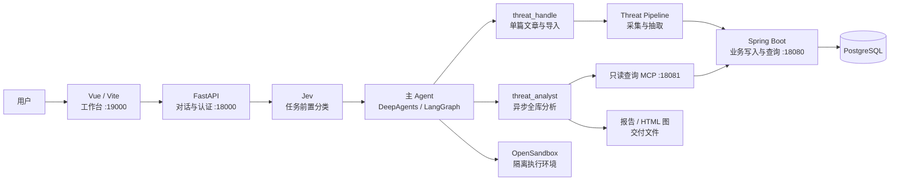

<div align="center">


# ThreatWeave

**面向公开威胁情报的 Harness 多 Agent 分析工作台**

将公开文章转化为可追溯的威胁事实，并通过对话、图谱和报告支持情报分析。

[中文](README.md) · [English](README_EN.md)

</div>

<p align="center">
  
  
  
  
</p>

## ✨ 项目介绍

ThreatWeave 是一个采用 **Harness 工程设计**的多 Agent 系统，面向公开威胁情报的采集、整理、查询和关联分析。它把模型能力放入受约束的运行时中：主 Agent 负责理解任务和组织协作，固定 Pipeline 负责情报处理，子 Agent 负责单篇文章工作或后台分析，OpenSandbox 为 Agent 提供隔离的文件与命令执行环境。

ThreatWeave 解决的核心问题是：将分散在公开网页中的非结构化信息，整理为带有原文出处的结构化威胁情报。系统保存规范正文、威胁实体、实体关系和证据位置，使分析结果可以回到支持它的文章内容，而不是只返回无法复核的模型结论。

## 🧩 核心能力

- **情报采集与规范化**：支持按已配置来源或指定文章 URL 采集公开文章，清理页面噪声并保存规范正文。
- **实体与关系抽取**：从文章中识别 IoC、TTP、恶意软件、威胁行为者等情报对象及其关系，并保留原文证据。
- **对话式 Agent 工作流**：通过主 Agent 统一理解请求、调用工具并委派合适的同步或异步任务。
- **Jev 前置任务分类**：在主 Agent 执行前快速判断任务类型、处理范围和报告/图表交付意图；分类服务不可用时自动回退，不阻断主流程。
- **全库关联分析**：对已入库情报进行跨文章查询、统计和关联分析，按需生成 Markdown 报告或 HTML 关系图。
- **异步任务交付**：长时间分析在后台执行，前端可查看任务状态并访问生成的交付文件。
- **证据可追溯**：结构化实体和关系关联到文章及原文字符范围，便于复核来源。
- **隔离执行**：通过 OpenSandbox 隔离 Agent 的文件操作、脚本执行和交付文件。

## 🏗️ 系统架构



项目自身的服务由根目录 `start_web.py` 统一编排：Java 业务服务、查询 MCP、异步 Agent Protocol、FastAPI 和 Vue/Vite。PostgreSQL、OpenSandbox 以及外部模型/MCP 服务需要在启动前准备好。

## 📁 项目结构

```text
ThreatWeave-Agent/
├── frontend/                # Vue 3 + Vite 工作台
├── java-backend/            # Spring Boot 业务服务
├── src/
│   ├── agent/               # 主 Agent、子 Agent、工具、技能与运行时状态
│   ├── api/                 # FastAPI 路由、认证、SSE 和任务接口
│   ├── intel_ingestor/      # 来源配置、文章发现与正文采集
│   ├── threat_pipeline/     # 清洗、文档写入、抽取与图谱写入
│   ├── mcp_server/          # Java 业务查询的 MCP 适配层
│   └── services/            # 任务、交付文件与运行时资源服务
├── tests/                   # Python 测试
├── pictures/                # README 与项目视觉资源
├── doc/                     # 完整技术文档
├── sandbox/                 # OpenSandbox 镜像与运行脚本
├── .env.example             # 环境变量模板
├── langgraph.json           # 异步 Agent Protocol 图配置
└── start_web.py             # 本地统一启动器
```

## 🚀 快速启动

以下命令以 Windows PowerShell 为例。完整架构、接口边界和排障说明见 [项目技术文档](doc/PROJECT_DOCUMENTATION.md)。

### 1. 准备依赖

需要准备以下环境：

| 依赖 | 用途 |
| --- | --- |
| Python 3.12 + `uv` | 运行 FastAPI、Agent、MCP 和异步 Agent Protocol |
| JDK 17 + Maven | 编译并启动 Spring Boot 业务服务 |
| Node.js + npm | 安装并运行 Vue/Vite 前端 |
| PostgreSQL | 保存认证、会话、Agent 状态和威胁情报数据 |
| OpenSandbox | 提供 Agent 的隔离文件与命令执行环境 |

Jev、DeepSeek、公共搜索 MCP 和图表 MCP 属于外部服务，需要按实际使用功能配置。

### 2. 创建 Python 环境并安装依赖

在项目根目录执行：

```powershell
uv venv --python 3.12 .venv
uv pip install --python .\.venv\Scripts\python.exe -r requirements.txt
npm --prefix .\frontend install
```

### 3. 配置环境变量

复制模板并编辑本地配置：

```powershell
Copy-Item .env.example .env
```

至少检查以下配置：

- `DEEPSEEK_API_KEY`、`DEEPSEEK_BASE_URL`、`DEEPSEEK_MODEL`
- `JEVMODEL_API_KEY`、`JEVMODEL_BASE_URL`、`JEVMODEL_MODEL`
- `DB_HOST`、`DB_PORT`、`DB_NAME`、`DB_USER`、`DB_PASSWORD`
- `OPEN_SANDBOX_API_KEY` 及 OpenSandbox 地址配置
- 使用搜索或图表功能时对应的 MCP 配置

`.env` 已被 Git 忽略。**不要提交 API Key、数据库密码、Cookie 或其他真实凭据。** Jev 未配置或暂时不可用时，主 Agent 仍会按原流程继续执行。

### 4. 启动项目

确保 PostgreSQL 和 OpenSandbox 已运行，然后执行：

```powershell
.\.venv\Scripts\python.exe .\start_web.py
```

看到服务启动完成后，访问：

```text
http://127.0.0.1:19000/
```

统一启动器默认使用以下地址：

| 服务 | 默认地址 | 作用 |
| --- | --- | --- |
| Vue / Vite | `http://127.0.0.1:19000/` | 用户工作台 |
| FastAPI | `http://127.0.0.1:18000/` | 认证、对话、历史与任务接口 |
| Spring Boot | `http://127.0.0.1:18080/` | 威胁情报业务 REST 接口 |
| 查询 MCP | `http://127.0.0.1:18081/mcp` | 受限只读业务查询 |
| Agent Protocol | `http://127.0.0.1:18082/` | 异步分析 Agent |
| OpenSandbox | `http://127.0.0.1:18083/` | 独立的隔离执行服务 |

首次启动异步 Agent Protocol 可能需要额外时间加载工具。正常停止时，在启动器终端按 `Ctrl+C`。

## 🧪 常用验证命令

```powershell
# Python 测试
$env:PYTHONPATH="src"
.\.venv\Scripts\python.exe -m unittest discover -s tests -p "test_*.py"

# 前端测试与生产构建
npm --prefix .\frontend test
npm --prefix .\frontend run build

# Java 编译检查
mvn.cmd -f .\java-backend\pom.xml -DskipTests compile
```

## 🎬 项目演示

<!-- TODO: 将项目演示视频链接或 GIF 放在这里。 -->

演示视频即将补充。

## 📚 相关文档

- [项目技术文档](doc/PROJECT_DOCUMENTATION.md)：架构、Agent 分工、情报数据模型、服务边界和运行机制。
- [环境变量模板](.env.example)：本地运行所需配置项名称与默认值。
- [统一启动器](start_web.py)：项目服务启动顺序、健康检查和退出清理逻辑。

## 🔒 安全边界

- ThreatWeave 面向公开威胁情报的采集、整理和分析，**不自动封禁 IOC、下发检测规则或执行安全响应**。
- 外部搜索和模型生成的内容应与库内证据、分析推断明确区分。
- OpenSandbox 只隔离 Agent 的文件与命令执行，不代表应用、数据库或 MCP 服务都运行在沙箱内。
- 本项目适合本地开发和受控环境使用；部署到生产环境前，应进一步收紧认证、用户归属和外部服务权限。

## 📄 License

License information will be added in a future release.
