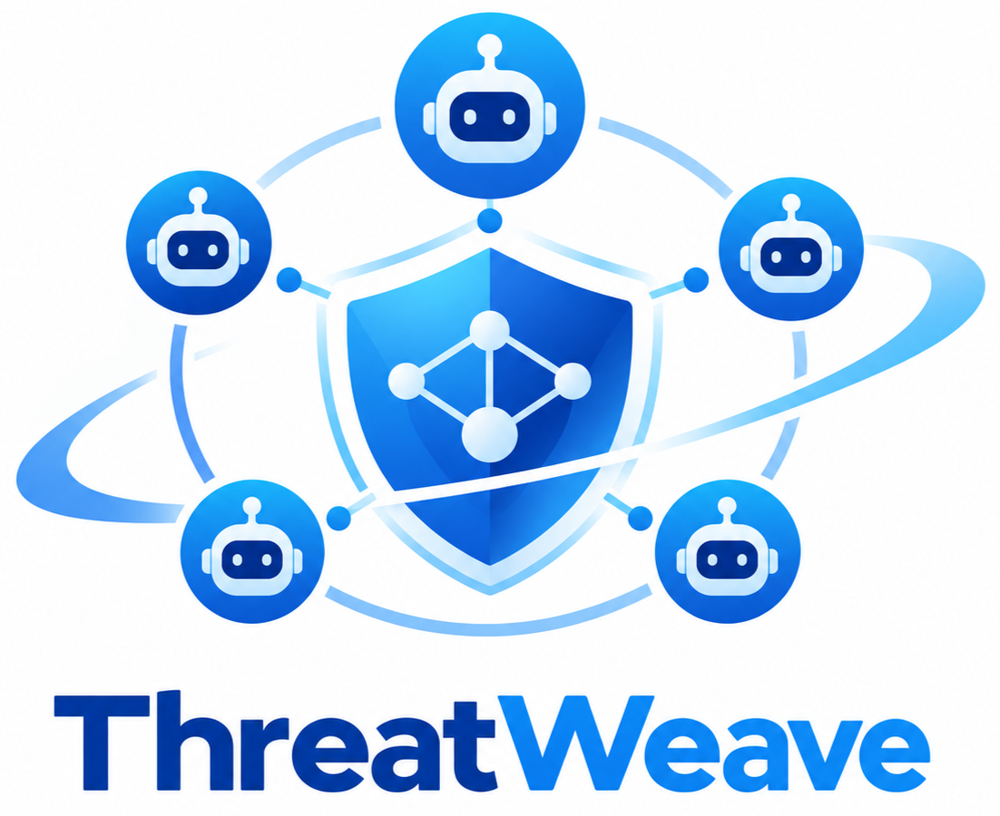
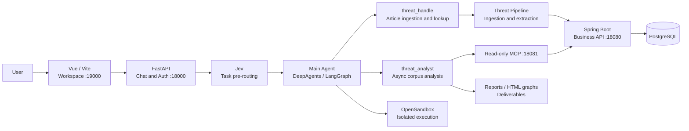

<div align="center">



# ThreatWeave

**An automated threat intelligence (CTI) processing system built on a multi-agent architecture**

Automates the end-to-end workflow from collecting trusted user-specified intelligence sources and extracting entities and relationships to interactive analysis, querying, and knowledge graph visualization.

[中文](README.md) · [English](README_EN.md)

</div>

<p align="center">
  
  
  
  
  
  
</p>

## ✨ Project Overview

ThreatWeave is a **Harness-oriented multi-agent system** for collecting, structuring, querying, and correlating public threat intelligence. The project places model capabilities inside a controlled runtime: the main Agent understands requests and coordinates work, a deterministic Pipeline handles intelligence processing, specialized Agents handle article-level or background analysis, and OpenSandbox isolates Agent file and command execution.

The core goal is to transform unstructured information from public web pages into structured, evidence-backed threat intelligence. ThreatWeave stores normalized documents, threat entities, relationships, and provenance so that an analysis can be traced back to the article evidence that supports it instead of returning an unreviewable model-only conclusion.

## 🧩 Core Capabilities

- **Intelligence ingestion and normalization**: Ingest articles from configured sources or direct URLs, remove page noise, and store normalized content.
- **Entity and relationship extraction**: Identify IoCs, TTPs, malware, threat actors, and related intelligence objects while retaining source evidence.
- **Conversational Agent workflow**: Use a main Agent to understand requests, call tools, and delegate synchronous or asynchronous work.
- **Jev pre-routing**: Classify task type, processing scope, and report/graph delivery intent before the main Agent runs. If Jev is unavailable, the request falls back to the normal flow.
- **Cross-document analysis**: Query and correlate stored intelligence, then generate Markdown reports or HTML relationship graphs when requested.
- **Asynchronous delivery**: Run long analyses in the background and expose their status and deliverables through the web workspace.
- **Traceable evidence**: Link extracted entities and relationships to source documents and character ranges in the normalized text.
- **Isolated execution**: Use OpenSandbox for Agent file operations, scripts, and generated deliverables.

## 🏗️ Architecture



The root `start_web.py` orchestrates the project services: the Java business service, read-only MCP adapter, asynchronous Agent Protocol service, FastAPI, and Vue/Vite. PostgreSQL, OpenSandbox, and external model/MCP services must be prepared separately.

## 📁 Repository Structure

```text
ThreatWeave-Agent/
├── frontend/                # Vue 3 + Vite workspace
├── java-backend/            # Spring Boot business service
├── src/
│   ├── agent/               # Main Agent, sub-agents, tools, skills, and runtime state
│   ├── api/                 # FastAPI routes, auth, SSE, and task APIs
│   ├── intel_ingestor/      # Source configuration and article ingestion
│   ├── threat_pipeline/     # Normalization, persistence, extraction, and graph writes
│   ├── mcp_server/          # MCP adapter for read-only business queries
│   └── services/            # Task, deliverable, and runtime resource services
├── tests/                   # Python tests
├── pictures/                # README and project visual assets
├── demo/                    # Project demo video and generated deliverables
│   ├── videos/              # Demo videos
│   └── artifacts/           # Example deliverables generated in the demo
│       ├── reports/
│       └── visualizations/
├── doc/                     # Full technical documentation
├── sandbox/                 # OpenSandbox image and runtime files
├── .env.example             # Environment variable template
├── langgraph.json           # Async Agent Protocol graph configuration
└── start_web.py             # Local service orchestrator
```

## 🚀 Quick Start

The commands below target Windows PowerShell. For complete architecture, API boundaries, and troubleshooting details, see the [technical documentation](doc/PROJECT_DOCUMENTATION.md).

### 1. Prerequisites

| Dependency | Purpose |
| --- | --- |
| Python 3.12 + `uv` | Run FastAPI, Agents, MCP, and Agent Protocol |
| JDK 17 + Maven | Build and run the Spring Boot service |
| Node.js + npm | Install and run the Vue/Vite frontend |
| PostgreSQL | Store auth, sessions, Agent state, and threat intelligence |
| OpenSandbox | Isolated file and command execution for Agents |

Jev, DeepSeek, public search MCP, and chart MCP are external services and should be configured only when the corresponding capabilities are needed.

### 2. Create the Python environment and install dependencies

Run from the repository root:

```powershell
uv venv --python 3.12 .venv
uv pip install --python .\.venv\Scripts\python.exe -r requirements.txt
npm --prefix .\frontend install
```

### 3. Configure environment variables

Create a local `.env` file from the template:

```powershell
Copy-Item .env.example .env
```

At minimum, review:

- `DEEPSEEK_API_KEY`, `DEEPSEEK_BASE_URL`, and `DEEPSEEK_MODEL`
- `JEVMODEL_API_KEY`, `JEVMODEL_BASE_URL`, and `JEVMODEL_MODEL`
- `DB_HOST`, `DB_PORT`, `DB_NAME`, `DB_USER`, and `DB_PASSWORD`
- `OPEN_SANDBOX_API_KEY` and the OpenSandbox connection settings
- MCP settings for search or chart capabilities, if required

`.env` is ignored by Git. **Never commit API keys, database passwords, cookies, or other credentials.** When Jev is missing or temporarily unavailable, the main Agent continues through the normal flow.

### 4. Start the project

Start PostgreSQL and OpenSandbox first, then run:

```powershell
.\.venv\Scripts\python.exe .\start_web.py
```

Open the workspace after startup:

```text
http://127.0.0.1:19000/
```

Default service endpoints:

| Service | Default address | Purpose |
| --- | --- | --- |
| Vue / Vite | `http://127.0.0.1:19000/` | User workspace |
| FastAPI | `http://127.0.0.1:18000/` | Auth, chat, history, and task APIs |
| Spring Boot | `http://127.0.0.1:18080/` | Threat intelligence REST API |
| Read-only MCP | `http://127.0.0.1:18081/mcp` | Restricted business queries |
| Agent Protocol | `http://127.0.0.1:18082/` | Asynchronous analysis Agent |
| OpenSandbox | `http://127.0.0.1:18083/` | Separate isolated execution service |

The first Agent Protocol startup may take additional time while tools are loaded. Press `Ctrl+C` in the launcher terminal to stop the project services.

## 🧪 Common Verification Commands

```powershell
# Python tests
$env:PYTHONPATH="src"
.\.venv\Scripts\python.exe -m unittest discover -s tests -p "test_*.py"

# Frontend tests and production build
npm --prefix .\frontend test
npm --prefix .\frontend run build

# Java compilation check
mvn.cmd -f .\java-backend\pom.xml -DskipTests compile
```

## 🎬 Demo

- [Project demo video](demo/videos/threatweave-demo.mp4)
- [Example deliverables generated in the video](demo/artifacts/)

## 📚 Documentation

- [Technical documentation](doc/PROJECT_DOCUMENTATION.md): architecture, Agent roles, data model, service boundaries, and runtime behavior.
- [Environment template](.env.example): local configuration names and defaults.
- [Service launcher](start_web.py): startup order, health checks, and process cleanup.

## 🔒 Security Boundaries

- ThreatWeave focuses on collecting, structuring, and analyzing public threat intelligence. It **does not automatically block IoCs, deploy detection rules, or execute incident response**.
- External search and model-generated content should be distinguished from stored evidence and analytical inference.
- OpenSandbox isolates Agent files and commands; it does not mean that the application, database, or MCP services run inside the sandbox.
- This repository is intended for local development and controlled environments. Production deployments should further harden authentication, user ownership checks, and external service permissions.

## 📄 License

License information will be added in a future release.
