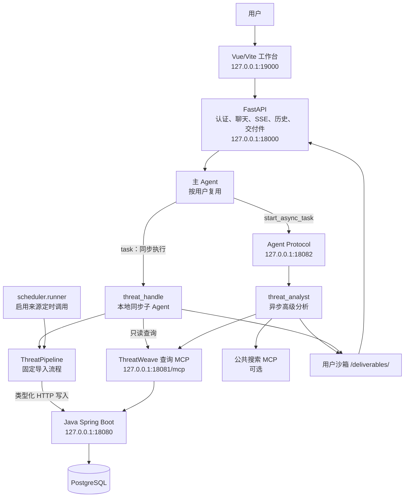
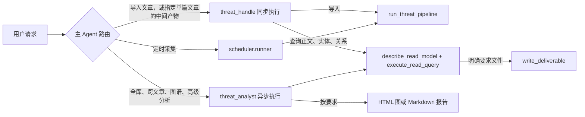
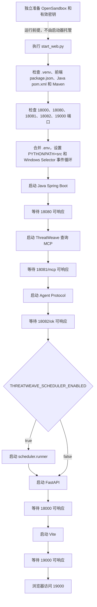
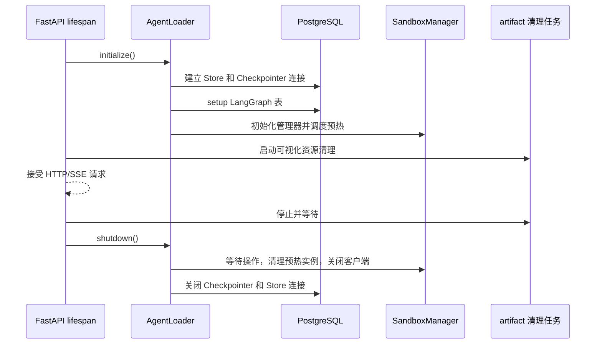
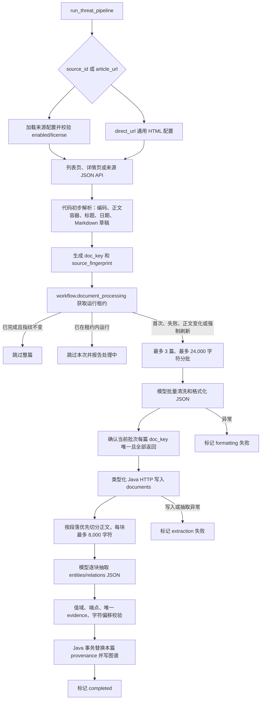
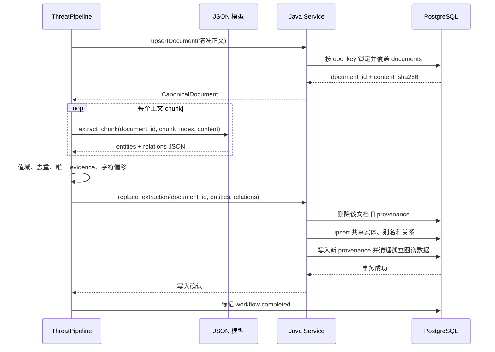
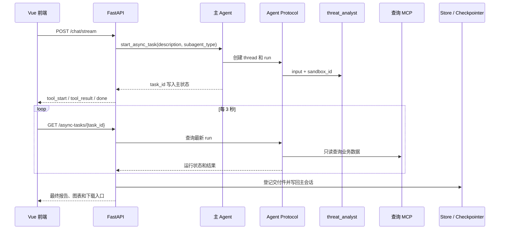
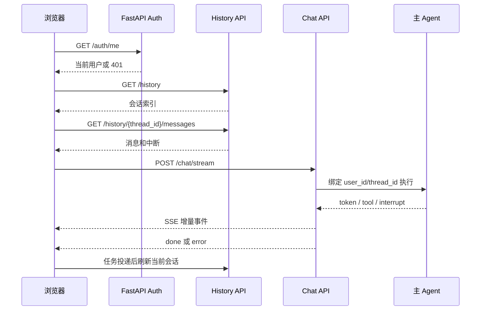
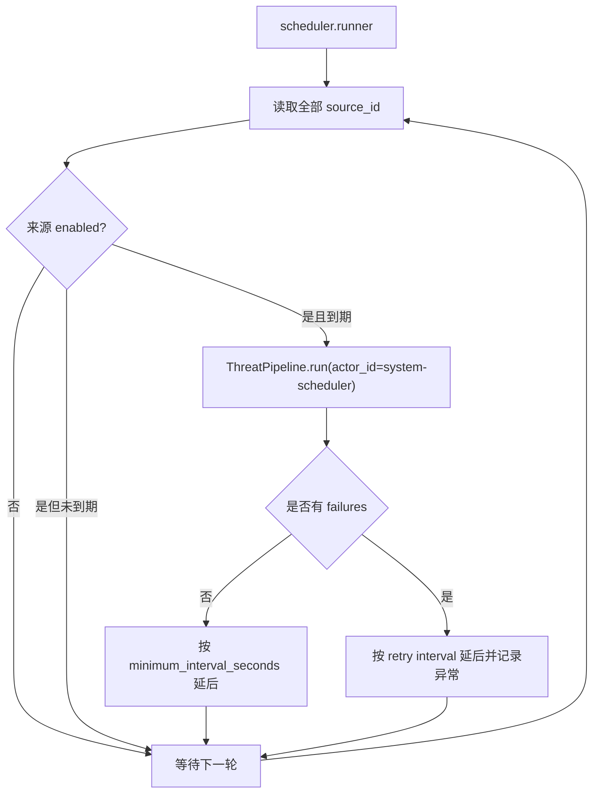

# ThreatWeave 项目技术文档

> 本文严格以当前仓库代码、测试和配置为准，说明 ThreatWeave 的业务边界、运行方式、Agent 架构、Threat Pipeline、数据模型、接口、前端交互和排障方法。
> 文档参考 `C:\Users\25144\Desktop\MyAgent\doc\PROJECT_DOCUMENTATION.md` 的组织方式和表达风格，但其中的采购、旧工作流和旧 MCP 描述不适用于本项目。
> 已确认的业务决策见 [`THREATWEAVE_CONFIRMED_DECISIONS.md`](./THREATWEAVE_CONFIRMED_DECISIONS.md)。代码、测试和本文出现不一致时，应先定位具体版本差异，不要按旧描述推断当前行为。

**推荐阅读顺序**：项目总览 → 本地运行 → 用户请求和 Agent 架构 → Threat Pipeline → 数据模型与幂等 → 工具和 MCP → 持久化与会话 → 异步分析和交付件 → HTTP/SSE 与前端 → 调度器 → 测试和排障。

## 0. 先理解项目

### 0.1 项目解决什么问题

ThreatWeave 是一个面向公开威胁情报的工作台。它把已配置来源或用户提供的文章 URL 处理成可查询、可追溯的威胁情报数据，并为用户提供两类使用方式：

1. 通过同步 `threat_handle` 导入一篇或一批文章，固定完成采集、清洗、文档入库、实体关系抽取和图谱写入。
2. 通过只读查询和异步 `threat_analyst` 对库内的文档、实体、关系和出处做高级分析，按用户要求生成 HTML 图或 Markdown 报告。

项目不是自动处置系统，不负责封禁 IOC、下发检测规则、自动响应、维护黑名单或修改用户认证数据。业务事实必须能够回到已入库规范正文中的原文证据。

### 0.2 当前实现摘要

| 事项 | 当前实现 |
| --- | --- |
| 文章导入入口 | `threat_handle` 的 `run_threat_pipeline`，或系统调度器直接调用同一个 `ThreatPipeline`。 |
| 固定业务流程 | 采集 → 按预算分批清洗格式化 → 写入规范文档 → 按正文分块抽取 → 一次性替换实体、关系和 provenance。 |
| 同步处理器 | `threat_handle`，本地同步子 Agent，只能通过 Pipeline 工具和两个只读查询工具工作。 |
| 高级分析器 | `threat_analyst`，通过独立 Agent Protocol 异步运行，只读查询业务数据，按要求生成图或报告。 |
| 采集来源 | `cncert_cc_threat_warning`、`hillstone_hot_threat`，以及用户只提供 URL 时使用的 `direct_url`。 |
| 业务事实存储 | PostgreSQL 的 `threatweave` schema，由 Java Spring Boot 事务服务维护。 |
| Pipeline 状态 | PostgreSQL 的 `workflow.document_processing`，用于幂等、运行租约和失败诊断。 |
| 查询能力 | Python MCP 仅暴露 `describe_read_model` 和 `execute_read_query`。当前实现通过 Java 查询策略限制业务表和 SQL，不是通用 CRUD MCP。 |
| 写入能力 | Pipeline 直接调用类型化 Java HTTP 命令接口；不保留 `threatweave-write` Python MCP。 |
| 交付件 | 通过统一的 `write_deliverable` 写入用户沙箱 `/deliverables/`，登记后由页面提供下载；没有独立的 `export_document_markdown`。 |
| 前端 | Vue 3 + Vite 聊天工作台，支持登录、会话历史、SSE 流式回答、中断恢复、异步任务和文件交付。 |

### 0.3 必须明确的业务边界

当前运行链路已经不再使用以下旧业务流程，任何新代码和文档都不应继续依赖它们：

| 已删除概念 | 当前替代方案 |
| --- | --- |
| A 子 Agent | `ThreatPipeline` 内的批量清洗格式化模型调用。 |
| B 子 Agent | `ThreatPipeline` 内的分块抽取模型调用和 Java 原子写入。 |
| C 子 Agent | 当前名称为 `threat_analyst` 的异步高级分析子 Agent。 |
| 预览草稿流程 | Pipeline 只有正式处理结果；旧草稿表和授权表会在状态表初始化时删除。 |
| 仅格式化流程 | `run_threat_pipeline` 固定走到实体关系抽取和图谱写入。 |
| 待补抽取流程 | 失败文章下一次按规则重新获取并从头处理，不提供单独的 `extract_pending` 模式。 |
| `threatweave-write` MCP | Pipeline 直接使用 `ThreatWeaveCommandGateway` 调用类型化 Java HTTP。 |
| `export_document_markdown` | 用户明确要求文件时统一调用 `write_deliverable`。 |
| 模型直接访问业务库 | 模型只能通过受控工具访问；Pipeline 模型只返回 JSON，不持有业务工具。 |

这里的“删除”指业务入口和运行时调用链已经删除。Java 中仍保留若干兼容读取 REST 接口，`src/mcp_server/schema.py` 还保留未被当前 MCP 注册流程使用的旧候选模型，个别 Java 注释仍沿用 A/B/C 叫法；这些不是当前 Agent 的可用业务路径，但也不应被误写成已经从仓库文件中完全移除。

### 0.4 运行时拓扑



### 0.5 最重要的执行边界



- 主 Agent 不直接写 `threatweave` 业务表。
- `threat_handle` 不直接调用 Java 写入工具，只调用 `run_threat_pipeline`；查询单篇文章时使用两个只读查询工具。
- `ThreatPipeline` 是业务流程的唯一固定入口。模型只能完成正文清洗和实体关系 JSON 转换，不能决定跳过阶段、改变写入目标或执行 SQL。
- `threat_analyst` 只读业务数据，不能修改文档、实体、关系或 Pipeline 状态。
- 调度器不创建用户 Agent、不创建沙箱、不进入聊天会话，直接等待 Pipeline 完成。

理解这层关系时，可以把主 Agent 看成“路由和解释层”，而不是情报数据库的业务服务。它只回答三个问题：用户要处理哪一类对象、应该交给哪个执行单元、最终应该以聊天文本还是文件交付。文章如何采集、正文如何覆盖、实体如何落库，则由 Pipeline 和 Java 事务服务决定。

## 1. 本地运行与服务启动

### 1.1 前置条件

项目当前使用 Windows 本地虚拟环境和多个协作服务：

- Python 3.12，通过 uv 在仓库根目录创建 `.venv`；
- JDK 17 或更高版本、Maven、Node.js；
- PostgreSQL，认证、LangGraph 持久化、Pipeline 状态和 ThreatWeave 业务表共用当前 `DB_*` 配置；
- DeepSeek 或兼容的模型服务；
- 可访问的 OpenSandbox 服务；需要执行 Agent 文件和命令操作时必须配置 `OPEN_SANDBOX_API_KEY`；
- 需要公共联网搜索时配置 ModelScope Bing 搜索 MCP 令牌；
- 需要 HTML 关系图时配置 Charts MCP URL。

创建并安装 Python 环境：

```powershell
uv venv --python 3.12 .venv
uv pip install --python .\.venv\Scripts\python.exe -r requirements.txt
```

前端依赖：

```powershell
Set-Location .\frontend
npm install
Set-Location ..
```

### 1.2 配置项

敏感值只放在仓库根目录 `.env`，不要写入代码、文档、Skill 或日志。模板见 [`.env.example`](../.env.example)。`start_web.py` 会把 `.env` 中的配置注入 Java、MCP、异步 Agent、FastAPI 和前端进程。

| 配置 | 用途 | 当前行为 |
| --- | --- | --- |
| `DEEPSEEK_API_KEY` | 主 Agent、Pipeline 清洗/抽取和异步分析模型 | 未配置时服务可能启动，但实际模型调用会失败。 |
| `DEEPSEEK_BASE_URL` | 模型服务地址 | 由 `ChatDeepSeek` 使用。 |
| `DEEPSEEK_MODEL` | 模型名称 | `src/agent/config.py` 提供默认值；以当前 `.env` 为准。 |
| `DB_HOST`、`DB_PORT`、`DB_NAME`、`DB_USER`、`DB_PASSWORD`、`DB_SSLMODE` | PostgreSQL 连接 | Python、Java 和认证代码读取同一组配置。 |
| `MODELSCOPE_BING_SEARCH_MCP_TOKEN` | 公共联网搜索 MCP | 未配置或远端加载失败时，公共工具降级为只返回不可用提示的 `web_search`。 |
| `MODELSCOPE_CHARTS_MCP_URL` | 图表 MCP | `threat_analyst` 生成 HTML 图所需；不可用时不得伪造成功图。 |
| `OPEN_SANDBOX_HOST`、`OPEN_SANDBOX_PORT` | OpenSandbox 管理 API | 默认 `127.0.0.1:18083`。 |
| `OPEN_SANDBOX_API_KEY` | OpenSandbox 鉴权 | 缺少时禁用沙箱预热和实际沙箱 Agent 执行。 |
| `OPEN_SANDBOX_IMAGE` | 新沙箱默认镜像 | 默认 `myagent-sandbox:1`。 |
| `OPEN_SANDBOX_DEFAULT_TIMEOUT_SECONDS` | 单次沙箱命令超时 | 由沙箱后端使用。 |
| `OPEN_SANDBOX_SANDBOX_TIMEOUT_SECONDS` | 沙箱实例有效期 | 由沙箱管理器使用。 |
| `THREATWEAVE_PIPELINE_RUNNING_LEASE_SECONDS` | Pipeline 运行租约 | 默认 7200 秒，最小按代码保证为 60 秒。 |
| `THREATWEAVE_SCHEDULER_ENABLED` | 是否由启动器托管调度器 | `.env.example` 默认 `false`。 |
| `THREATWEAVE_SCHEDULER_POLL_SECONDS` | 调度器轮询间隔 | 默认 60 秒。 |
| `THREATWEAVE_SCHEDULER_RETRY_SECONDS` | 调度失败后的重试间隔 | 默认 300 秒。 |
| `MYAGENT_VISUALIZATION_TTL_DAYS`、`MYAGENT_VISUALIZATION_CLEANUP_INTERVAL_SECONDS` | 图表运行时文件有效期和清理周期 | 默认分别为 7 天和 3600 秒。 |
| `MYAGENT_*` 地址和端口变量 | 覆盖 FastAPI、Vite、Java、MCP、Agent Protocol 地址 | 未配置时使用 1.3 的默认值。 |

配置名必须以代码实际读取的名称为准。当前 `.env.example` 仍保留两个容易误用的旧键：`THREATWEAVE_WORKFLOW_RUNNING_LEASE_SECONDS` 不会被当前代码读取，实际生效的是 `THREATWEAVE_PIPELINE_RUNNING_LEASE_SECONDS`；`MODELSCOPE_CHARTS_MCP_TOKEN` 也不会直接配置图表工具，当前图表代码读取的是 `MODELSCOPE_CHARTS_MCP_URL`。此外，`.env.example` 将调度器设为 `false`，但如果完全没有环境变量和 `.env`，`start_web.py` 的代码默认值是 `true`，启动前应显式确认调度器开关。

联网搜索的 ModelScope 配置示例：

```env
MODELSCOPE_BING_SEARCH_MCP_TOKEN=<ModelScope MCP URL 中的 token>
```

代码会把它拼接为：

```text
https://mcp.api-inference.modelscope.net/<token>/mcp
```

搜索 MCP 是可选的公共工具。它不参与本地文章导入，也不替代 ThreatWeave 业务库中的事实和 provenance。

### 1.3 默认服务

统一启动命令：

```powershell
.\.venv\Scripts\python.exe .\start_web.py
```

启动成功后访问：

```text
http://127.0.0.1:19000/
```

默认服务如下：

| 服务 | 地址 | 是否由 `start_web.py` 启动 | 用途 |
| --- | --- | ---: | --- |
| Vue/Vite | `127.0.0.1:19000` | 是 | 登录、聊天、历史、任务和文件入口。 |
| FastAPI | `127.0.0.1:18000` | 是 | 认证、对话、SSE、历史、异步任务和交付件下载。 |
| Java Spring Boot | `127.0.0.1:18080` | 是 | ThreatWeave 类型化 HTTP 命令和受限查询 REST 接口。 |
| ThreatWeave 查询 MCP | `127.0.0.1:18081/mcp` | 是 | 仅向模型暴露 `describe_read_model` 和 `execute_read_query`。 |
| Agent Protocol | `127.0.0.1:18082` | 是 | 托管 `threat_analyst_async`。 |
| 调度器 | 无监听端口 | 可选 | 直接为全部启用来源运行 Pipeline。 |
| OpenSandbox | `127.0.0.1:18083` | 否 | 外部沙箱服务，由独立部署负责。 |

### 1.4 启动顺序



`start_web.py` 的 HTTP 探测只证明进程已经监听并能返回 HTTP 2xx—4xx。MCP 普通 GET 返回 406 也可能表示服务入口正常；这不等于模型、数据库、外部搜索、图表 MCP 或 OpenSandbox 的业务调用已经成功。

### 1.5 应用生命周期与资源清理

FastAPI 的 `lifespan` 在应用启动时初始化 `AgentLoader`，应用关闭时清理 Agent、沙箱管理器、图表清理任务和 PostgreSQL 连接。



初始化具有进程锁和失败清理逻辑，不会把半初始化的 Store、Checkpointer 或沙箱管理器发布给请求。服务关闭不会删除 PostgreSQL 中的用户、会话、长期记忆和 checkpoint；用户沙箱是否还能继续使用取决于远端沙箱服务生命周期。

### 1.6 运行目录和持久化边界

| 位置 | 内容 | 是否业务权威数据 |
| --- | --- | --- |
| PostgreSQL `auth` | 用户、密码哈希、持久化会话摘要 | 是认证数据。 |
| PostgreSQL LangGraph Store | 会话索引、用户记忆、沙箱绑定、交付件登记 | 是 Agent 状态元数据。 |
| PostgreSQL LangGraph Checkpointer | 会话消息、工具调用、中断和运行状态 | 是会话恢复数据。 |
| PostgreSQL `threatweave` | 文档、实体、别名、关系、provenance | 是威胁情报业务事实。 |
| PostgreSQL `workflow` | Pipeline 幂等、运行租约和失败信息 | 是处理状态，不是情报正文。 |
| 用户沙箱 `/deliverables/` | Markdown、HTML、JSON 文件内容 | 是当前交付件文件内容。 |
| `runtime/visualizations/` | 历史图表兼容资源和清理目录 | 否，资源可过期或重新生成。 |
| `runtime/java-tmp/` | Java 临时目录 | 否。 |

不要从项目 `runtime/` 推断规范正文、实体关系或用户 Markdown 报告；这些内容的权威来源分别是 PostgreSQL 业务表和用户沙箱交付件。

### 1.7 验证命令

```powershell
$env:PYTHONPATH = "src"
.\.venv\Scripts\python.exe -m unittest discover -s tests -p "test_*.py"

Set-Location .\frontend
npm test
npm run build
Set-Location ..

mvn.cmd -f .\java-backend\pom.xml -DskipTests compile
```

测试使用 mock、临时目录、内存状态或测试替身隔离外部服务。测试全部通过不等于真实来源、模型、搜索 MCP、Charts MCP 或 OpenSandbox 已经完成端到端验证；真实验证需要在服务启动后通过页面或 API 操作。

## 2. 用户请求与 Agent 架构

### 2.1 主 Agent 的职责

主 Agent 由 `src/agent/main_agent.py` 的 `create_main_agent()` 构建，是用户直接对话的唯一入口。它负责：

- 读取用户身份和 `/memories/{user_id}/preferences.md`；
- 通过 `CompositeBackend` 将普通文件、记忆文件和命令执行路由到正确后端；
- 加载公共搜索工具、异步任务工具、补充信息工具和交付件工具；
- 注册本地同步 `threat_handle` 和远程异步 `threat_analyst`；
- 根据请求范围选择同步导入、单篇查询、全库分析或普通回答；
- 维护对话 checkpoint、长期记忆和前端可见的结构化结果。

主 Agent 不拥有 ThreatWeave 写库工具和任意 SQL 工具。它通过 `task` 委派给 `threat_handle`，通过 `start_async_task` 委派给异步分析器。

### 2.2 请求路由规则

`src/agent/memory/prompts.py` 规定了以下优先级：

| 用户意图 | 路由 | 结果 |
| --- | --- | --- |
| 指定来源或文章 URL 导入情报 | `threat_handle` | 同步等待完整 Pipeline 结果。 |
| 指定单篇文章查询清洗正文、实体或关系 | `threat_handle` | 只查询该文章相关中间产物；不得扩展为全库分析。 |
| 指定单篇文章并要求 Markdown | `threat_handle` + `write_deliverable` | 查询数据库后生成可下载 Markdown。 |
| 全库查询、文章列表、跨文档统计、图谱、高级威胁分析 | `threat_analyst` | 异步返回聊天结果、HTML 图或 Markdown 报告。 |
| 基于当前会话已有结果重画或改进 HTML | 主 Agent + `write_deliverable` | 不修改业务库，只生成文件。 |
| 定时采集 | `scheduler.runner` | 直接调用 Pipeline，不创建用户会话。 |

主 Agent 不因任务复杂、结果较多或模型偏好自动生成文件。文件和图必须由用户明确要求；查询结果中的外部搜索内容也不能替代本地库内证据。

可以用下面三个请求区分路由：

| 示例请求 | 实际处理顺序 |
| --- | --- |
| “从 `hillstone_hot_threat` 导入 1 篇文章” | 主 Agent → `threat_handle` → `run_threat_pipeline` → 同步返回 Pipeline 摘要。 |
| “查询标题为 X 的文章正文和实体关系，并生成 Markdown” | 主 Agent → `threat_handle` → 描述读模型 → 参数化查询文档和出处 → `write_deliverable` → 返回下载入口。 |
| “统计库中所有组织和攻击者的关联，并画关系图” | 主 Agent → `start_async_task` → `threat_analyst` → 查询全库 → 需要时生成 HTML → 轮询并投递主会话。 |

前两个请求虽然都可能涉及同一篇文章，但第一个会改变业务库，第二个只读业务库并生成用户文件；第三个跨越多篇文章，查询范围和运行时间都更大，所以必须进入异步分析链路。

### 2.3 `threat_handle`：同步单篇处理器

配置文件为 `src/agent/subagents/configs/threat_handle.yaml`。它是本地嵌入主图的同步子 Agent，不是单独的 Agent Protocol 服务。

它拥有四类工具：

| 工具 | 来源 | 用途 |
| --- | --- | --- |
| `run_threat_pipeline` | `src/agent/tools/threat_pipeline_tools.py` | 唯一导入入口，固定执行完整 Pipeline。 |
| `describe_read_model` | ThreatWeave 查询 MCP | 读取允许的数据集、字段、关联和 SQL 示例。 |
| `execute_read_query` | ThreatWeave 查询 MCP | 查询业务数据和 Pipeline 状态。 |
| `write_deliverable` | 本地交付件工具 | 用户明确要求文件时写入 Markdown。 |

`threat_handle` 被限制为：

- 导入时只调用一次 `run_threat_pipeline`；
- 不自行拆分采集、清洗、抽取和写入步骤；
- 不调用 Java 写库接口，不执行任意文件写入，不编造文档状态；
- 查询时只处理用户明确指定的单篇文章；
- 不做全库列表、跨文章统计或高级图谱分析；
- 只有用户明确要求文件时才调用 `write_deliverable`。

### 2.4 `run_threat_pipeline` 请求模型

工具参数由代码转换为 `ThreatPipelineRequest`：

| 参数 | 类型 | 含义 |
| --- | --- | --- |
| `source_id` | 可选字符串 | 已登记来源标识，例如 `cncert_cc_threat_warning`。 |
| `article_url` | 可选字符串 | 指定一篇文章 URL；只提供 URL 时使用 `direct_url` 配置。 |
| `max_articles` | 整数 | 采集最多文章数，代码限制为 1—100，默认 3。 |
| `force_refresh` | 布尔 | 强制重新处理，即使正文指纹未变且之前已完成。 |
| `actor_id` | 由工具绑定 | 用户调用时绑定用户 ID，调度器使用 `system-scheduler`。 |

请求必须至少指定 `source_id` 或 `article_url`。如果模型把 URL 放入 `source_id`，工具会兼容性地把它转为 `article_url`；这不改变 Pipeline 的固定流程。

请求参数不会让模型选择 Pipeline 内部阶段。比如 `force_refresh` 只能改变幂等判断，不能把流程变成“只清洗”；`max_articles` 只能限制本次采集上限，不能绕过每批最多 3 篇和 24,000 字符预算；`actor_id` 只用于状态和审计，不是数据库权限替代品。

### 2.5 `threat_analyst`：异步高级分析器

异步配置文件为 `src/agent/subagents/configs/threat_analyst.yaml`，注册表为 `src/agent/subagents/async_registry.py`，图 ID 为 `threat_analyst_async`。

它通过 Agent Protocol 在 `18082` 运行，工具包括：

- `web_search`：公共联网搜索工具，实际加载失败时可能是降级实现；
- `describe_read_model`、`execute_read_query`：只读业务查询；
- `generate_network_graph_html`：根据查询结果生成自包含 HTML 图；
- `write_deliverable`：按明确要求写 HTML 或 Markdown 交付件。

分析器开始时必须先描述读模型，再使用参数化 SQL 查询证据。它区分库内事实、分析推断和外部背景，不写业务表。默认只返回聊天文本；只有用户明确要求 HTML 图或 Markdown 报告时才生成对应文件。

异步任务使用发起用户当前沙箱的 `sandbox_id`，但其 Agent Protocol thread/run 与主会话状态分开保存。完成后，FastAPI 轮询接口把结果、图表和交付件登记回原会话。

### 2.6 Agent 权限矩阵

| 能力 | 主 Agent | `threat_handle` | `threat_analyst` | 调度器 |
| --- | ---: | ---: | ---: | ---: |
| 公共联网搜索 | 是 | 否 | 是 | 否 |
| `run_threat_pipeline` | 否 | 是 | 否 | 直接调用 Python 类 |
| 只读业务查询 | 否 | 是，单篇范围 | 是，高级范围 | 否 |
| 写入文档、实体、关系 | 否 | 仅通过 Pipeline 间接完成 | 否 | 仅通过 Pipeline 间接完成 |
| 生成 HTML 图 | 可处理已有结果 | 否 | 用户明确要求时 | 否 |
| 写 Markdown/HTML/JSON 交付件 | 用户明确要求时 | 用户明确要求时 | 用户明确要求时 | 否 |
| 创建异步任务 | 是 | 否 | 不适用 | 否 |

### 2.7 文件、记忆和沙箱路由

主 Agent 使用 `CompositeBackend`：

```text
/memories/  -> PostgreSQL StoreBackend，namespace=(user_id,)
/skills/    -> 当前用户沙箱中的技能同步副本
其他文件    -> 当前用户共享 OpenSandbox
execute     -> 当前用户 OpenSandbox 命令执行
messages    -> PostgreSQL Checkpointer，按 thread_id 区分
/deliverables/ -> 当前用户沙箱文件，并在 Store 中登记元数据
```

同一用户的不同会话共用用户级沙箱和主 Agent 实例，但通过不同 `thread_id` 使用不同 checkpoint。沙箱不是业务数据库，不能作为规范正文或图谱事实的权威来源。

一次请求中几种 ID 的作用不同：

| 标识 | 作用 | 是否决定业务文章身份 |
| --- | --- | ---: |
| `user_id` | 确定认证用户、记忆和沙箱归属。 | 否 |
| `thread_id` | 确定聊天会话和 checkpoint。 | 否 |
| `task_id` | 确定一次异步分析任务及其轮询状态。 | 否 |
| `doc_key` | 按来源和外部文章标识稳定定位一篇文章。 | 是 |
| `document_id` | Java 数据库中的文档主键。 | 是，但只在当前数据库中有效 |

因此，重新打开会话不会重新定义文章；异步任务重新运行也不会自动创建另一篇文章。只要来源和外部文章身份不变，Pipeline 就应继续使用同一个 `doc_key`，由正文指纹决定跳过还是覆盖。

## 3. Threat Pipeline：采集、清洗、抽取与入库

### 3.1 固定业务流程

`src/threat_pipeline/pipeline.py` 中的 `ThreatPipeline.run()` 是导入业务的唯一流程控制器。代码顺序固定为：

```text
采集来源文章
  -> 采集阶段初步解析和基础格式化
  -> 按篇数和字符预算分批
  -> 模型批量清洗、格式化
  -> Java upsert 规范文档
  -> 按规范正文分块
  -> 模型逐块抽取实体和关系 JSON
  -> 代码规范化、去重、校验 evidence
  -> Java 事务替换本篇实体关系和出处
  -> 标记 workflow.document_processing=completed
```



这里有两个容易混淆的“清洗”层：采集器先做确定性的机械解析，解决“从网页或 JSON 中拿到什么”；模型再做语义层面的正文整理，解决“哪些内容属于文章正文、如何恢复 Markdown 结构”。两者都完成后才得到 `documents.content`。实体关系抽取只读取这个最终规范正文，不读取原始网页和采集草稿。

一次 Pipeline 只有同时满足以下条件才会标记为完成：

1. 采集结果非空，并且每篇文章都有稳定的 `doc_key`；
2. 文章取得 `workflow.document_processing` 运行租约；
3. 清洗批次返回本批次全部文章，且每篇只返回一次；
4. Java 返回已确认的 `document_id`、规范正文和正文哈希；
5. 每个正文块都完成实体关系 JSON 解析；
6. 值域、关系端点、证据唯一性和字符偏移全部通过校验；
7. Java 在事务中替换本篇文章的实体关系和 provenance；
8. 最后才把状态写为 `completed`。

任一步失败都会保留失败阶段和错误信息，不能把部分结果报告成“导入成功”。

### 3.2 来源配置

来源配置在 `src/intel_ingestor/sources/`，由 `src/intel_ingestor/sources.py` 加载。来源必须在配置目录中登记，至少包含入口 URL、解析器类型、文章 URL 正则和许可说明；已停用来源不能被 Pipeline 使用。

当前来源：

| `source_id` | 入口 | `parser_type` | 当前采集方式 |
| --- | --- | --- | --- |
| `cncert_cc_threat_warning` | `https://www.cert.org.cn/publish/main/11/index.html` | `cncert_cc_listing_html` | 抓取栏目列表，通过 `onclick`/`href` 发现文章，正文选择器为 `div.artil_content`。 |
| `hillstone_hot_threat` | Hillstone `hotthreat/detail?id=4715` | `hillstone_hot_threat_json` | 入口是前端 SPA 详情页，代码把查询参数填入公开 JSON 详情接口，不抓空 HTML 壳。 |
| `direct_url` | 用户提供的 HTTP(S) URL | `generic_html` | 只提供文章 URL 时生成的临时通用配置，不经过仓库来源白名单匹配。 |

采集器不接受未登记的 `source_id`，但 `direct_url` 是工具明确支持的用户直链分支。用户只提供文章 URL 时，系统不要求额外补充来源名称，也不使用来源配置的专用解析器。

### 3.3 采集阶段的确定性职责

`src/intel_ingestor/ingestor.py`、`fetcher.py` 和 `cleaner.py` 负责可测试的机械逻辑：

1. 校验来源存在、已启用且有许可说明；
2. 抓取列表页、详情 HTML 或来源指定 JSON 接口；
3. 从列表页的 `href`、`onclick` 中解析绝对文章 URL，并按正则过滤；
4. 修复声明错误或不完整的字符编码；
5. 按来源选择器提取标题、日期和正文容器；
6. 删除脚本、样式和配置的跳过容器，保留标题、段落、列表、表格和文本结构；
7. 将 Hillstone JSON 的摘要、详细内容、受影响系统、威胁标签、IP、域名、文件、参考链接、防护建议和事件范围转换为 Markdown；
8. 生成 `CollectedDocument`，交给 Pipeline 的批量清洗模型。

这一阶段的结果是 `preliminary_content`，不是最终规范正文。原始 HTML、原始 JSON 和初步草稿不会作为业务正文另存。

以 Hillstone 为例，入口 URL 是前端详情页，网页本身只是 SPA 壳。采集器从 URL 提取 `id`，把它填入 `fetch_url_template` 请求公开 JSON 详情接口，再把 JSON 字段转换为初步 Markdown。如果误把入口页当作普通文章 HTML，得到的只是空壳；因此来源的 `parser_type` 和详情接口转换是采集正确性的组成部分。

### 3.4 批量清洗和格式化

`src/threat_pipeline/batching.py` 固定两个预算：

- 每批最多 3 篇文章；
- 每批输入字符预算最多 24,000，计算内容、标题和 URL 的长度；
- 不截断单篇文章，超过预算时把文章放到下一批。

`JsonPipelineModel.format_batch()` 使用主模型返回以下 JSON 结构：

```json
{
  "documents": [
    {
      "doc_key": "...",
      "title": "...",
      "content": "清洗后的 Markdown 正文"
    }
  ]
}
```

清洗模型的约束是删除导航、广告、页脚、联系方式、乱码和重复内容，恢复标题、段落、列表和表格结构，同时保留全部情报事实，不摘要、不补充结论。模型调用失败或 JSON 无法解析时最多重试一次；代码随后要求当前批次的每篇文章都返回唯一、非空且被授权的 `doc_key`。

这里的“清洗”不是一个可以单独提交的业务模式，而是完整 Pipeline 的内部阶段。用户不能选择“只格式化、不抽取”。

清洗模型的返回结果还会经过批次完整性检查：代码只接受本次输入集合中的 `doc_key`，拒绝陌生文档、重复文档、缺失文档和空正文。这一步防止模型在批量任务中把一篇文章的内容错配给另一篇文章，也防止模型悄悄扩大处理范围。

### 3.5 规范文档写入

`ThreatWeaveCommandGateway.upsert_document()` 直接向 Java REST 命令接口发送 JSON，不经过写入 MCP。身份字段 `doc_key`、来源、外部 ID、URL 和发布时间来自采集器；正文、标题和 `contentSha256` 来自清洗模型输出。

Java `upsertDocument()` 在同一事务中：

1. 按 `doc_key` 锁定并读取旧正文哈希；
2. 判断当前规范正文是否发生变化；
3. 对 `threatweave.documents` 执行 insert 或 update；
4. 如果正文发生变化，删除该文档的旧 `provenance`，避免旧字符偏移指向新正文；
5. 返回数据库确认后的完整规范文档。

Pipeline 只有拿到 Java 返回的文档 ID、正文和 `content_sha256` 后，才会把格式化阶段记录为已确认。

如果 Java 写入成功但后面的抽取失败，数据库中可能已经存在最新规范正文，但 `workflow.document_processing.status` 仍是 `failed`。这不是“半完成可供用户选择”的业务模式，而是下一次运行必须重新确认全文和抽取结果的故障状态。下一次重跑会重新 upsert 同一个 `doc_key`，不会因为上一轮已经创建了 `document_id` 就跳过清洗阶段。

### 3.6 分块实体关系抽取

`src/threat_pipeline/extraction.py` 按段落优先切分规范正文，每块最多 8,000 字符；超长段落按字符边界继续切分，不丢失字符。

每个块由 `JsonPipelineModel.extract_chunk()` 返回：

```json
{
  "entities": [
    {
      "entityType": "domain",
      "canonicalValue": "example.com",
      "semanticRole": "malicious_infrastructure",
      "evidence": "正文中唯一出现的原文引文"
    }
  ],
  "relations": [
    {
      "srcEntityType": "threat_actor",
      "srcCanonicalValue": "UTA0001",
      "dstEntityType": "malware",
      "dstCanonicalValue": "ExampleMalware",
      "relationType": "USES",
      "evidence": "正文中唯一出现的原文引文"
    }
  ]
}
```

代码随后跨块合并候选，按实体类型和值去重，按关系端点和关系类型去重。抽取模型不提交字符偏移；`build_extraction_payload()` 在完整规范正文中定位唯一 evidence，生成 `charStart` 和 `charEnd`。

分块只限制模型单次输入，不改变业务文档边界。所有块仍然属于同一个 `document_id`；抽取结果在写入 Java 之前合并成这一篇文章的完整实体和关系集合。由于代码要求关系端点必须出现在本次实体集合中，模型不能只提出一条关系而不提供两端实体。

### 3.7 evidence 和值域校验

实体、关系和出处写入前必须满足：

- entity type 在允许集合内；
- semantic role 在允许集合内；
- relation type 在允许集合内；
- relation 两端实体必须在本次抽取的实体集合中；
- evidence 非空，并且在规范正文中恰好出现一次；
- confidence 如果存在，必须是 0—100 的整数；
- aliases 必须是字符串数组；
- 无法校验的候选会被拒绝，不会写入业务库。

拒绝某个候选不会把未经验证的事实写进库。Java 写入时还会再次验证字符范围以及 `content.substring(charStart, charEnd)` 是否等于 `evidenceQuote`，形成 Python 和 Java 两层防线。

### 3.8 一次性替换图谱事实

`ThreatWeaveCommandGateway.replace_extraction()` 调用 Java 的 `POST /api/threatweave/extractions`。Java 在一个事务中：

1. 确认文档存在并取出当前规范正文；
2. 删除该文档全部旧 `provenance`；
3. 对实体按 `(entity_type, canonical_value)` upsert；
4. 写入别名；
5. 对关系按 `(src_entity_id, dst_entity_id, relation_type)` upsert；
6. 对本次实体和关系写入经过正文校验的 provenance；
7. 删除没有任何出处且没有被关系引用的孤立实体，删除没有出处的孤立关系。



## 4. ThreatWeave 数据模型与幂等重跑

### 4.1 PostgreSQL schema 分区

当前 PostgreSQL 中存在四个职责不同的逻辑区域：

| schema/区域 | 用途 | 模型是否可通过查询 MCP 访问 |
| --- | --- | ---: |
| `auth` | 用户账号、密码哈希和登录会话摘要 | 否 |
| LangGraph Store/Checkpointer 表 | 会话、记忆、任务和 Agent 状态 | 否 |
| `threatweave` | 文档、实体、别名、关系和 provenance | 是，受 Java 表白名单限制 |
| `workflow` | Pipeline 处理状态和错误信息 | 是，受 Java 表白名单限制 |

查询 MCP 只允许 ThreatWeave 业务数据和 Pipeline 状态，不允许认证、其他用户、会话、系统表或任意 PostgreSQL 数据。

### 4.2 核心业务表

Java `ThreatWeaveSchemaInitializer` 启动时幂等创建 `threatweave` schema 和以下表：

| 表 | 关键字段 | 作用 |
| --- | --- | --- |
| `threatweave.documents` | `id`、`doc_key`、`source_id`、`source_name`、`external_id`、`title`、`url`、`content`、`content_sha256` | 清洗后的规范文章和来源元数据。`doc_key` 唯一。 |
| `threatweave.entities` | `id`、`entity_type`、`canonical_value`、`display_name`、`semantic_role`、`confidence` | 规范化实体。`(entity_type, canonical_value)` 唯一。 |
| `threatweave.entity_aliases` | `entity_id`、`alias`、`source_url` | 实体别名。实体删除时级联删除。 |
| `threatweave.relations` | `src_entity_id`、`dst_entity_id`、`relation_type`、`confidence` | 有向关系。端点和关系类型组合唯一。 |
| `threatweave.provenance` | `document_id`、`entity_id`/`relation_id`、`evidence_quote`、`char_start`、`char_end`、`extractor` | 证明实体或关系来自某篇文档的原文证据。实体和关系二选一。 |

### 4.3 Pipeline 状态表

`PipelineRepository.ensure_schema()` 维护 `workflow.document_processing`：

| 字段 | 含义 |
| --- | --- |
| `doc_key` | 处理记录主键。 |
| `source_id`、`external_id`、`url` | 当前文章身份和来源信息。 |
| `document_id` | Java 规范文档主键。 |
| `source_fingerprint` | 采集阶段 `preliminary_content` 的 SHA-256。 |
| `formatted_content_sha256` | Java 确认的规范正文哈希。 |
| `status` | `pending`、`running`、`completed` 或 `failed`。 |
| `current_run_id` | 当前运行租约标识。 |
| `last_failed_stage`、`last_error` | 最近一次失败阶段和受限错误文本。 |
| `formatted_at`、`extracted_at` | 格式化确认和抽取完成时间。 |
| `created_at`、`updated_at` | 状态记录时间。 |

初始化会删除已废弃的：

- `workflow.extraction_drafts`；
- `workflow.draft_access_grants`；
- `workflow.formatting_access_grants`；
- `formatting_status`、`extraction_status`、`extracted_content_sha256`、`current_workflow_id` 旧字段。

这一步是数据库清理逻辑的一部分，不是文档约定；部署到旧数据库时会由当前 Pipeline 初始化代码执行。

### 4.4 `doc_key`、正文指纹和跳过规则

`doc_key` 不包含正文内容：

```text
有 external_id：SHA256(source_id + ":" + external_id)
无 external_id：SHA256(source_id + ":" + 规范 URL)
```

这保证同一来源文章更新正文时仍命中同一篇文档。Pipeline 使用采集阶段初步正文的 SHA-256 作为 `source_fingerprint`：

| 条件 | 行为 |
| --- | --- |
| 没有处理记录 | 获得租约，从头运行。 |
| 上次 `completed` 且 `source_fingerprint` 未变化 | 跳过整篇，返回 `skipped_unchanged`。 |
| 上次 `completed` 但指纹变化 | 获得新租约，从采集结果重新清洗、写文档、抽取和覆盖图谱。 |
| 上次 `failed` | 不提供补抽取模式，下一次从头运行。 |
| 仍有有效 `running` 租约 | 不重复抢占，返回 `skipped_in_progress`。 |
| `running` 租约过期 | 允许新运行接管。 |
| `force_refresh=true` | 无论指纹是否变化都从头处理。 |

因此“正文未变化”在当前代码中具体指采集阶段用于比较的 `preliminary_content` 指纹未变化，并且上次状态为 `completed`。

一次重跑可以用以下状态变化理解：

```text
首次文章       -> running -> documents 写入 -> extraction 写入 -> completed
正文未变化     -> skipped_unchanged
正文发生变化   -> running -> 覆盖同一 doc_key 的正文和旧 provenance -> completed
上次失败       -> running -> 重新清洗、重新抽取、重新替换 -> completed 或 failed
租约仍有效     -> skipped_in_progress
租约已过期     -> 接管租约并按正文变化规则重新处理
```

这里 `run_id` 只标识一次执行，`doc_key` 标识业务文章，`content_sha256` 标识当前规范正文版本。覆盖旧内容只替换这篇文章的 provenance 集合；全局实体只有在没有任何其他文章引用时才会被清理。

### 4.5 来源变化时如何处理共享实体

实体是跨文档共享的全局对象，由 `(entity_type, canonical_value)` 唯一标识。关系同样按实体 ID 和关系类型共享。文章内容变化时：

1. Java 覆盖同一个 `doc_key` 的规范正文；
2. 删除该文档旧 provenance；
3. 抽取新正文并 upsert 新实体和关系；
4. 写入新 provenance；
5. 删除没有任何 provenance 且没有被其他关系引用的孤立图谱数据。

如果某个实体还被其他文档的 provenance 或关系引用，它会继续保留；如果实体只属于被覆盖文章且新版本不再引用它，清理逻辑会移除它。共享实体不会因为一篇文章变化而被无条件删除。

### 4.6 实体、语义角色和关系值域

实体类型：

```text
ipv4, ipv6, domain, url, file_hash, cve,
threat_actor, malware, campaign, attack_technique, tool, organization
```

语义角色：

```text
malicious_infrastructure, victim, research, unknown
```

关系类型：

```text
USES, ATTRIBUTED_TO, INDICATES, RESOLVES_TO,
TARGETS, EXPLOITS, COMMUNICATES_WITH
```

实体共现不等于关系。模型只有在正文明确支持时才应提出关系；外部搜索可用于背景或消歧，但不能把搜索结果写成本文档的 provenance。

### 4.7 evidence 设计

`provenance` 同时支持实体和关系，但一条记录只能指向其中一个对象：

```text
document_id + entity_id + evidence_quote + char_start + char_end + extractor
```

或：

```text
document_id + relation_id + evidence_quote + char_start + char_end + extractor
```

写入前必须保证：

- `char_start >= 0`；
- `char_end > char_start`；
- `char_end <= 当前规范正文长度`；
- 当前正文对应字符切片与 `evidence_quote` 完全一致；
- 同一正文、对象、引文、偏移和抽取器不重复插入。

这也是为什么正文覆盖时必须删除旧 provenance：旧字符偏移不能安全复用到新正文。

## 5. 工具、Java HTTP 与查询 MCP

### 5.1 工具分组

`src/agent/tools/mcp_client.py` 维护两类 MCP 连接：

| 连接 | 地址 | 工具用途 |
| --- | --- | --- |
| 公共搜索 MCP | ModelScope Bing MCP | 外部背景搜索，加载后将远端 `bing_search` 统一映射为 `web_search`。 |
| ThreatWeave 查询 MCP | `http://127.0.0.1:18081/mcp` | 只读业务数据查询，当前只发现两个工具。 |

公共搜索加载失败时，`load_common_tools()` 返回受限降级 `web_search`。降级工具不会联网，只返回不可用提示；它不会伪装成搜索成功。

### 5.2 类型化 Java HTTP 命令接口

`ThreatPipeline` 使用 `src/threat_pipeline/gateway.py` 中的 `ThreatWeaveCommandGateway`，通过 `httpx.AsyncClient` 调用 `JAVA_API_BASE_URL`：

| 方法 | 路径 | 用途 |
| --- | --- | --- |
| `POST` | `/api/threatweave/documents` | 写入或覆盖规范文档。 |
| `POST` | `/api/threatweave/extractions` | 在事务中替换该文档的实体、关系和 provenance。 |

Java REST 还保留用于查询和兼容的接口。完整端点如下：

| 方法 | 路径 | 用途 | 主要调用方 |
| --- | --- | --- | --- |
| `POST` | `/api/threatweave/documents` | 按 `doc_key` upsert 规范文档。 | `ThreatPipeline`。 |
| `GET` | `/api/threatweave/documents/{documentId}` | 读取单篇规范文档。 | Java 内部服务、兼容调用。 |
| `GET` | `/api/threatweave/documents/by-key?docKey=...` | 按 `doc_key` 读取文档。 | Java 内部服务、兼容调用。 |
| `GET` | `/api/threatweave/documents/{documentId}/extraction` | 读取该文档关联的实体和关系证据。 | Java 内部服务、兼容调用。 |
| `POST` | `/api/threatweave/extractions` | 在事务中替换该文档的实体、关系和 provenance。 | `ThreatPipeline`。 |
| `GET` | `/api/threatweave/graph` | 按关键词、文档 ID 和 limit 执行简单图谱读取。 | 兼容 REST 调用；模型推荐走查询 MCP。 |
| `GET` | `/api/threatweave/read-model` | 返回受控读模型描述。 | Python 查询 MCP。 |
| `POST` | `/api/threatweave/read-query` | 执行 Java 策略校验后的参数化只读 SQL。 | Python 查询 MCP。 |

模型使用业务查询时经 Python 查询 MCP 进入，而不是把 Java REST 直接作为通用模型工具暴露。写入接口仍然是 Pipeline 专用的类型化 HTTP 命令边界。

Pipeline HTTP 失败、返回无法解析的数据或业务码不是 200 时会抛出失败，不能把“请求发出”当成“写入成功”。写操作不自动重试，避免超时后产生重复或不确定写入。

### 5.3 Python 查询 MCP 的两个工具

`src/mcp_server/tools/threatweave_tools.py` 只注册：

#### `describe_read_model()`

返回：

- `schemaVersion`；
- 允许查询的数据集；
- 每个数据集的主键、字段和字段语义；
- 可用 JOIN 关系；
- 示例 SQL；
- 最大行数和参数化要求。

当前返回的是 Java 维护的 ThreatWeave 业务表数据集和 `workflow.document_processing`，不是对认证表、LangGraph 表或 PostgreSQL 系统目录的描述。

查询 Agent 的正确操作顺序是：

1. 先调用 `describe_read_model()`，确认当前 schema 版本、允许数据集、字段语义和 JOIN 关系；
2. 根据任务选择最小必要的数据集，不把认证、会话或其他用户信息当作业务查询条件；
3. 使用 `?` 占位符，把用户给出的文章 ID、来源或时间范围放入 `parameters`；
4. 调用 `execute_read_query()` 获取结果，并根据需要继续查询证据、实体端点或处理状态；
5. 由 Agent 把查询结果解释成回答，只有用户明确要求时才写入交付件。

`threat_handle` 通常只查询一篇文章的正文和关联实体关系；`threat_analyst` 才适合多篇文章、聚合、跨文档关系和时间范围分析。

#### `execute_read_query(sql, parameters)`

模型可以写单条参数化 SQL，用于 JOIN、聚合、排序和限定，但必须遵守 Java 的查询策略。用户值放到 `parameters`，按 SQL 中 `?` 占位符顺序绑定，不能拼接进 SQL 文本。

### 5.4 当前读模型数据集

Java `describeReadModel()` 当前描述六个数据集：

| 数据集 | 主键 | 用途 |
| --- | --- | --- |
| `threatweave.documents` | `id` | 清洗后的规范正文和来源元数据。 |
| `threatweave.entities` | `id` | 规范化实体和语义角色。 |
| `threatweave.entity_aliases` | `id` | 实体别名。 |
| `threatweave.relations` | `id` | 有向实体关系。 |
| `threatweave.provenance` | `id` | 文档支持的实体/关系证据和字符范围。 |
| `workflow.document_processing` | `doc_key` | Pipeline 状态、指纹、租约和失败信息。 |

字段语义以 Java `describeReadModel()` 的返回值为准。当前字段完整清单如下：

| 数据集 | 字段 |
| --- | --- |
| `threatweave.documents` | `id`、`doc_key`、`source_id`、`source_name`、`external_id`、`title`、`url`、`published_at`、`content`、`content_sha256`、`formatted_at`、`ingested_at`。 |
| `threatweave.entities` | `id`、`entity_type`、`canonical_value`、`display_name`、`semantic_role`、`confidence`、`first_seen_at`、`last_seen_at`、`updated_at`。 |
| `threatweave.entity_aliases` | `id`、`entity_id`、`alias`、`source_url`。 |
| `threatweave.relations` | `id`、`src_entity_id`、`dst_entity_id`、`relation_type`、`confidence`、`first_seen_at`、`last_seen_at`、`updated_at`。 |
| `threatweave.provenance` | `id`、`document_id`、`entity_id`、`relation_id`、`evidence_quote`、`char_start`、`char_end`、`extractor`、`confidence`。 |
| `workflow.document_processing` | `doc_key`、`source_id`、`document_id`、`source_fingerprint`、`formatted_content_sha256`、`status`、`last_failed_stage`、`last_error`、`formatted_at`、`extracted_at`、`updated_at`。 |

其中 `provenance.entity_id` 和 `provenance.relation_id` 必须二选一；`documents.content` 是当前清洗后的 Markdown 正文；`workflow.document_processing.source_fingerprint` 是采集阶段正文指纹，不能误当成规范正文哈希。

主要 JOIN 关系：

```text
provenance.document_id = documents.id
provenance.entity_id = entities.id
provenance.relation_id = relations.id
relations.src_entity_id = entities.id
relations.dst_entity_id = entities.id
entity_aliases.entity_id = entities.id
document_processing.doc_key = documents.doc_key
```

单篇文章的中间产物只有两类：

1. `documents.content` 和对应文章元数据，即清洗后的规范正文；
2. 通过 `provenance` 关联到该文档的实体和关系及其证据。

“中间产物”不包括原始 HTML、模型提示词、清洗模型的临时 JSON、抽取预览草稿或其他用户数据。

### 5.5 查询安全策略

`ThreatWeaveReadQueryPolicy` 使用 JSqlParser 检查 SQL：

- 只允许单条 `SELECT` 或非递归 `WITH SELECT`；
- 拒绝 `INSERT`、`UPDATE`、`DELETE`、DDL、`COPY` 等非 SELECT 语句；
- 拒绝 `FOR UPDATE`、`FOR SHARE` 和递归查询；
- 允许表集合严格限定为上面的六个业务数据集；
- 最多 4 个 JOIN；
- SELECT 嵌套深度最多 3；
- 拒绝 `pg_sleep`、`dblink`、`lo_import`、`lo_export`、`set_config`、`current_setting` 等危险函数；
- Java 强制最大 200 行；
- JDBC statement timeout 为 3 秒；
- 返回内容累计 UTF-8 字节数超过 1 MiB 时停止读取；
- 查询参数通过 `PreparedStatement` 绑定。

因此当前实现是“业务表白名单 + SQL AST/策略限制”，不是开放数据库账号，也不是暴露通用 CRUD。若未来要切换为 PostgreSQL 独立只读账号或真正的版本化 VIEW，应同步修改 Java 策略、schema 初始化、MCP 描述和测试，不能只改文档。

查询安全策略保护的是“模型能读什么”，不是“模型应该查什么”。前者由 Java 白名单和语句限制完成，后者由 Agent 的任务范围完成。即使某个 JOIN 在策略上合法，`threat_handle` 也不能借此把单篇文章请求扩展成全库统计；即使查询结果可读，也不能把未经文章 provenance 支持的外部搜索内容写回业务库。

### 5.6 交付件工具

`src/services/deliverables.py` 统一实现 `write_deliverable`：

- 支持 `text/markdown`、`text/html`、`application/json`；
- 文件名只允许字母、数字、点、下划线和连字符；
- MIME 类型和扩展名必须匹配；
- 内容限制为 4 MiB 以内 UTF-8 文本；
- 文件只能写入用户沙箱 `/deliverables/`；
- 后端在 Store 中登记 `artifact_id`、用户归属、路径、文件名、MIME 和标签；
- 下载接口按当前登录用户校验归属；
- HTML 只有显式 `preview=1` 时才在受限上下文中预览；Markdown 默认只下载。

`write_deliverable` 同时供主 Agent、`threat_handle` 和 `threat_analyst` 使用。它是当前 Markdown 导出和 HTML 图交付的统一入口；不存在独立 `export_document_markdown`。

交付过程分为“写文件”和“登记文件”两个动作：工具先把内容写入当前用户沙箱的 `/deliverables/`，再由后端登记 artifact、用户归属、MIME 和可下载路径。只有登记成功，前端历史消息才能在刷新后恢复下载入口；因此不能只返回一个沙箱内部路径，也不能把文件写成功等同于页面已经完成交付。

## 6. 持久化、认证、会话与沙箱

### 6.1 AgentLoader 的两层状态

`src/api/agent_loader.py` 同时管理进程内缓存和 PostgreSQL 持久化：

| 状态 | 保存位置 | 作用 |
| --- | --- | --- |
| 用户 Agent 实例 | FastAPI 当前进程 `_user_groups` | 同一用户复用主 Agent 图。服务重启后重新构建。 |
| 用户 `thread_ids` | 当前进程缓存 + Store 会话索引 | 快速归拢当前用户访问过的会话。 |
| 会话索引 | Store | 标题、创建时间、更新时间和用户归属。 |
| 会话消息和中断 | Checkpointer | 按 `thread_id` 恢复 LangGraph 状态。 |
| 用户记忆 | Store namespace `(user_id,)` | 保存近期查询和用户偏好。 |
| 沙箱绑定 | Store namespace `("sandboxes", user_id)` | 保存用户当前沙箱 ID。 |
| 交付件登记 | Store namespace `("sandbox_deliverables",)` | 保存 artifact 与用户归属。 |

当前会话写入互斥只在一个 FastAPI 进程内有效。代码明确按单 worker 设计；如果部署多个 worker，必须增加跨进程协调，不能把 PostgreSQL 持久化误认为已经实现了分布式写锁。

进程内缓存解决的是访问效率，Store 和 Checkpointer 解决的是重启后的恢复，两者不是同一份状态。请求进入时可以从缓存拿到 Agent 实例，但会话消息仍以 `thread_id` 从 Checkpointer 恢复；服务重启后实例缓存会丢失，持久化会话和业务数据不会因此丢失。

### 6.2 用户认证

当前认证实现位于 `src/api/auth.py`，使用 `POSTGRES_URI` 连接 PostgreSQL 的 `auth` schema，不使用旧的 MySQL 配置。

规则如下：

- 账号为 6—20 位数字；
- 密码为 8—64 位；
- 注册需要一次性 4 位数字验证码；
- 验证码有效期 5 分钟，校验后立即消费；
- 密码使用随机盐 PBKDF2-SHA256，当前迭代次数 600000；
- 会话 Cookie 名称为 `myagent_session`，有效期 7 天，`HttpOnly`、`SameSite=Lax`；
- 数据库只保存会话 token 的 SHA-256 摘要，不保存浏览器实际 token。

认证接口：

| 方法 | 路径 | 作用 |
| --- | --- | --- |
| `GET` | `/auth/captcha` | 获取验证码图片和 `captcha_id`。 |
| `POST` | `/auth/register` | 校验验证码，创建账号并建立会话。 |
| `POST` | `/auth/login` | 校验账号密码并建立会话。 |
| `GET` | `/auth/me` | 验证当前 Cookie 并返回用户。 |
| `POST` | `/auth/logout` | 删除会话并清理 Cookie。 |

聊天、会话、异步任务和交付件下载路由使用当前 Cookie 作为认证身份；前端 localStorage 中的用户信息只用于界面缓存，不能替代服务端会话。

### 6.3 会话历史和所有权

会话索引由 history API 管理，消息由 Checkpointer 恢复。读取指定 `thread_id` 时先检查 Store 中的用户归属，再读取 checkpoint，避免仅凭已知 ID 跨用户访问。

历史接口：

| 方法 | 路径 | 作用 |
| --- | --- | --- |
| `POST` | `/history` | 创建空会话。 |
| `GET` | `/history` | 返回当前用户会话列表。 |
| `GET` | `/history/{thread_id}/messages` | 恢复可展示消息和待处理中断。 |
| `DELETE` | `/history/{thread_id}` | 删除当前用户会话及其 checkpoint。 |

历史序列化会将 AI 工具调用转换为前端工具卡片或委派卡片，把后续 `ToolMessage` 按 `tool_call_id` 回填。内部子 Agent 过程不会作为普通用户消息展示；主会话最终结果、异步投递结果和交付件会被保留。

### 6.4 OpenSandbox 和技能同步

OpenSandbox 是独立服务，不由 `start_web.py` 启动或停止。`SandboxManager` 为用户准备或复用沙箱，检查失效后可重新连接或替换底层代理。主 Agent 和异步 `threat_analyst` 使用同一用户沙箱 ID。

技能同步器把项目维护的技能和 `src/agent/memory/AGENTS.md` 增量复制到沙箱中，供本次 Agent run 发现。技能文件不是业务正文，也不是数据库事实。

沙箱相关边界：

- 缺少 `OPEN_SANDBOX_API_KEY` 时，页面和历史接口仍可能启动，但实际需要沙箱的 Agent 请求会失败；
- 预热失败会退回按需创建；
- FastAPI 关闭时清理未分配的预热实例，但通常不主动销毁已分配用户实例；
- 多个 thread 共用同一用户沙箱文件，因此普通文件不是会话级隔离；
- 交付件必须走 `write_deliverable`，不能只把沙箱路径文本返回给用户。

### 6.5 长期记忆

主提示要求每轮读取 `/memories/{user_id}/preferences.md`。`MemoryUpdateMiddleware` 在对话结束后使用摘要模型提取精简的近期查询和用户明确偏好，并写回用户 Store namespace。记忆用于辅助理解后续请求，不得扩大当前查询范围，也不能替代用户当前明确指定的文档或条件。

### 6.6 关闭顺序

正常关闭时：

1. 停止图表 artifact 清理任务；
2. 停止接受新的 Agent 操作，等待已接收的沙箱操作；
3. 清理未分配预热实例，关闭沙箱客户端；
4. 关闭 Checkpointer 连接；
5. 关闭 Store 连接；
6. 启动器逆序结束 Vite、FastAPI、Agent Protocol、MCP 和 Java 进程树。

强制结束服务不保证每个服务都完成优雅关闭，但不会主动删除 PostgreSQL 业务数据。

## 7. 异步威胁分析与交付件

### 7.1 异步任务生命周期

`start_async_task` 为主会话创建 Agent Protocol thread/run，并将任务绑定到当前用户、主会话和沙箱 ID。任务状态保存在主图 `async_tasks` 状态中；前端通过 `/async-tasks/{task_id}` 轮询。



状态包括 `pending`、`running`、`success`、`error`、`interrupted`、`cancelled` 和 `timeout` 等归一化值。成功运行不代表已经完成主会话投递；接口还返回 `delivered`，只有结果写回主会话后前端才停止轮询。

异步任务要区分三个层次：

| 层次 | 含义 | 客户端处理 |
| --- | --- | --- |
| `status` | Agent Protocol run 当前处于运行、成功、失败或取消等状态。 | 判断执行本身是否结束。 |
| `done` | 后端已经拿到可展示的最终结果。 | 判断是否可以停止等待结果内容。 |
| `delivered` | 最终结果和交付件已经写回主会话。 | 判断前端是否可以停止轮询并刷新历史。 |

例如 `status=success` 但 `delivered=false` 时，分析已经完成，主会话投递仍未完成，前端不能把任务显示为完整交付。

### 7.2 输出模式

主 Agent 对异步任务必须在描述中明确输出模式：

| 模式 | 允许结果 |
| --- | --- |
| 只返回聊天文本 | 不生成 HTML 或 Markdown。 |
| 只生成 HTML 图 | 生成 HTML 图；不要生成 Markdown 报告。 |
| 只生成 Markdown 报告 | 生成 Markdown；不要生成 HTML 图。 |
| 图和报告 | 只有用户明确同时要求时才允许生成两种交付件。 |

如果用户要求 HTML 图但 Charts MCP 失败，任务必须说明失败，不能使用另一种 HTML 生成方法伪造成功。若首次有效查询明确没有实体和关系，则停止进一步图谱查询，不生成空图。

### 7.3 交付件登记和下载

异步 Agent 在用户沙箱中写入文件后，FastAPI 从工具结果中提取受控声明，调用 `DeliverableRegistry` 登记 artifact，再把 `download_src` 和必要的 `preview_src` 回写主会话。

同步 `threat_handle` 的工具调用发生在主图的本地子 Agent 内部，因此主会话完成时会再次扫描状态消息中的交付声明并登记同步交付件。这个登记步骤保证刷新历史后仍能看到下载按钮。

下载接口：

```text
GET /deliverables/{artifact_id}
```

接口从 Cookie 获得当前用户，验证 Store 中的 artifact 所属关系，再从该用户沙箱读取文件。不存在、过期或归属不匹配时统一返回不可访问结果，不暴露沙箱路径。

## 8. HTTP、SSE 与前端交互

### 8.1 FastAPI 路由

`src/api/chat.py` 挂载以下主要路由：

| 方法 | 路径 | 作用 |
| --- | --- | --- |
| `GET` | `/` | 返回前端首页。 |
| `POST` | `/chat/stream` | 启动认证后的 SSE 对话。 |
| `POST` | `/chat/{thread_id}/resume` | 提交补充信息或审批结果，恢复中断。 |
| `POST` | `/chat` | 兼容非流式对话调用。 |
| `GET` | `/history` | 会话列表。 |
| `GET` | `/history/{thread_id}/messages` | 会话消息。 |
| `POST` | `/history` | 创建会话。 |
| `DELETE` | `/history/{thread_id}` | 删除会话。 |
| `GET` | `/async-tasks/{task_id}` | 查询异步任务状态。 |
| `GET` | `/deliverables/{artifact_id}` | 下载或安全预览用户交付件。 |
| `GET` | `/visualizations/{artifact_id}` | 读取运行时图表资源；同时兼容历史图表文件。 |

所有需要当前用户数据的公开路由都通过 `get_current_user` 检查 Cookie；`ChatRequest` 中的兼容身份字段会被认证身份覆盖，不应作为权限来源。

### 8.2 SSE 事件

流式接口使用 `text/event-stream`，并关闭代理缓冲。当前主要事件类型：

| 事件 | 前端行为 |
| --- | --- |
| `token` | 增量拼接主 Agent 文本。 |
| `tool_start` | 创建工具或委派卡片，记录工具名称和调用 ID。 |
| `tool_args` | 累积分片工具参数，供展开详情展示。 |
| `tool_result` | 回填工具状态、结果、图表或交付件。 |
| `tool_end` | 标记仍未产生结果的工具调用结束。 |
| `interrupt` | 打开人工补充信息或审批面板。 |
| `done` | 结束本次流，包含最终内容和是否被中断。 |
| `error` | 显示可理解错误并释放输入状态。 |

流结束前，后端会从 checkpoint 重新确认中断 ID，避免子图事件中的临时 ID 被错误用于恢复。同步交付件也会在终态补发 `tool_result`，确保页面可立即显示下载入口。

前端因此不能只按事件到达顺序猜测最终状态：工具参数可能分多次到达，工具结果可能在流尾补发，中断恢复必须使用 checkpoint 确认后的 ID，异步交付还要等待 `delivered`。页面刷新时则重新读取历史和任务接口，把这些暂态事件还原成稳定的消息卡片。

### 8.3 前端状态

`frontend/src/App.vue` 管理：

- 当前认证用户和登录恢复；
- 当前 `thread_id`、会话列表和会话搜索；
- 用户、助手、工具、委派和中断消息；
- SSE 流状态、输入锁定、消息排队和失败重试；
- 异步任务轮询、交付完成后的历史刷新；
- 页面卸载时的 AbortController、定时器和轮询清理。

主要组件：

| 组件 | 职责 |
| --- | --- |
| `AuthView.vue` | 登录、注册和验证码。 |
| `ChatArea.vue` | 按顺序渲染消息。 |
| `InputArea.vue` | 文本输入、发送和生成状态。 |
| `MessageItem.vue` | Markdown、工具卡片、委派卡片、图表和下载链接。 |
| `InterruptPanel.vue` | 补充信息和审批恢复。 |
| `utils/chatState.js` | 消息归一化、安全 URL 和任务状态。 |
| `api/chat.js` | 会话、SSE 和恢复 API。 |
| `api/asyncTasks.js` | 异步任务状态 API。 |

前端不把沙箱路径或 artifact 内部 ID作为主要可见信息；交付件以下载标签和用户可读名称展示。HTML 预览和可下载 URL 经过安全过滤。

### 8.4 前端到后端的典型链路



## 9. 定时采集调度器

### 9.1 调度器职责

`src/scheduler/runner.py` 是无端口的常驻进程。它调用 `list_source_ids()` 读取来源目录，再加载每个来源配置，过滤 `enabled=false` 的来源，对所有启用来源直接构造：

```python
ThreatPipelineRequest(
    actor_id="system-scheduler",
    source_id=source_id,
    max_articles=3,
)
```

调度器不调用主 Agent、不创建 OpenSandbox、不写聊天消息，也不生成用户交付件。

### 9.2 来源调度策略

- 每个来源第一次进入循环时即可运行；
- 成功后按来源 `minimum_interval_seconds` 计算下一次运行；
- 失败后按 `THREATWEAVE_SCHEDULER_RETRY_SECONDS` 重试；
- 每轮等待 `THREATWEAVE_SCHEDULER_POLL_SECONDS`；
- 禁用来源永不提交；
- 当前代码遍历来源目录中的全部配置，不只处理某一个来源。

轮询间隔只决定调度器多久重新检查一次来源，不代表每次检查都会抓取。真正是否运行由来源的 `enabled` 和下一次到期时间共同决定；一次运行结束后，成功和失败分别写入不同的下一次运行时间，因此失败来源不会因为成功间隔过长而长时间不重试。



### 9.3 直接运行调度器

统一启动器配置为启用时会执行：

```powershell
.\.venv\Scripts\python.exe -m scheduler.runner
```

也可以在测试环境单独运行，但必须保证 PostgreSQL、Java HTTP 命令服务和来源网络可用。调度器的成功只表示本次 Pipeline 没有返回 failure；具体文章结果仍以 `workflow.document_processing` 和 `threatweave` 数据为准。

## 10. 测试、排障与已知限制

### 10.1 推荐验证顺序

遇到完整链路问题时，按以下顺序定位：

1. 检查 `.venv`、`.env`、PostgreSQL、Java、Maven 和 Node.js；
2. 检查五个托管端口是否被旧进程占用；
3. 启动 `start_web.py`，确认 Java → MCP → Agent Protocol → FastAPI → Vite 顺序完成；
4. 查看启动日志中的公共搜索 MCP 工具发现结果；若 token 缺失或远端失败，会明确记录降级；
5. 用浏览器注册/登录，确认 `/auth/me`、会话列表和首个空会话正常；
6. 使用已配置来源执行一次真实 Pipeline，检查 `workflow.document_processing`；
7. 重复相同来源文章，确认返回 `skipped_unchanged`；
8. 修改来源正文或使用 `force_refresh=true`，确认从头处理并覆盖旧 provenance；
9. 查询单篇文章的 `documents`、`provenance`、`entities` 和 `relations`；
10. 要求生成 Markdown，确认页面出现下载入口，并请求 `/deliverables/{artifact_id}` 返回正确 MIME；
11. 要求全库或图谱分析，确认异步任务最终 `delivered=true`；
12. 最后运行 Python、前端和 Java 验证命令。

这组步骤按“基础设施 → 用户边界 → 写入链路 → 查询和交付 → 异步链路”的依赖顺序排列。前面的检查失败时，不要直接用页面现象判断后面的业务逻辑；例如 Pipeline 没有获得 Java 返回的 `document_id`，就不应继续用查询结果排查实体关系，应该先检查 Java 命令接口和数据库事务。

### 10.2 常见现象

| 现象 | 可能原因 | 检查方式 |
| --- | --- | --- |
| 搜索工具提示不可用或降级 | `MODELSCOPE_BING_SEARCH_MCP_TOKEN` 缺失、过期或远端工具发现失败 | 查看启动日志是否出现“已从公共 MCP 加载工具”。 |
| 普通访问 MCP 返回 406 | Streamable HTTP 不接受普通 GET | 使用 MCP 客户端或查看启动器探测结果，不把 406 单独视为服务失败。 |
| 页面能打开但发送消息失败 | 模型密钥、PostgreSQL、OpenSandbox 或 Agent 工具初始化失败 | 查看 FastAPI 日志和对应异常阶段。 |
| Pipeline 发现 0 篇文章 | 来源列表选择器、URL 正则或来源详情适配不匹配 | 检查 `source_id` 配置和 `CollectionReport`；Hillstone 必须走 JSON 详情接口。 |
| 同一篇文章重复导入 | 记录未完成、正文指纹改变、租约过期或使用了 `force_refresh` | 查询 `workflow.document_processing` 的 status、fingerprint 和时间。 |
| 文章正文更新后旧实体仍存在 | 实体被其他文档 provenance 或关系引用，属于共享实体保留规则 | 查询所有指向该实体的 provenance 和关系。 |
| 抽取失败但文档已写入 | 文档写入和抽取状态分两个代码阶段；本次会标记 `failed`，下一次从头处理 | 查 `last_failed_stage` 和 `last_error`。 |
| Markdown 已写入但没有下载按钮 | 交付件声明没有被主会话登记，或沙箱文件已失效 | 查看同步/异步交付登记日志和当前用户沙箱。 |
| 异步任务长期轮询 | Agent Protocol run 未终止、结果读取失败或主会话投递未完成 | 检查 `status` 与 `delivered`，不要只看 `done`。 |
| HTML 图无法打开 | Charts MCP 不可用、资源过期或 CSP/安全 URL 过滤 | 检查 `/visualizations` 和任务返回的 artifact 信息。 |
| Java 根路径返回 404 | Java 已监听但根路径没有业务路由 | 检查 `/api/threatweave/read-model` 或 `/api/threatweave/documents/...`。 |
| 测试中找不到来源 | 测试应使用 `THREATWEAVE_SOURCES_DIR` 覆盖来源目录，而不是旧环境变量名 | 查看测试夹具和 `src/intel_ingestor/sources.py`。 |

### 10.3 数据一致性排查 SQL 示例

以下 SQL 只适用于 Java 受控读查询，并应通过 `execute_read_query` 的参数机制提交；示例本身不应绕过查询 MCP 直接连生产数据库。

检查最近 Pipeline 状态：

```sql
SELECT doc_key, source_id, document_id, status,
       source_fingerprint, formatted_content_sha256,
       last_failed_stage, updated_at
FROM workflow.document_processing
ORDER BY updated_at DESC
LIMIT 20
```

检查某篇文档的规范正文：

```sql
SELECT id, doc_key, source_id, source_name, external_id,
       title, url, content, content_sha256, formatted_at
FROM threatweave.documents
WHERE id = ?
```

检查某篇文档关联的实体和证据：

```sql
SELECT e.entity_type, e.canonical_value, e.semantic_role,
       p.evidence_quote, p.char_start, p.char_end
FROM threatweave.provenance p
JOIN threatweave.entities e ON e.id = p.entity_id
WHERE p.document_id = ?
ORDER BY e.entity_type, e.canonical_value
```

检查某篇文档关联的关系和证据：

```sql
SELECT r.relation_type,
       src.entity_type AS src_type, src.canonical_value AS src_value,
       dst.entity_type AS dst_type, dst.canonical_value AS dst_value,
       p.evidence_quote, p.char_start, p.char_end
FROM threatweave.provenance p
JOIN threatweave.relations r ON r.id = p.relation_id
JOIN threatweave.entities src ON src.id = r.src_entity_id
JOIN threatweave.entities dst ON dst.id = r.dst_entity_id
WHERE p.document_id = ?
ORDER BY r.relation_type, src.canonical_value, dst.canonical_value
```

### 10.4 已知限制和剩余风险

- 来源仍由仓库内 YAML 管理，没有来源管理页面；新增、启用、停用来源需要同步配置和测试。
- `source_fingerprint` 当前比较采集阶段初步正文，不是模型清洗后的 `content_sha256`；来源解析器变化可能触发重新处理。
- Java 查询策略当前保护的是业务表白名单，不是独立 PostgreSQL 只读账号或物理 VIEW；部署安全边界不能据此扩大解释。
- Pipeline 通过 Java HTTP 依赖 Java 服务已经启动；Java 不可用时不会伪造成功写入。
- Pipeline 和 Java 的数据库写入依赖 PostgreSQL；同一数据库中的认证、LangGraph、业务和 workflow 逻辑上隔离，但目前共用连接配置和数据库实例。
- AgentLoader 的会话写互斥为单进程范围，多 worker 部署需要额外的分布式协调。
- `threat_analyst` 完整链路依赖 Agent Protocol、OpenSandbox、查询 MCP 和模型；图任务还依赖 Charts MCP。
- 公共搜索 MCP 是外部服务，失效时只提供诊断性降级工具；它不能作为 ThreatWeave 本地事实来源。
- 交付件文件内容保存在用户沙箱，Store 只保存登记元数据；沙箱生命周期和数据库生命周期不是同一套清理机制。
- 运行成功、任务终态成功和主会话已投递是三个不同状态，异步客户端必须同时检查 `status`、`done` 和 `delivered`。
- 当前 Java REST 仍保留部分兼容读取接口，仓库还留有未被当前 MCP 注册流程使用的旧候选模型和少量旧注释；模型的推荐入口是受控查询 MCP，后续清理时必须同步检查调用方和测试。
- `.env.example` 中的 `THREATWEAVE_WORKFLOW_RUNNING_LEASE_SECONDS` 和 `MODELSCOPE_CHARTS_MCP_TOKEN` 与当前读取代码不一致；实际运行分别使用 `THREATWEAVE_PIPELINE_RUNNING_LEASE_SECONDS` 和 `MODELSCOPE_CHARTS_MCP_URL`。
