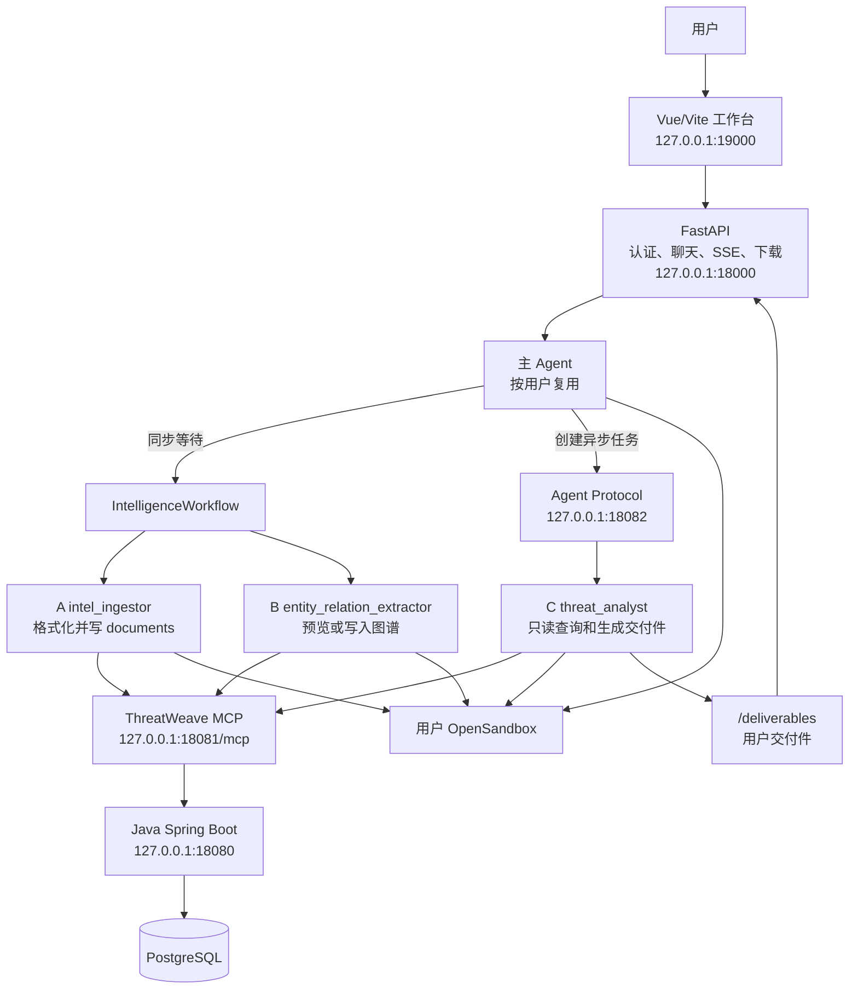
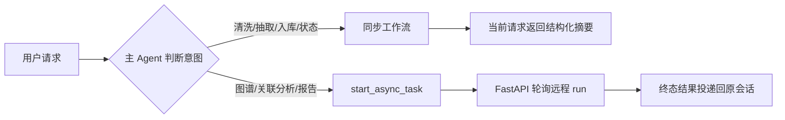
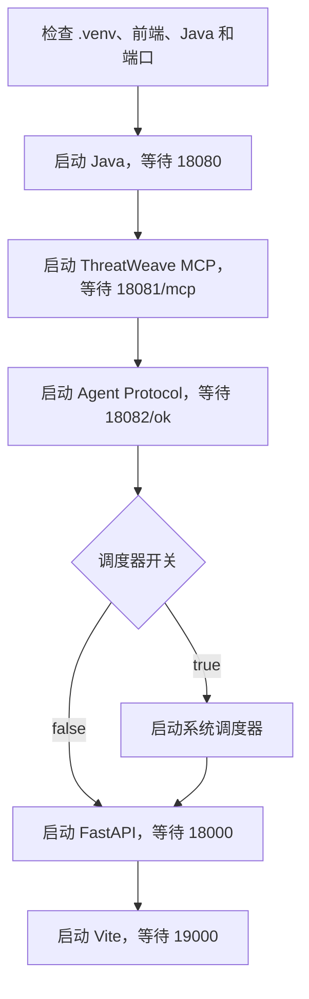
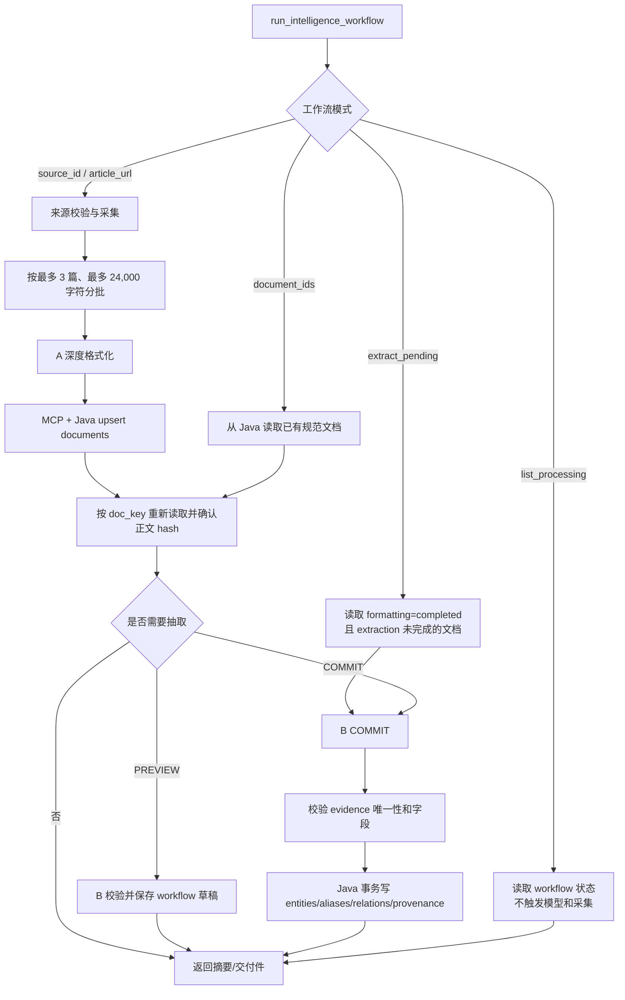
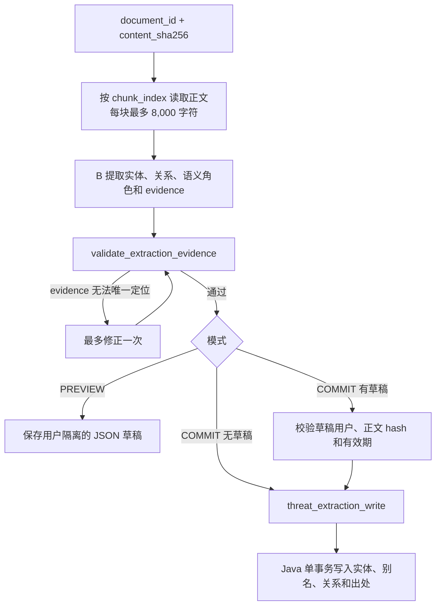
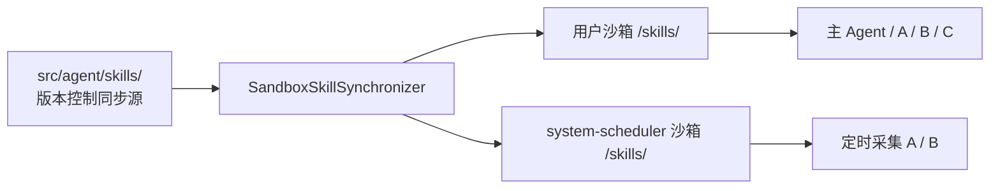
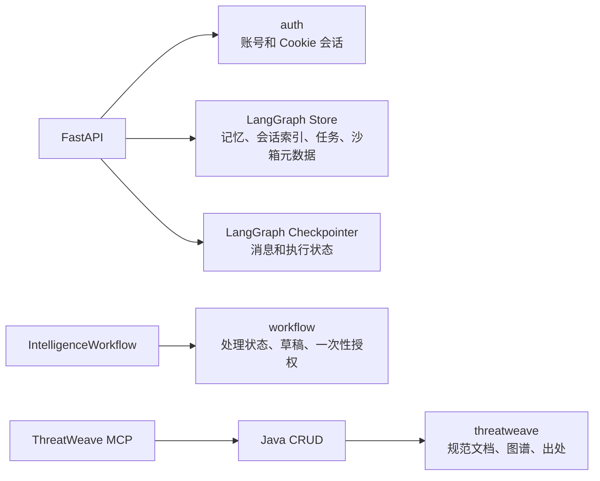
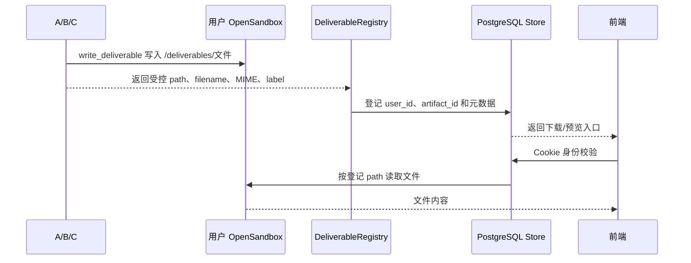
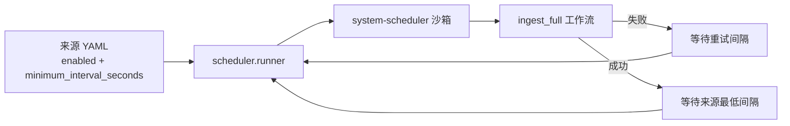

# ThreatWeave 项目技术文档

> 本文以仓库当前代码为准，说明 ThreatWeave 的运行方式、业务边界、处理链路、数据持久化、接口和排障方法。
> 它不替代 [`THREATWEAVE_CONFIRMED_DECISIONS.md`](./THREATWEAVE_CONFIRMED_DECISIONS.md) 中已经确认的业务模型；两者不一致时，应先判断是代码尚未同步还是决策已经变更。

## 0. 先理解项目

### 0.1 项目解决什么问题

ThreatWeave 是一个面向公开威胁情报的多 Agent 工作台。它把批准来源的文章处理为三类结果：

1. 保留完整事实、结构清晰的规范情报文档；
2. 带精确原文证据的实体、关系和出处数据；
3. 基于库内数据的只读分析、HTML 关系图和 Markdown 报告。

项目不是自动处置系统，不负责封禁 IOC、下发规则、自动响应或维护黑名单。所有可写入 ThreatWeave 业务库的事实，都必须能够回到规范文档中的原文证据。

### 0.2 当前实现摘要

| 事项 | 当前实现 |
| --- | --- |
| 可采集来源 | `cncert_cc_threat_warning`、`hillstone_hot_threat`，配置在 `src/agent/skills/subagents/intel_ingestor/intel-ingestion/sources/`。 |
| A：格式化 | `intel_ingestor` 由 `IntelligenceWorkflow` 同步调用；负责深度清洗和规范正文写入。 |
| B：抽取 | `entity_relation_extractor` 由同一工作流同步调用；支持预览草稿和正式入库。 |
| C：分析 | `threat_analyst` 通过 Agent Protocol 异步运行；只读查询图谱，并按需生成 HTML/Markdown 交付件。 |
| 业务事实存储 | Java Spring Boot 负责 `threatweave` schema 的事务性 CRUD；数据库为 PostgreSQL。 |
| 会话和任务状态 | FastAPI + LangGraph Store/Checkpointer，均使用同一个 PostgreSQL 服务但与 `threatweave` schema 隔离。 |
| 文件交付 | Agent 将文件写入用户 OpenSandbox 的 `/deliverables/`，后端登记 artifact 元数据后提供下载。 |
| 用户界面 | Vue/Vite 聊天工作台，使用 SSE 展示主 Agent、工具、同步子 Agent 和异步任务状态。 |

### 0.3 当前代码与早期文档的主要差异

本节是接手项目时最容易踩坑的地方。

| 早期描述或假设 | 当前代码行为 | 维护要求 |
| --- | --- | --- |
| A、B、C 都作为多个 Agent Protocol 图异步运行 | 只有 C 注册为 `threat_analyst_async`；A/B 由本地 `IntelligenceWorkflow` 同步等待。 | 不要为 A/B 创建远程任务或用任务轮询替代工作流。 |
| 只维护 CNCERT/CC 一个来源 | 当前代码已启用 CNCERT/CC 和 Hillstone 两个 YAML 来源。 | 增加来源时同步更新来源配置、测试和本文。 |
| Hillstone 详情页可以直接抓 HTML | Hillstone 详情页是 SPA 壳，采集器按 `fetch_url_template` 请求公开 JSON 接口。 | 修改来源适配器时必须保持接口转换，不能退回抓空 HTML。 |
| ThreatWeave MCP 只有四或七个工具 | 当前 `threatweave_tools.py` 注册 8 个业务工具，包含预览、草稿提交和抽取读取。 | 子 Agent 通过配置筛选最小权限，不要按“全量工具”理解权限。 |
| Java 只提供文档写入、抽取写入和图谱查询 | 当前还提供单文档抽取读取接口，供 Markdown 导出使用。 | 导出抽取结果应读取 Java 已确认数据，不从模型文本反解析。 |
| 认证可能使用旧 MySQL 配置 | 当前 `src/api/auth.py` 与 LangGraph、Java 都读取 `DB_*`，连接 PostgreSQL；`MYAGENT_AUTH_MYSQL_*` 不是当前认证配置。 | 以 `.env.example` 和 `src/agent/config.py` 为配置依据。 |
| HTML 图直接保存在项目目录并作为业务数据 | 当前 C 的 HTML 是用户沙箱交付件；`runtime/visualizations/` 只保留旧图表资源兼容路径。 | 不把 `runtime/` 当作情报正文、图谱或交付件的权威存储。 |

## 1. 总体架构

### 1.1 模块边界

| 层 | 目录或入口 | 职责 |
| --- | --- | --- |
| 启动编排 | `start_web.py` | 检查依赖和端口，按依赖顺序启动 Java、MCP、Agent Protocol、调度器、FastAPI 和 Vite。 |
| Web/API | `src/api/` | Cookie 认证、聊天、SSE、会话历史、异步任务状态、图表和交付件下载。 |
| 主 Agent | `src/agent/main_agent.py` | 识别用户意图，选择同步工作流或异步 C，管理技能、记忆和用户沙箱。 |
| 同步业务工作流 | `src/intelligence_workflow/` | 确定性地完成采集、批次、状态迁移、A/B 调用、幂等和导出。 |
| 采集器 | `src/intel_ingestor/` | 读取已批准来源，抓取文章或 JSON，进行机械清洗，生成 A 的输入。 |
| Agent 工具 | `src/agent/tools/` | 为主 Agent、工作流和 C 提供受控工具入口。 |
| MCP 适配层 | `src/mcp_server/` | 将 Java 业务接口包装为按权限筛选的 MCP 工具。 |
| Java 业务层 | `java-backend/` | PostgreSQL `threatweave` schema 的文档、实体、关系和 provenance CRUD。 |
| 调度器 | `src/scheduler/runner.py` | 使用系统专用身份周期性执行 `ingest_full`。 |
| 前端 | `frontend/src/` | 登录、会话、SSE 消息、任务轮询、中断恢复和交付件入口。 |

### 1.2 运行时拓扑



### 1.3 最重要的执行边界



- 主 Agent 不直接写 `threatweave` 业务表。
- A 只写规范文档；B 只写实体、别名、关系和 provenance；C 不写业务表。
- A/B 的完成依据是受控工具成功返回和工作流状态，而不是模型最后一句自然语言。
- C 的异步任务有独立的 Agent Protocol thread/run，但最终结果仍绑定到发起用户和父会话。

## 2. 本地运行

### 2.1 前置条件

需要以下组件：

- Windows 本地 `.venv`，Python 3.12，由 uv 创建；
- JDK、Maven 和 Node.js；
- PostgreSQL，当前 Python、Java 和认证共用 `DB_*` 连接配置；
- 可访问的 OpenSandbox 服务，默认 `127.0.0.1:18083`；
- 可用的 DeepSeek 模型服务；
- 可选的公共搜索 MCP 和 Charts MCP。

初始化 Python 环境：

```powershell
uv venv --python 3.12 .venv
uv pip install --python .\.venv\Scripts\python.exe -r requirements.txt
```

### 2.2 配置项

敏感值只放在项目根目录 `.env`，不要写入代码、Skill 或日志。完整模板见 [`.env.example`](../.env.example)。

| 配置 | 用途 | 默认或说明 |
| --- | --- | --- |
| `DEEPSEEK_API_KEY`、`DEEPSEEK_BASE_URL`、`DEEPSEEK_MODEL` | 主 Agent、摘要和子 Agent 模型 | 模型不可用时服务可以启动，但业务请求会失败。 |
| `DB_HOST`、`DB_PORT`、`DB_NAME`、`DB_USER`、`DB_PASSWORD`、`DB_SSLMODE` | PostgreSQL | 供认证、LangGraph、工作流和 Java 使用。 |
| `OPEN_SANDBOX_API_KEY` | OpenSandbox 鉴权 | 缺少时禁用沙箱预热和需要沙箱的 Agent 执行。 |
| `OPEN_SANDBOX_HOST`、`OPEN_SANDBOX_PORT`、`OPEN_SANDBOX_IMAGE` | 沙箱服务和新沙箱镜像 | 默认端口 `18083`。 |
| `MODELSCOPE_BING_SEARCH_MCP_TOKEN` | 公共搜索 MCP | 缺少时使用受限 `web_search` 降级工具。 |
| `MODELSCOPE_CHARTS_MCP_URL` | Charts MCP | C 生成 HTML 图所需；不可用时不会伪造成功图。 |
| `THREATWEAVE_SCHEDULER_ENABLED` | 是否由启动器托管定时采集 | `.env.example` 默认 `false`。 |
| `THREATWEAVE_WORKFLOW_RUNNING_LEASE_SECONDS` | 工作流 `running` 状态的崩溃恢复租约 | 默认 7200 秒，不能小于 60。 |
| `MYAGENT_*` 服务端口变量 | 覆盖 FastAPI、Vite、Java、MCP、Agent Protocol 地址 | 未配置时使用下表默认值。 |

旧的 `MYAGENT_AUTH_MYSQL_*` 变量不被当前认证代码读取，不要据此判断认证数据库。

### 2.3 默认服务

```powershell
.\.venv\Scripts\python.exe .\start_web.py
```

| 服务 | 默认地址 | 是否由 `start_web.py` 启动 | 启动探测 |
| --- | --- | --- | --- |
| FastAPI | `http://127.0.0.1:18000` | 是 | `GET /` |
| Java Spring Boot | `http://127.0.0.1:18080` | 是 | 根路径可返回 2xx-4xx 即表示监听成功，根路径 404 不代表 Java 未启动。 |
| ThreatWeave MCP | `http://127.0.0.1:18081/mcp` | 是 | Streamable HTTP；普通 GET 可能是 406。 |
| Agent Protocol | `http://127.0.0.1:18082` | 是 | `GET /ok` |
| Vue/Vite | `http://127.0.0.1:19000` | 是 | `GET /` |
| OpenSandbox | `http://127.0.0.1:18083` | 否 | 由独立服务管理。 |

启动顺序由依赖决定：



启动器的健康检查只证明进程已监听并能响应，不等同于数据库、模型、MCP 外部服务或真实沙箱业务可用。

### 2.4 停止和运行目录

在启动器终端按 `Ctrl+C`。它只停止自己创建的进程树，不停止独立 OpenSandbox，也不删除 PostgreSQL 数据。

| 路径 | 作用 | 是否为业务权威数据 |
| --- | --- | --- |
| `runtime/java-tmp/` | Java 通过 `JAVA_TOOL_OPTIONS=-Djava.io.tmpdir=...` 使用的临时目录。 | 否，但运行 Java 时应保留。 |
| `runtime/visualizations/` | 旧图表/兼容图表资源的本地缓存，FastAPI 会按 TTL 清理。 | 否，可再生。 |
| 用户沙箱 `/deliverables/` | Markdown、HTML、JSON 用户交付件。 | 是当前下载路径，但不在项目本地目录。 |
| PostgreSQL | 认证、会话、工作流状态、规范文档、实体、关系和出处。 | 是业务权威存储。 |

`runtime/` 被 `.gitignore` 忽略。除 `java-tmp` 外的运行时内容删除后，服务会按需重新创建；删除本地日志不会删除用户沙箱交付件或数据库内容。

### 2.5 验证命令

```powershell
$env:PYTHONPATH = "src"
.\.venv\Scripts\python.exe -m unittest discover -s tests -p "test_*.py"

Set-Location .\frontend
npm test
npm run build
Set-Location ..

mvn.cmd -f .\java-backend\pom.xml -DskipTests compile
```

测试主要隔离外部服务、模型和文件系统；全部通过也不代表真实来源、OpenSandbox 或 Charts MCP 已完成端到端验证。

## 3. 用户请求如何变成结果

### 3.1 主 Agent 的职责

主 Agent 由 `src/agent/main_agent.py` 组装，负责：

- 读取当前用户、会话和记忆上下文；
- 将主技能同步到用户沙箱；
- 判断请求是同步情报处理还是异步分析；
- 调用同步编排子 Agent 或提交 `threat_analyst` 异步任务；
- 把结构化结果整理为用户可读消息。

主 Agent 的普通工具包括公共搜索、异步任务操作和补充信息请求。ThreatWeave 文档、抽取和图谱工具不直接暴露给主 Agent，而由 A/B/C 的最小权限配置使用。

### 3.2 同步工作流模式

`IntelligenceWorkflowRequest` 定义五种模式：

| 模式 | 目标 | 是否采集 | 是否调用 B | 是否写图谱 |
| --- | --- | ---: | ---: | ---: |
| `format_only` | 获取或导出规范正文 | 可选 | 否 | 否 |
| `extract_preview` | 提取当前正文的结构化草稿 | 可选 | 是 | 否 |
| `ingest_full` | 格式化并完成正式抽取入库 | 可选 | 是 | 是 |
| `extract_pending` | 处理已格式化但尚未完成抽取的文档 | 否 | 是 | 是 |
| `list_processing` | 查询处理状态 | 否 | 否 | 否 |

目标可以是已批准 `source_id`、一篇符合来源规则的 `article_url` 或已有 `document_ids`。`list_processing` 只能按可选来源筛选；`extract_pending` 不能指定文章 URL 或文档 ID。

### 3.3 业务流程



工作流本身控制调用顺序和状态迁移，模型不能通过自然语言改变模式、文档身份或写库目标。

### 3.4 交付件请求规则

同步工作流只在请求明确包含以下类型时生成文件：

- `formatted_markdown`：从 Java 已确认的规范正文生成清洗后 Markdown；
- `extraction_markdown`：从 Java 已确认的实体、关系和 evidence 生成抽取结果 Markdown。

定时采集使用 `actor_id=system-scheduler`，不会生成用户交付件。普通处理、预览和入库也不会自动生成文件。

## 4. 情报来源与采集

### 4.1 来源配置

来源配置位于：

```text
src/agent/skills/subagents/intel_ingestor/
└── intel-ingestion/sources/
    ├── cncert_cc.yaml
    └── hillstone_hot_threat.yaml
```

`src/intel_ingestor/sources.py` 只接受已登记、已启用且声明许可说明的来源。配置至少包含 `source_id`、入口地址、解析器类型、文章 URL 正则、最低间隔和许可证说明。调用方不能把任意 URL 临时伪装成来源。

当前来源：

| `source_id` | 入口 | 解析器 | 关键适配逻辑 |
| --- | --- | --- | --- |
| `cncert_cc_threat_warning` | CNCERT/CC 威胁预警栏目 | `cncert_cc_listing_html` | 列表页从 `onclick` 发现文章 URL，正文通过 `div.artil_content` 提取。 |
| `hillstone_hot_threat` | Hillstone 热点威胁详情 URL | `hillstone_hot_threat_json` | 将 SPA 详情 URL 的 `id` 填入公开 `api/report/hot-threat/advice/detail` JSON 接口。 |

### 4.2 采集器的确定性职责

`src/intel_ingestor/ingestor.py`、`fetcher.py` 和 `cleaner.py` 只做可测试的机械处理：

1. 校验来源和文章 URL；
2. 抓取列表页、详情页或来源指定的详情 API；
3. 发现文章引用并解析绝对 URL；
4. 修复声明错误或不完整的字符编码；
5. 提取配置指定的正文、标题和日期；
6. 对 HTML 删除脚本、样式、表单和明确页面容器，保留标题、段落、列表、表格和文本；
7. 对 Hillstone JSON 将摘要、详细内容、受影响系统、标签、IOC、参考链接、防护建议和事件范围转换为 Markdown 草稿；
8. 生成不依赖正文内容的稳定 `doc_key`；
9. 将 `preliminary_content` 交给 A 做语义层面的深度整理。

采集器不负责判断广告、恶意性、实体类型或关系语义，也不直接写 PostgreSQL。

### 4.3 `doc_key` 和幂等

`doc_key = SHA256(source_id + ":" + external_id)`；来源没有稳定外部 ID 时退化为 `SHA256(source_id + ":" + url)`。例如 Hillstone 的 `id=4715` 会作为 `external_id`，所以详情内容更新时仍命中同一文档。

Java 以 `doc_key` 唯一键执行 upsert。正文改变时，旧的 provenance 会被删除，避免字符偏移继续指向旧正文；工作流随后把抽取状态标记为需要重新处理。

### 4.4 A 的深度格式化

`intel_ingestor` 的 Skill 和 YAML 配置位于 `src/agent/subagents/`。A 必须：

- 去除广告、导航、推荐、页脚、联系方式、乱码和重复片段；
- 恢复标题、段落、列表和表格结构；
- 保留原文完整情报事实，不摘要、不擅自补充结论；
- 使用工作流针对单篇文章签发的一次性 `access_token` 调用 `threat_document_upsert`；
- 只有工作流明确要求时才调用 `write_deliverable` 导出 Markdown。

A 不抽取实体和关系，不判断 IOC 是否恶意，不启动 B，也不自行抓取其他来源。

## 5. 实体、关系和证据抽取

### 5.1 B 的处理方式

B 使用 `threat_document_get` 按正文顺序分块读取文档，默认每块最多 8,000 字符。模型逐块提出候选，代码负责统一字段规范化、evidence 校验、去重和写入。



### 5.2 当前值域

实体类型：

```text
ipv4, ipv6, domain, url, file_hash, cve,
threat_actor, malware, campaign, attack_technique, tool, organization
```

语义角色：

```text
malicious_infrastructure, victim, research, unknown
```

关系类型：

```text
USES, ATTRIBUTED_TO, INDICATES, RESOLVES_TO,
TARGETS, EXPLOITS, COMMUNICATES_WITH
```

B 只能写入规范文档明确支持的关系。实体共同出现不等于存在关系；网络搜索可以辅助消歧，但搜索结果不是 provenance，也不能扩大原文事实范围。

### 5.3 evidence 校验

模型只提交精简 `evidence` 文本，不提交字符偏移。MCP 在完整规范正文中查找该文本，要求：

- 非空；
- 在正文中恰好出现一次；
- 通过后由代码生成 `charStart` 和 `charEnd`；
- 写入时 Java 再次确认 `document.content.substring(charStart, charEnd)` 与 `evidenceQuote` 完全相等。

无法定位、重复出现或字段不合规的候选会被拒绝；Java 事务不会写入未通过校验的事实。

### 5.4 预览草稿和正式入库

- `extract_preview`：草稿写入 `workflow.extraction_drafts`，带用户、文档 ID、正文 hash 和过期时间；不会写 `threatweave.entities`、`relations` 或 `provenance`。
- `ingest_full` / `extract_pending`：没有有效草稿时由 B 直接写入；存在当前用户和当前正文对应的草稿时，使用一次性授权提交草稿，不从 Markdown 或模型回复重建数据。
- 正文 hash 变化、草稿过期、用户不匹配或文档不存在时，草稿不能提交。

## 6. Agent、Skill 与权限

### 6.1 Agent 职责

| Agent | 执行方式 | 可访问工具或数据 | 不允许做什么 |
| --- | --- | --- | --- |
| 主 Agent | FastAPI 进程内按用户复用 | 公共搜索、补充信息、异步任务、同步工作流入口 | 不直接读写 ThreatWeave 业务表。 |
| `intelligence_workflow_orchestrator` | 主 Agent 的同步子 Agent | `run_intelligence_workflow`、`list_intelligence_processing` | 不自行调用 A、B、Java、MCP 或异步 C。 |
| `intel_ingestor`（A） | 工作流内部同步等待 | `threat_document_upsert`、`write_deliverable` | 不抽取实体关系，不提交其他任务。 |
| `entity_relation_extractor`（B） | 工作流内部同步等待 | 文档读取、evidence 校验、预览/写入、草稿提交、可选导出 | 不采集新文章，不做威胁分析。 |
| `threat_analyst`（C） | Agent Protocol 异步 | `threat_graph_query`、`generate_network_graph_html`、`write_deliverable` | 不写业务表，不修改文档、实体、关系或出处。 |

### 6.2 Skill 同步边界

仓库 `src/agent/skills/` 是版本控制下的同步源。运行时由 `SandboxSkillsMiddleware` 和 `SandboxSkillSynchronizer` 将所需目录增量同步到 OpenSandbox 的 `/skills/`；Agent 只读取沙箱副本，不直接读取宿主机 Skill 文件。



用户沙箱负责用户 Agent 文件和 `/deliverables/`；系统调度使用独立 `system-scheduler` 沙箱，不共享普通用户的文件、会话和记忆。

## 7. 持久化与数据模型

### 7.1 PostgreSQL 分区

| 区域 | 主要内容 | 创建或使用代码 |
| --- | --- | --- |
| `auth` | `users`、`sessions`、PBKDF2 密码 hash、会话 hash 和过期时间 | `src/api/auth.py` 首次需要认证时幂等创建。 |
| LangGraph Store | 用户记忆、会话索引、异步任务绑定、沙箱绑定、沙箱交付件元数据 | `src/agent/config.py`、`api/agent_loader.py`。 |
| LangGraph Checkpointer | thread 消息、工具调用、执行状态和中断 | LangGraph PostgreSQL Checkpointer。 |
| `workflow` | `document_processing`、`extraction_drafts`、两类一次性授权 | `src/intelligence_workflow/repository.py`。 |
| `threatweave` | documents、entities、entity_aliases、relations、provenance | `ThreatWeaveSchemaInitializer` 启动时幂等创建。 |



这些区域用途不同，不能互相替代：Checkpointer 不是情报库，Store 不是交付件文件系统，`workflow` 状态也不是 Java 业务事实。

### 7.2 ThreatWeave 核心表

| 表 | 关键字段和约束 |
| --- | --- |
| `documents` | `doc_key` 唯一；保存来源、URL、标题、发布时间、规范正文和 `content_sha256`。 |
| `entities` | `(entity_type, canonical_value)` 唯一；保存展示名、语义角色、置信度和观察时间。 |
| `entity_aliases` | 绑定实体的别名，`(entity_id, alias)` 唯一。 |
| `relations` | 源实体、目标实体和关系类型唯一；禁止自环。 |
| `provenance` | 一条记录只指向实体或关系之一，保存 evidence、字符范围、抽取器和置信度。 |

Java 的 schema 初始化器还创建按来源、实体、别名、关系和 provenance 查询所需的索引。项目没有独立迁移目录，表结构由启动时的幂等 DDL 管理。

### 7.3 会话、身份和并发

- 登录 Cookie 名为 `myagent_session`，有效期 7 天；数据库只保存 Cookie 的 SHA-256 摘要。
- 密码使用随机盐 PBKDF2-SHA256，当前迭代次数为 600,000。
- 业务接口通过 `get_current_user` 从 Cookie 取得身份；请求体中的 `user_id` 不能改变资源归属。
- 同一用户的多个 `thread_id` 共享当前进程内 Agent 实例，但使用独立 Checkpointer 状态。
- `AgentLoader` 的会话写入互斥只覆盖单个 FastAPI 进程，当前部署模型是单 worker；跨重启恢复依赖 PostgreSQL。
- 删除会话时会删除 checkpoint 和会话索引；不会主动取消已创建的远程 C 任务，迟到结果也不会重新创建已删除会话。

## 8. Java REST 与 ThreatWeave MCP

### 8.1 Java REST 接口

基础路径：`/api/threatweave`。

| 方法 | 路径 | 使用者 | 作用 |
| --- | --- | --- | --- |
| `POST` | `/documents` | A | 按 `doc_key` upsert 规范文档并返回文档信息。 |
| `GET` | `/documents/{documentId}` | B | 读取规范文档；MCP 再按字符预算切块。 |
| `GET` | `/documents/{documentId}/extraction` | B/导出 | 读取 Java 已确认的实体、关系及 provenance。 |
| `GET` | `/documents/by-key?docKey=...` | 工作流 | 确认 A 已写入的文档。 |
| `POST` | `/extractions` | B | 事务性写入实体、别名、关系和出处。 |
| `GET` | `/graph?query=...&documentIds=...&limit=...` | C | 只读查询图谱子集，`limit` 为 1 到 500。 |

Java 只负责业务 CRUD 和事务，不负责模型调用、Agent 编排、用户会话或交付件登记。

### 8.2 当前 8 个 MCP 工具

| 工具 | 权限 | 作用 |
| --- | --- | --- |
| `threat_document_upsert` | A | 消费一次性格式化授权，固定文档身份并写入正文。 |
| `threat_document_get` | B | 按 `chunk_index` 读取最多 8,000 字符的正文块。 |
| `threat_extraction_get` | B | 读取既有抽取结果，主要用于导出 Markdown。 |
| `validate_extraction_evidence` | B | 独立校验实体、关系字段和值域及唯一 evidence。 |
| `threat_extraction_write` | B | 再次校验后调用 Java 事务写入。 |
| `threat_extraction_preview` | B | 校验并保存用户隔离的结构化草稿，不写图谱。 |
| `commit_extraction_draft` | B | 校验正文 hash 和草稿归属后提交草稿。 |
| `threat_graph_query` | C | 只读查询实体和关系，可按文档 ID 限定范围。 |

MCP 通过 Streamable HTTP 访问 Java。工具选择不是“连接到 MCP 就拥有全部权限”，而是每个子 Agent YAML 明确声明所需工具后再装配。

## 9. 异步威胁分析与交付件

### 9.1 C 的分析链路

`src/agent/subagents/async_registry.py` 只注册 `threat_analyst_async`。C 的典型流程是：

1. 读取 `threat-analysis` Skill；
2. 调用 `threat_graph_query` 查询库内实体、关系和证据；
3. 必要时基于证据扩展有限关联；
4. 将库内事实、外部背景和模型推断分开表述；
5. 用户明确要求 HTML 图时调用 `generate_network_graph_html`；
6. 用户明确要求 Markdown 报告时调用 `write_deliverable`；
7. 结束后由 FastAPI 登记交付件并写回父会话。

HTML 图生成器要求 Charts MCP 返回 HTML，并执行离线可见性检查；当前代码不会在 Charts MCP 不可用时偷偷伪造成功结果。没有可分析的图谱数据时，C 应说明限制，而不是添加没有证据的边。

### 9.2 交付件生命周期



`write_deliverable` 只允许 Markdown、HTML、JSON，文件名只允许 ASCII 字母、数字、点、下划线和连字符，正文限制为 4 MiB 以内 UTF-8 文本，路径固定在 `/deliverables/` 根目录。

同步 A/B 由工作流写入并立即登记；异步 C 的结果在 `GET /async-tasks/{task_id}` 首次读取终态时登记。下载接口使用当前 Cookie 用户校验 artifact 归属，不以客户端传入的 `user_id` 作为授权依据。

### 9.3 Markdown 和 HTML 的来源

| 文件 | 生成方式 | 内容来源 |
| --- | --- | --- |
| 清洗后 Markdown | `format_only + formatted_markdown` | Java 已确认的 `documents.content`，不是 A 的未确认文本。 |
| 抽取结果 Markdown | `extraction_markdown` | Java `/documents/{id}/extraction` 返回的实体、关系和 provenance。 |
| HTML 关系图 | C 调用 Charts MCP 后再 `write_deliverable` | 当前查询返回的节点和有证据的边。 |
| 普通分析报告 | C 调用 `write_deliverable` | C 的分析结论，必须区分事实、背景和推断。 |

历史消息可能还包含旧的 `chart_artifact` 资源引用。`/visualizations/{artifact_id}` 是兼容和本地缓存入口；当前用户文件下载应优先走 `/deliverables/{artifact_id}`。

## 10. HTTP、SSE 和前端

### 10.1 FastAPI 路由

| 方法 | 路径 | 作用 |
| --- | --- | --- |
| `GET` | `/auth/captcha` | 获取注册验证码图片。 |
| `POST` | `/auth/register` | 校验验证码、创建账号并建立 Cookie 会话。 |
| `POST` | `/auth/login` | 登录并建立 Cookie 会话。 |
| `GET` | `/auth/me` | 查询当前用户。 |
| `POST` | `/auth/logout` | 删除会话并清理 Cookie。 |
| `GET` | `/auth/health` | 认证健康检查。 |
| `POST` | `/chat` | 非流式聊天。 |
| `POST` | `/chat/stream` | SSE 流式聊天。 |
| `POST` | `/chat/{thread_id}/resume` | 恢复信息补充或人工审批中断。 |
| `POST` | `/history` | 创建空会话。 |
| `GET` | `/history` | 列出当前用户会话。 |
| `GET` | `/history/{thread_id}/messages` | 恢复会话消息和交付件入口。 |
| `DELETE` | `/history/{thread_id}` | 删除当前用户会话。 |
| `GET` | `/async-tasks/{task_id}` | 查询 C 的异步任务状态和终态结果。 |
| `GET` | `/deliverables/{artifact_id}` | 下载交付件；HTML 带 `preview=1` 时受限预览。 |
| `GET` | `/visualizations/{artifact_id}` | 兼容旧图表资源，带 `download=1` 时下载。 |

### 10.2 SSE 事件

`src/api/chat.py` 统一输出以下事件：

| 事件 | 前端行为 |
| --- | --- |
| `token` | 追加主 Agent 文本。 |
| `tool_start` | 创建工具或委派占位卡片。 |
| `tool_args` | 显示工具调用参数。 |
| `tool_result` | 保存工具返回和可交付件元数据。 |
| `tool_end` | 结束工具状态。 |
| `interrupt` | 显示补充信息或人工审批面板。 |
| `done` | 保存 thread ID，结束本轮流式请求。 |
| `error` | 显示脱敏错误并结束本轮。 |

前端不会把原始沙箱路径直接展示给用户。消息工具结果中的 artifact 声明会转换为当前用户可访问的下载 URL；Markdown 由 `marked` 解析后经 DOMPurify 白名单清洗。

### 10.3 异步任务状态

主 Agent 提交 C 后只返回任务提交状态。前端使用可取消的轮询器调用 `/async-tasks/{task_id}`，在任务进入终态且父会话空闲时，后端以固定消息 ID 幂等写回结果。切换会话、组件卸载或取消请求时，前端清理定时器和 AbortController。

任务失败、超时、取消或超过 Agent 工具调用上限时，不应被伪装成“报告已生成”。图表-only 请求即使没有 Markdown 也可以成功；明确要求报告但没有 Markdown 交付件时，任务会被标记为失败。

### 10.4 关键前端组件

| 文件 | 职责 |
| --- | --- |
| `frontend/src/App.vue` | 登录、会话切换、SSE、轮询、队列和页面级状态。 |
| `components/AuthView.vue` | 注册、登录、验证码。 |
| `components/ChatArea.vue` | 消息列表、滚动位置和新消息提示。 |
| `components/MessageItem.vue` | 用户、助手、工具、委派、HTML 图和文件交付展示。 |
| `components/InputArea.vue` | 输入、发送和取消。 |
| `components/InterruptPanel.vue` | 补充信息和人工审批。 |
| `api/chat.js` | SSE 解析和中断恢复。 |
| `api/asyncTasks.js` | 异步任务查询和取消。 |
| `utils/chatState.js` | 消息状态、交付件和任务状态归一化。 |
| `utils/markdown.js` | Markdown 解析和 DOMPurify 清洗。 |

## 11. 定时采集

`src/scheduler/runner.py` 是独立后台进程，不监听 HTTP 端口。它当前读取 `cncert_cc.yaml`，以 `system-scheduler` 身份执行：

```text
IntelligenceWorkflowRequest(
    mode="ingest_full",
    actor_id="system-scheduler",
    source_id="cncert_cc_threat_warning",
    max_articles=3,
)
```

成功后按来源 `minimum_interval_seconds` 等待，失败后按 `THREATWEAVE_SCHEDULER_RETRY_SECONDS` 重试；使用系统专用沙箱，不共享普通用户的会话、记忆和交付件。



当前启动器从 `.env` 读取 `THREATWEAVE_SCHEDULER_ENABLED`；本地开发建议关闭，避免启动项目时立即抓取来源。调度器不会生成用户可下载的 Markdown、HTML 或 JSON 文件。

## 12. 测试、排障与已知限制

### 12.1 推荐验证顺序

遇到问题时按边界逐层验证：

1. 先确认 PostgreSQL、OpenSandbox、模型服务和端口；
2. 再确认 Java 根路径、FastAPI `/`、Agent Protocol `/ok` 和 Vite `/`；
3. 用 MCP 工具发现确认 Java MCP 已加载 8 个工具；
4. 用已批准来源 URL 验证采集器是否得到非空 `preliminary_content`；
5. 查看 `workflow.document_processing` 的格式化和抽取状态；
6. 检查 Java `documents` 是否存在当前 `doc_key` 和正文 hash；
7. 检查 B 工具结果中的 `rejected`、实体数、关系数和 provenance；
8. 最后检查 `/deliverables/{artifact_id}` 的用户归属、MIME 和实际文件内容。

### 12.2 常见现象

| 现象 | 判断方式 | 处理建议 |
| --- | --- | --- |
| Java 根路径返回 404 | `18080` 已监听且启动器健康检查通过 | 这是未定义根路由的正常现象，改查实际 `/api/threatweave/...`。 |
| MCP 普通 GET 返回 406 | MCP 日志已显示 Uvicorn running | Streamable HTTP 需要正确的请求头；不要仅凭 GET 406 判断服务失败。 |
| Hillstone 得到空正文 | 查看抓取 URL 是否仍是 `/hotthreat/detail?id=...` | 应检查是否使用 `fetch_url_template` 指向公开 JSON 接口，以及 JSON 是否包含 `result`。 |
| 文档已格式化但抽取未完成 | 查看 `workflow.document_processing` 的 `extraction_status` 和 `last_error` | 保留规范正文，使用 `extract_pending` 或针对文档 ID 重试 B。 |
| evidence 大量被拒绝 | 检查 evidence 是否在规范正文中唯一出现 | 不手工填字符偏移；让 B 提供更短且唯一的原文引文。 |
| 报告任务显示成功但没有文件 | 检查原始用户请求是否明确要求报告，以及 `write_deliverable` 工具结果 | 后端会拒绝“要求报告但没有 Markdown 交付件”的假成功。 |
| HTML 图无法生成 | 检查 `MODELSCOPE_CHARTS_MCP_URL`、Charts MCP 返回是否为 HTML、查询是否有节点/边 | 当前实现不会用未声明的替代生成方式掩盖 Charts MCP 失败。 |
| 下载 404 或无权访问 | 检查登录 Cookie、artifact 所属用户和 Store 元数据 | 不能用客户端 `user_id` 跨用户下载。 |
| 重启后会话仍在但本地文件不在 | 会话和交付件元数据在 PostgreSQL，文件内容在用户沙箱 | 不要从项目 `runtime/` 查找用户交付件。 |

### 12.3 当前边界和剩余风险

- 来源配置仍是仓库内 YAML，没有前端来源管理台；新增、启用或停用来源需要同步配置和测试。
- Java 请求模型有基础 Bean Validation，但完整值域主要由 PostgreSQL CHECK 和 MCP Python 校验共同保证；错误可能先表现为通用业务异常。
- 调度器目前只读取 `cncert_cc.yaml`，即使 Hillstone 已支持用户请求，也不会自动调度 Hillstone。
- C 的完整链路依赖 OpenSandbox、Charts MCP 和图谱中已有数据；服务启动成功不代表这三项都可用。
- 当前 `AgentLoader` 的写入互斥是单进程范围，多 worker 部署前需要增加跨进程协调。
- 本地 `runtime/visualizations/` 兼容资源有默认 7 天 TTL；用户沙箱 `/deliverables/` 的生命周期由沙箱和登记元数据管理，两者不是同一套清理机制。

## 13. 代码导航

| 想了解什么 | 从哪里开始 |
| --- | --- |
| 启动和端口 | `start_web.py` |
| 主 Agent 装配 | `src/agent/main_agent.py` |
| 主 Agent 生命周期、会话和交付件登记 | `src/api/agent_loader.py` |
| 工作流模式和状态 | `src/intelligence_workflow/schema.py`、`workflow.py`、`repository.py` |
| 来源和正文初步清洗 | `src/intel_ingestor/sources.py`、`ingestor.py`、`cleaner.py` |
| A/B 工作流工具 | `src/agent/tools/intelligence_workflow_tools.py` |
| C 异步注册和入口 | `src/agent/subagents/async_registry.py`、`async_entry.py` |
| MCP 工具和值域校验 | `src/mcp_server/tools/threatweave_tools.py`、`schema.py` |
| Java 表结构和事务写入 | `ThreatWeaveSchemaInitializer.java`、`ThreatWeaveServiceImpl.java` |
| 异步任务终态和交付件 | `src/api/async_tasks.py`、`src/services/deliverables.py` |
| 前端交付件展示 | `frontend/src/components/MessageItem.vue`、`frontend/src/utils/chatState.js` |
| 测试 | `tests/`、`frontend/`、`java-backend/` |

## 14. 权威文档关系

- [`AGENTS.md`](../AGENTS.md)：仓库开发、测试和编辑规范。
- [`THREATWEAVE_CONFIRMED_DECISIONS.md`](./THREATWEAVE_CONFIRMED_DECISIONS.md)：已确认的业务边界、实体/关系模型和存储决策。

当代码、本文和业务决策文档冲突时，优先检查当前代码和测试；确认业务意图发生变化后，再同步更新决策文档和本文。
