# ThreatWeave 项目架构与运行说明

> 面向首次接手项目的开发者与使用者。本文描述 ThreatWeave 当前可运行的架构、边界和流程。

## 1. 项目总览

ThreatWeave 是一个面向公开威胁情报的多 Agent 工作台。它将来源文章转化为可追溯的规范文档、实体关系图谱和按需分析交付件。系统的核心业务对象是威胁情报文档、实体、关系、出处和分析报告。

业务边界和数据模型以 [`THREATWEAVE_CONFIRMED_DECISIONS.md`](THREATWEAVE_CONFIRMED_DECISIONS.md) 为唯一权威来源；本文说明当前代码如何实现这些决策。

**推荐阅读顺序**：项目总览 → 服务启动 → Agent 架构 → 情报处理链路 → 持久化与沙箱 → 工具与 MCP → 异步任务 → 会话历史 → 前端展示 → 关键对象总览。

### 1.1 系统模块介绍

| 模块 | 主要代码 | 主要职责 |
| --- | --- | --- |
| 启动与进程编排 | `start_web.py` | 检查环境和端口，按依赖顺序启动 Java、MCP、异步 Agent Protocol、调度器、FastAPI 和 Vite。 |
| 前端交互 | `frontend/src/` | 登录、会话、聊天、SSE、异步任务卡片、中断恢复、HTML 图和报告下载。 |
| HTTP API | `src/api/` | 认证、对话、SSE、会话历史、异步任务状态和交付件访问。 |
| 主 Agent | `src/agent/main_agent.py` | 组装 DeepAgents 主图、同步工作流子 Agent、C 异步子 Agent、中间件、记忆和用户沙箱。 |
| 业务子 Agent | `src/agent/subagents/` | 托管 A 格式化、B 实体关系抽取的内部执行图，以及 C 的独立异步图。 |
| 情报采集 | `src/intel_ingestor/` | 读取受控来源配置，抓取文章，完成代码侧初步清洗并生成批处理输入。 |
| ThreatWeave MCP | `src/mcp_server/` | 将 Java 后端的文档 CRUD、抽取写入和图谱查询暴露给子 Agent。 |
| Java 业务后端 | `java-backend/` | 对 PostgreSQL 中的文档、实体、别名、关系和 provenance 提供事务性 CRUD。 |
| 调度器 | `src/scheduler/runner.py` | 按来源最低间隔直接执行并等待系统拥有的完整入库工作流。 |
| 持久化与运行时 | PostgreSQL、OpenSandbox、`runtime/` | 保存会话、长期记忆、认证、威胁情报业务数据和用户交付件运行资源。 |

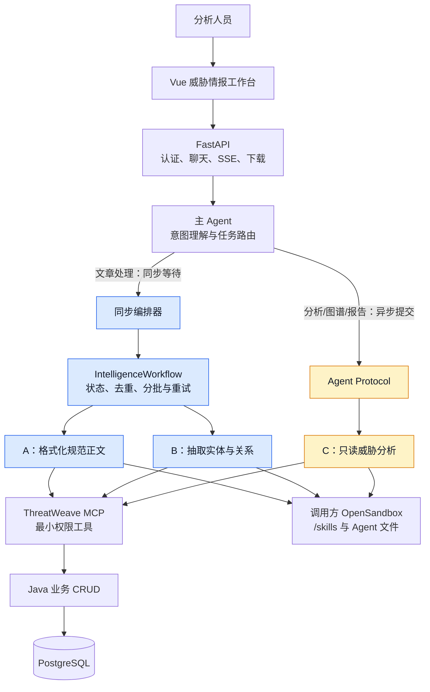

### 1.2 业务 Agent 分工

ThreatWeave 有三个业务 Agent。A 和 B 由确定性工作流以内部异步调用方式执行；C 保持独立的用户可见异步任务。编排器是主 Agent 的本地同步子 Agent，不是独立远程图。三个 Agent 的 Skill 都由仓库同步到调用方沙箱 `/skills/` 后读取；运行时不直接读取宿主技能目录。

| Agent | 主要职责 | 数据权限 |
| --- | --- | --- |
| `intelligence_workflow_orchestrator` | 主 Agent 的同步子 Agent，只调用确定性工作流并等待结果。 | 不直接写业务表。 |
| `intel_ingestor` | 以模型为主深度清洗和格式化文章，保留完整情报事实，调用 Java MCP 覆盖写入规范文档。 | 写 `documents`。 |
| `entity_relation_extractor` | 读取格式化文档，提取实体、别名、关系、语义角色和精简 evidence；预览时保存草稿，提交时写入图谱。 | 写草稿或 `entities`、`entity_aliases`、`relations`、`provenance`。 |
| `threat_analyst` | 只读查询图谱，区分库内事实、外部背景和分析推断，按需生成 HTML 图和 Markdown 报告。 | 只写用户交付件，不写业务表。 |

A 的代码工具先做来源校验、HTML 正文容器提取、编码修复、基础 Markdown 渲染和稳定 `doc_key` 生成；模型负责广告、导航、推荐、乱码、重复内容和混乱断行等深度整理。A 不抽取实体、不判断恶意性、不做威胁分析。

B 的模型负责上下文理解和语义判断；代码只负责按块读取、字段规范化、类型校验、evidence 唯一匹配、字符偏移生成、去重和事务性写入。搜索结果只能辅助消歧或背景理解，不能作为写库证据。

C 只有图谱查询和图生成能力，没有文档写入、抽取写入或数据库修改工具。HTML 图和 Markdown 报告是用户明确要求时才生成的独立交付件。

### 1.3 沙箱执行与 Skill 加载

仓库 `src/agent/skills/` 是可审计、可版本控制的 Skill 同步源，不是 Agent 的运行时文件系统。每次主 Agent、A、B 或 C 执行前，`SandboxSkillsMiddleware` 会通过 `SandboxSkillSynchronizer` 将其所需 Skill 和固定 `AGENTS.md` 增量同步到对应 OpenSandbox；随后 Agent 只从 `/skills/` 读取。

| 调用来源 | 使用的沙箱 | 其中运行的 Agent | 数据边界 |
| --- | --- | --- | --- |
| 用户聊天 | 当前用户持久化沙箱 | 主 Agent、A、B、C | 用户文件与 `/deliverables/` 只属于该用户；业务文档和图谱仍通过 MCP 写入 PostgreSQL。 |
| 定期调度 | `system-scheduler` 持久化专用沙箱 | A、B | 不含普通用户会话、长期记忆或交付件；只用于系统采集链路。 |

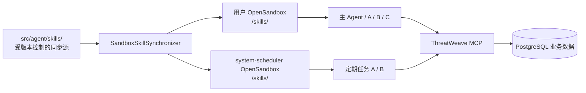

沙箱保存 Agent 所需文件和用户交付件，不是威胁情报正文或图谱的权威存储。A/B 的规范正文、抽取结果和状态仍分别由 Java CRUD 与工作流 PostgreSQL schema 持久化。

### 1.4 用户请求路由

主 Agent 只负责识别意图和选择入口；它不直接访问威胁情报业务表。文章处理始终进入同步工作流，耗时的图谱分析和交付件生成进入 C 的异步任务。

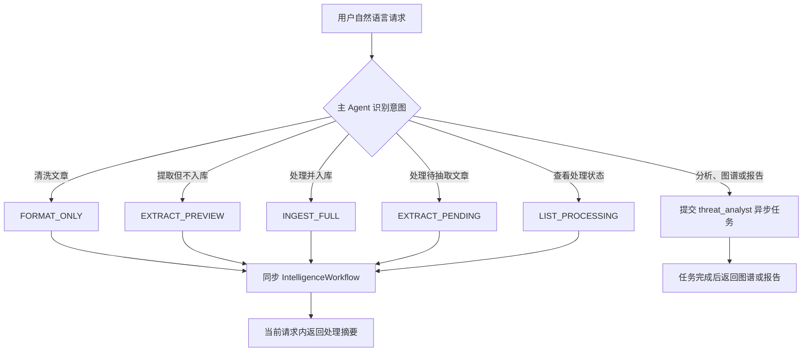

### 1.5 情报数据流

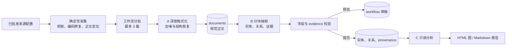

定期任务和用户明确要求“采集并入库”时，调度器或主 Agent 同步调用 `IntelligenceWorkflow` 的 `ingest_full` 模式。它按批次创建全新的 A 上下文，确认 Java 已写入规范文档后逐篇调用 B。

用户只要求抽取时走 `EXTRACT_PREVIEW`，生成与用户、正文哈希绑定的结构化草稿而不写图谱。用户要求图谱分析或报告时才提交 C 的独立分析路径。报告文件不会因为采集、抽取或分析自动产生；只有任务明确要求交付文件时，A、B 或 C 才调用统一的 `write_deliverable` 工具写入沙箱 `/deliverables/`，由后端登记为可下载 artifact。

### 1.6 运行服务

统一启动器托管以下服务：

| 服务 | 默认地址 | 说明 |
| --- | --- | --- |
| Vue / Vite | `http://127.0.0.1:19000` | 用户访问的聊天工作台。 |
| FastAPI | `http://127.0.0.1:18000` | 认证、聊天、历史、任务和资源接口。 |
| Java Spring Boot | `http://127.0.0.1:18080` | ThreatWeave PostgreSQL CRUD。 |
| ThreatWeave MCP | `http://127.0.0.1:18081/mcp` | Python MCP 适配层。 |
| Agent Protocol | `http://127.0.0.1:18082` | C 的独立异步分析图。 |
| OpenSandbox | `http://127.0.0.1:18083` | 独立外部服务，不由 `start_web.py` 启动。 |

调度器是启动器托管的后台进程，不监听 HTTP 端口。

## 2. 服务启动

### 2.1 运行前提

项目使用根目录 `.venv`，由 uv 创建。依赖 JDK 17、Maven、Node.js、PostgreSQL、OpenSandbox 和可用的模型服务。

```powershell
uv venv --python 3.12 .venv
uv pip install --python .\.venv\Scripts\python.exe -r requirements.txt
```

敏感配置只放在根目录 `.env`，参照 `.env.example`。主要配置包括：

- `DEEPSEEK_API_KEY`、`DEEPSEEK_BASE_URL`、`DEEPSEEK_MODEL`：主 Agent 和摘要模型。
- `DB_HOST`、`DB_PORT`、`DB_NAME`、`DB_USER`、`DB_PASSWORD`、`DB_SSLMODE`：PostgreSQL。
- `OPEN_SANDBOX_HOST`、`OPEN_SANDBOX_PORT`、`OPEN_SANDBOX_API_KEY`、`OPEN_SANDBOX_IMAGE`：沙箱客户端。
- `MYAGENT_*_PORT` 和 `MYAGENT_ASYNC_AGENT_PROTOCOL_URL`：服务地址覆盖项。
- `BING_SEARCH_MCP_URL`、图表 MCP 等外部 MCP 配置：按当前本机环境配置。

### 2.2 启动方式

```powershell
.\.venv\Scripts\python.exe .\start_web.py
```

启动器的顺序是：

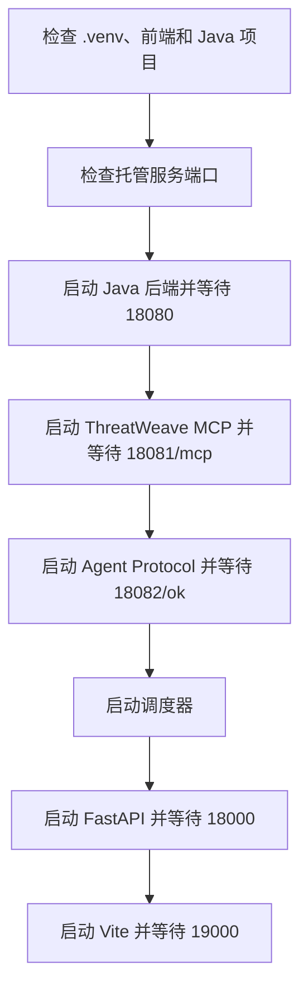

启动器只验证服务入口可响应，不代表模型、数据库、真实沙箱或业务请求已经成功。MCP 的普通 GET 可能返回 406，只要端点可处理请求即视为启动探测通过。

OpenSandbox 必须独立启动并可被项目访问。缺少 `OPEN_SANDBOX_API_KEY` 时，页面、认证和部分历史接口仍可启动，但第一次需要沙箱的 Agent 请求会失败。

### 2.3 停止和运行产物

在启动器终端按 `Ctrl+C`。启动器只停止它创建的进程树，不停止独立 OpenSandbox，也不主动删除 PostgreSQL 数据。

`runtime/` 只保存可再生的 Java 临时目录、日志和本地可视化资源，并被 `.gitignore` 忽略。服务重新启动时会自动创建需要的子目录。用户交付件主要保存在用户沙箱 `/deliverables/`，由统一 `write_deliverable` 工具写入，不应把运行日志当作业务数据。

### 2.4 验证命令

```powershell
$env:PYTHONPATH="src"
.\.venv\Scripts\python.exe -m unittest discover -s tests -p "test_*.py"

Set-Location .\frontend
npm test
npm run build
Set-Location ..

mvn.cmd -f .\java-backend\pom.xml -DskipTests compile
```

Python 测试使用 mock、内存状态和临时目录，不等同于真实模型或真实外部服务验证。真实链路验证需要同时启动服务、配置 PostgreSQL、模型、MCP 和 OpenSandbox。

## 3. 应用生命周期与持久化

### 3.1 FastAPI 生命周期

`src/api/chat.py` 创建 FastAPI 应用并注册认证、聊天、历史和异步任务路由。应用启动时执行：

1. `AgentLoader.initialize()` 创建 PostgreSQL Store 和 Checkpointer。
2. 对 LangGraph Store 和 Checkpointer 执行 `setup()`。
3. 创建 `SandboxManager`，按配置异步预热一个未分配沙箱。
4. 创建 `ThreadHistoryReader`。
5. 启动本地可视化资源清理任务。

关闭时停止清理任务，调用 `AgentLoader.shutdown()`，释放沙箱管理器和 PostgreSQL 连接。关闭不会删除 checkpoint、长期记忆、会话索引或数据库业务数据。

### 3.2 PostgreSQL 分区

项目使用同一个 PostgreSQL 服务，但按 schema 和用途隔离：

| 区域 | 内容 |
| --- | --- |
| `auth` | 用户账号、PBKDF2 密码哈希、会话 token 摘要和过期时间。 |
| LangGraph Store | 用户长期记忆、会话索引、异步任务绑定、沙箱绑定和交付件元数据。 |
| LangGraph Checkpointer | 会话消息、工具调用、执行状态和中断恢复状态。 |
| `threatweave` | 文档、实体、别名、关系和 provenance。 |
| `workflow` | 文档处理状态、仅抽取草稿和一次性内部授权。 |

LangGraph 的表由 Python `setup()` 创建；ThreatWeave 业务表由 Java `ThreatWeaveSchemaInitializer` 启动时创建。项目当前没有单独的 `db/migrations` 目录。

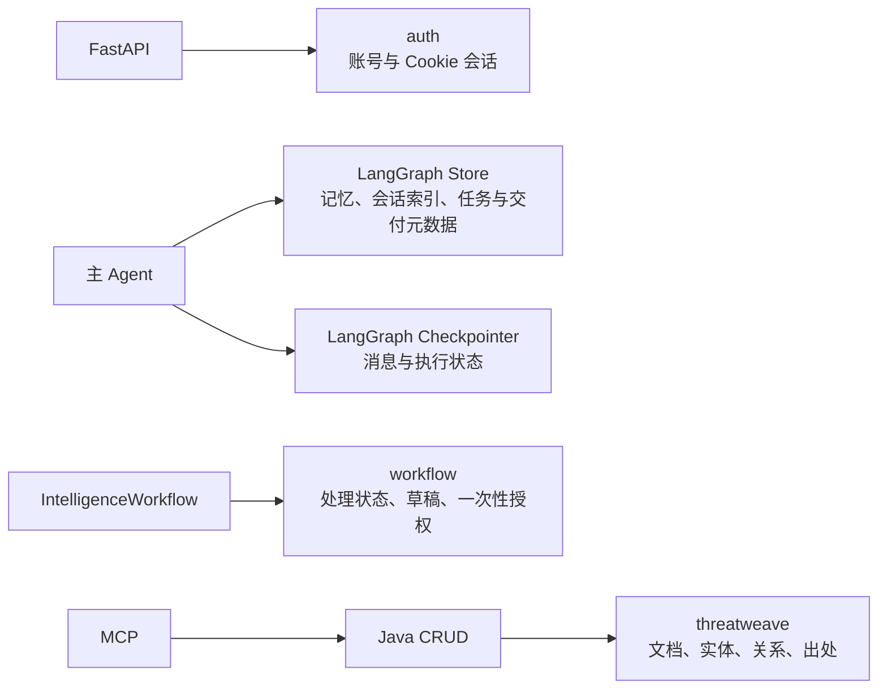

### 3.3 会话和 Agent 缓存

`AgentLoader` 维护进程内的 `user_id -> UserGroup` 缓存。同一用户的多个 `thread_id` 复用同一个主 Agent 图，但每个 thread 使用独立的 PostgreSQL checkpoint。不同用户分别拥有 Agent、沙箱和长期记忆命名空间。

进程内缓存不是跨 worker 的共享状态；跨重启恢复依赖 PostgreSQL。当前实现的会话写入互斥只覆盖单个 FastAPI 进程。

### 3.4 交付件和图表资源

A、B、C 生成的 Markdown、HTML 或 JSON 文件都经 `write_deliverable` 写入用户沙箱 `/deliverables/`。工具返回受限路径的结构化声明，后端登记 artifact ID、文件名、MIME 和用户归属；下载时重新通过 Cookie 身份校验，不能依赖客户端传入的 `user_id`。

本地图表资源位于 `runtime/visualizations/`，通过 `/visualizations/{artifact_id}` 提供访问。HTML 预览使用 `sandbox allow-scripts` 的受限上下文，下载使用附件响应；过期资源返回占位 SVG，而不暴露本地路径。

## 4. 用户认证与身份边界

### 4.1 认证流程

认证实现位于 `src/api/auth.py`，使用 PostgreSQL `auth` schema。注册需要一次性验证码；登录只需要账号和密码。密码使用独立随机盐的 PBKDF2-SHA256 哈希保存，数据库不保存明文密码。

认证接口为：

| 方法 | 路径 | 作用 |
| --- | --- | --- |
| `GET` | `/auth/captcha` | 创建验证码图片。 |
| `POST` | `/auth/register` | 校验验证码、创建用户并建立会话。 |
| `POST` | `/auth/login` | 校验账号密码并建立会话。 |
| `GET` | `/auth/me` | 根据 HttpOnly Cookie 获取当前用户。 |
| `POST` | `/auth/logout` | 删除数据库会话并清除 Cookie。 |
| `GET` | `/auth/health` | 认证模块健康检查。 |

会话 token 只通过 HttpOnly Cookie 传递，数据库保存 SHA-256 摘要。`/auth/me`、聊天、历史、异步任务和交付件下载均使用当前 Cookie 身份。

### 4.2 身份约束

业务请求体中的 `user_id` 不再作为可信身份来源。会话归属、异步任务归属、交付件归属和长期记忆命名空间均使用服务端解析出的当前用户。

会话 API 先校验 `thread_id` 是否属于当前用户；异步任务查询只允许任务所属用户访问；交付件下载使用 `get_current_user`，不接受请求参数覆盖身份。

## 5. Agent 架构与中间件

### 5.1 主 Agent

`src/agent/main_agent.py` 是主图组合根，负责装配：

- DeepSeek 主模型和摘要模型；
- 公共网络搜索工具；
- 异步任务提交、查询、列举和取消工具；
- 补充信息工具；
- 主 Agent 技能管理工具；
- 同步工作流编排子 Agent 和 C 的远程子 Agent 规格；
- 用户级 OpenSandbox backend，并将该稳定代理传给同步工作流工具；
- PostgreSQL Store 和 Checkpointer。

主 Agent 只负责理解用户意图、选择同步工作流或异步分析任务、整理结果和回答用户，不直接调用 ThreatWeave 文档、抽取或图谱业务工具。

### 5.2 中间件顺序

主 Agent 使用以下中间件：

1. `ContextInjectionMiddleware`：将运行时用户身份和记忆路径注入模型可见上下文。
2. `SandboxSkillsMiddleware`：在 DeepAgents 发现技能前，将版本控制下的技能同步到当前用户沙箱；运行时只发现沙箱 `/skills/` 副本。
3. Agent protection middleware：限制模型/工具调用次数，支持自动摘要和主动压缩。
4. `SkillManagementVisibilityMiddleware`：只在用户请求技能管理时暴露技能管理工具。
5. `MemoryUpdateMiddleware`：Agent 完成后更新用户偏好和近期查询。

中间件中的上下文、checkpoint 和 Store 是运行时状态，不应与 ThreatWeave 业务表混用。

### 5.3 异步子 Agent 注册

`src/agent/subagents/async_registry.py` 只为用户可见的远程图声明名称、图 ID、配置文件、工具加载器和启动说明。`langgraph.json` 只注册以下图：

```text
threat_analyst_async
```

主 Agent 的本地 `intelligence_workflow_orchestrator` 通过 `task` 同步执行 A/B 工作流；只有 C 通过 Agent Protocol 创建独立 thread/run。C 的任务结果由 FastAPI 轮询并在父会话空闲时投递。

## 6. 情报采集和格式化链路

### 6.1 来源配置

第一阶段来源配置为：

```text
src/agent/skills/subagents/intel_ingestor/
  intel-ingestion/sources/cncert_cc.yaml
```

`src/intel_ingestor/sources.py` 负责读取和校验来源配置。来源至少需要 `source_id`、入口 URL、启用状态、解析器类型、最低间隔和文章 URL 模式。来源配置是代码可校验的结构化文件，不能在 Agent 运行中临时扩展。

### 6.2 代码侧采集

`src/intel_ingestor/ingestor.py` 和 `cleaner.py` 负责确定性处理：

1. 校验来源是否登记且启用。
2. 抓取来源列表页。
3. 从 `href` 或 `onclick` 发现符合模式的文章 URL。
4. 逐篇抓取文章页。
5. 修复字符编码，提取配置指定的正文容器。
6. 清除脚本、样式和明显页面容器噪声，转为基础 Markdown。
7. 根据来源、外部 ID 和 URL 生成稳定 `doc_key`。
8. 生成 `preliminary_content`，交给 A 做深度格式化。

这一步不写数据库，不负责判断广告、恶意性、IOC 或关系语义，也不把初步清洗结果当成最终正文。

### 6.3 编排和上下文边界

`IntelligenceWorkflow` 负责来源采集、状态检查和受控分批。每次最多处理三篇，并受正文字符预算限制；超过数量或预算就切换到下一批。每批都新建一个 A 上下文，上一批的正文不会继续留在下一批上下文中。

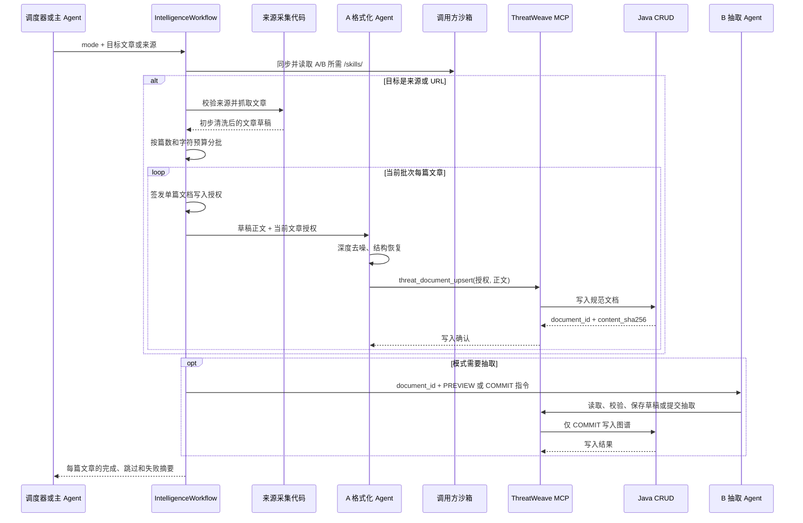

工作流在返回前等待 A/B 完成；它的结构化摘要才是格式化、预览或入库状态的依据。

### 6.4 A 的最终格式化和写入

`intel_ingestor` 必须先从调用方沙箱 `/skills/` 读取 `intel-ingestion` Skill。它逐篇完成：

- 去除广告、导航、推荐阅读、版权声明、联系方式和无关页面文字；
- 去除乱码和明显重复内容；
- 恢复混乱的标题、段落、列表和表格；
- 保留正文中的完整威胁情报事实，不概括补充、不编造结论；
- 使用当前文章的一次性写入授权；
- 调用 `threat_document_upsert` 写入最终正文。

工作流授权绑定 `doc_key`、来源、URL 和发布时间；A 只提交格式化后的正文和可选标题。MCP 根据最终正文计算 `content_sha256`。同一 `doc_key` 再次写入时覆盖文档内容和元数据；如果正文发生变化，Java 服务删除旧 provenance，避免旧字符偏移指向新正文。

工作流在 Java 确认规范文档后决定是否调用 B。A 不提交 B；B 失败时保留规范文档并仅重试 B，正文 hash 变化时将旧抽取标记为过期。

## 7. 实体、关系和出处抽取

### 7.1 B 的处理流程

`entity_relation_extractor` 先从调用方沙箱 `/skills/` 读取自己的 Skill，再使用 `threat_document_get` 分块读取正文。长文档按顺序切块，模型逐块建立候选，在全部块处理完后统一调用校验和写入。

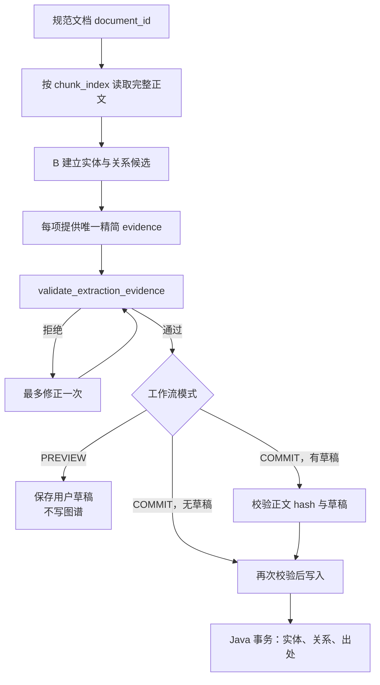

模型只提交 `evidence` 文本，不提交字符位置。Python MCP 在完整格式化正文中查找该引文，要求它非空且唯一出现，然后生成 `charStart`、`charEnd` 和固定 `extractor`。不存在、重复或不匹配的 evidence 会被拒绝。

### 7.2 实体与关系范围

实体类型、关系类型和语义角色以凿定决策为准。当前实体类型包括：

```text
ipv4, ipv6, domain, url, file_hash, cve,
threat_actor, malware, campaign, attack_technique, tool, organization
```

关系类型包括：

```text
USES, ATTRIBUTED_TO, INDICATES, RESOLVES_TO,
TARGETS, EXPLOITS, COMMUNICATES_WITH
```

语义角色包括：

```text
malicious_infrastructure, victim, research, unknown
```

B 只能写入格式化原文明确支持的关系，不能因为两个实体共同出现就推导关系。网络搜索可以帮助名称消歧或理解背景，但不能扩大原文事实范围，也不能成为 provenance 的 evidence。

### 7.3 校验和写入

`threat_extraction_write` 会再次读取文档并重复执行候选校验，防止模型绕过独立校验工具。`PREVIEW` 与草稿 `COMMIT` 使用工作流签发的一次性授权，模型不能指定其他用户或草稿。通过后调用 Java `/api/threatweave/extractions`，Java 服务在单个事务中：

1. upsert 实体；
2. 写入别名并按唯一键去重；
3. 找到关系两端实体并 upsert 关系；
4. 校验证据字符范围和引文正文匹配；
5. 写入 provenance 并按唯一约束去重。

任何业务异常都会回滚本次抽取写入。重复处理同一文档不会制造重复实体、关系或出处。

## 8. ThreatWeave Java CRUD 与 MCP

### 8.1 Java REST 接口

Java 后端入口为 `com.threatweave.threatweave.ThreatWeaveController`，基础路径为 `/api/threatweave`：

| 方法 | 路径 | 用途 |
| --- | --- | --- |
| `POST` | `/documents` | A 写入或覆盖格式化文档。 |
| `GET` | `/documents/{documentId}` | B 读取格式化文档。 |
| `GET` | `/documents/by-key` | 工作流确认 A 写入的规范文档。 |
| `POST` | `/extractions` | B 写入实体、关系和出处。 |
| `GET` | `/graph` | C 查询实体和关系子图。 |

Java 只提供受控业务 CRUD，不处理 Agent 编排和模型调用。`ThreatWeaveSchemaInitializer` 在启动时创建 `threatweave` schema 和索引。

### 8.2 MCP 工具权限

`src/mcp_server/tools/threatweave_tools.py` 注册七个业务工具：

| 工具 | 使用者 | 作用 |
| --- | --- | --- |
| `threat_document_upsert` | A | 用工作流签发的一次性授权写入最终格式化文档，MCP 固定来源身份并计算内容哈希。 |
| `threat_document_get` | B | 按字符预算读取正文分块。 |
| `validate_extraction_evidence` | B | 校验候选字段和唯一 evidence。 |
| `threat_extraction_write` | B | 再次校验后事务性写入抽取结果。 |
| `threat_extraction_preview` | B | 用一次性授权保存当前用户的结构化抽取草稿，不写图谱。 |
| `commit_extraction_draft` | B | 用一次性授权再次校验并提交有效草稿。 |
| `threat_graph_query` | C | 只读查询图谱。 |

实际装配由内部运行器和 `async_registry.py` 按子 Agent 选择工具。A 不获得图谱查询，B 不获得文档 upsert，C 不获得任何写库工具。

### 8.3 MCP HTTP 边界

MCP 使用 Streamable HTTP，生命周期中创建复用的 `httpx.AsyncClient`，通过 `JAVA_API_BASE_URL` 请求 Java 后端。业务错误转换为安全的工具异常，不把响应中的密码、token 或内部调试正文传给模型。

## 9. 威胁分析与交付件

### 9.1 C 的分析流程

`threat_analyst` 开始前从用户沙箱 `/skills/` 读取 `threat-analysis` Skill，然后：

1. 根据用户问题确定查询范围、起点和限制。
2. 使用 `threat_graph_query` 查询实体、关系和可用证据。
3. 必要时沿有证据的关系扩展一跳，不重复相同查询。
4. 把库内事实、网络背景和模型推断分开表达。
5. 按用户请求生成 HTML 图、Markdown 报告，或只在聊天中返回结果。

若有效查询第一次就返回空的 entities 和 relations，C 停止后续查询。用户要求图时生成空图，用户要求报告时生成“当前没有可分析实体或关系”的报告。

### 9.2 HTML 图

用户要求 HTML 图时，C 优先调用配置的 Charts MCP `generate_network_graph_html`；不可用或无返回时使用本地 `build_threat_graph_html`。生成的 HTML 由 C 使用 `write_deliverable` 写入用户沙箱 `/deliverables/`，工具返回结构化交付声明，后端据此登记下载信息。

图中只放当前查询支持的节点和边，不为视觉效果添加无证据关系。图不是 ThreatWeave 业务表中的一部分。

### 9.3 Markdown 报告

用户明确要求 Markdown 报告时，C 使用 `write_deliverable` 写入 `/deliverables/`。报告应包含分析范围、库内证据、主要关联、风险判断、外部背景、限制和下一步建议，并清楚区分事实与推断。

A、B 的 Markdown 导出同样是单独的用户任务，不会因为处理成功自动生成。导出文件与分析报告共用交付件登记和下载接口。

## 10. C 异步分析与定期采集

### 10.1 主 Agent 提交任务

主 Agent 可使用异步任务工具提交已注册图，工具会创建 Agent Protocol thread/run，并将任务绑定到当前主会话。前端收到任务 ID 后显示委派卡片，不把提交回执误认为最终结果。

可用任务操作包括：

- `start_async_task`：启动 C 的深度分析、图谱或报告任务；A、B 与编排器通过同步子 Agent 调用；
- `check_async_task`：读取远程任务状态和最终结果；
- `list_async_tasks`：列出当前会话可见任务；
- `cancel_async_task`：取消任务。

这些工具属于主 Agent 的通用异步能力，不能删除或用一次性 HTTP 请求替代。

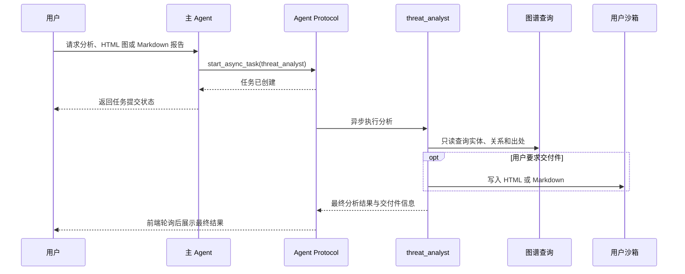

### 10.2 状态查询和投递

`src/api/async_tasks.py` 通过 Agent Protocol 查询远程 run，归一化状态、错误、最终文本和交付件。任务进入终态后，只有在父会话不忙且未被中断时，结果才写回父会话；父会话已删除时不会被迟到结果重新创建。

接口为：

```text
GET /async-tasks/{task_id}
```

前端使用带取消能力的轮询器等待终态，切换会话或组件卸载时清理定时器和请求。任务失败会显示错误并保留可重试的状态；查询重试不会重新创建原任务。

### 10.3 定期调度

`src/scheduler/runner.py` 读取唯一的 `cncert_cc.yaml`，按 `minimum_interval_seconds` 直接等待：

```text
IntelligenceWorkflow(mode=ingest_full)
actor_id = system-scheduler
max_articles = 3
```

调度器在后台等待完整工作流。失败按 `THREATWEAVE_SCHEDULER_RETRY_SECONDS` 延迟重试；成功完成后等待来源的最低间隔。它不使用普通用户会话或记忆，但会持久化取得 `system-scheduler` 专用 OpenSandbox，供 A/B 同步 Skill 并在沙箱内执行。

调度器不监听端口。工作流持久化每篇文档的格式化和抽取状态：A 成功而 B 失败时，下次运行可复用规范文档，仅重试 B；完整工作流成功才解释为业务链路完成。

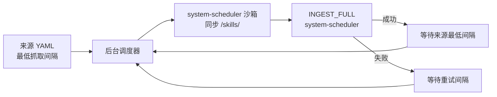

## 11. HTTP 请求、会话历史和前端

### 11.1 API 路由

聊天、历史、异步任务和资源接口由 `src/api/chat.py` 注册：

| 方法 | 路径 | 用途 |
| --- | --- | --- |
| `POST` | `/chat` | 非流式聊天。 |
| `POST` | `/chat/stream` | SSE 流式聊天。 |
| `POST` | `/chat/{thread_id}/resume` | 恢复信息补充或人工审批中断。 |
| `POST` | `/history` | 创建空会话。 |
| `GET` | `/history` | 列出当前用户会话。 |
| `GET` | `/history/{thread_id}/messages` | 恢复会话消息和任务信息。 |
| `DELETE` | `/history/{thread_id}` | 删除当前用户空闲会话。 |
| `GET` | `/visualizations/{artifact_id}` | 打开或下载本地图表 artifact。 |
| `GET` | `/deliverables/{artifact_id}` | 下载或受限预览沙箱交付件。 |

### 11.2 SSE 事件

前端 `frontend/src/api/chat.js` 读取 SSE，`App.vue` 根据事件更新消息状态：

- `token`：追加助手文本；
- `tool_start`：创建工具或委派占位；
- `tool_args`：累积工具参数；
- `tool_result`：写入工具返回；
- `tool_end`：结束普通工具状态；
- `interrupt`：显示补充信息或人工审批面板；
- `done`：保存会话 ID 并结束本轮；
- `error`：显示安全错误并结束异常状态。

同步子 Agent 的内部消息不会直接展示。异步任务只先显示提交状态，终态结果由 `/async-tasks/{task_id}` 查询并补充到委派卡片。

### 11.3 会话历史

会话索引存储在 LangGraph Store 的 `("sessions", user_id)` 命名空间，完整消息和执行状态存储在 Checkpointer。创建、列表、读取和删除会话都先校验 Cookie 身份与会话归属。

打开会话时，`ThreadHistoryReader` 只读恢复 checkpoint，不调用模型、不调用沙箱、不重新执行工具。历史转换逻辑会恢复中断信息、异步任务状态、HTML 图和用户交付件入口。

删除会话时，后端先获取会话操作 guard 并复查归属，再删除 checkpoint、会话索引和进程内 thread 记录。删除不会自动取消远程 Agent Protocol 任务；迟到任务结果会因父会话不存在而被丢弃。

### 11.4 前端组件

| 组件 | 职责 |
| --- | --- |
| `App.vue` | 维护认证、当前会话、SSE、异步轮询、队列和页面级状态。 |
| `AuthView.vue` | 注册、登录和验证码。 |
| `ChatArea.vue` | 消息列表和滚动。 |
| `InputArea.vue` | 输入和发送。 |
| `InterruptPanel.vue` | 信息补充和人工审批。 |
| `MessageItem.vue` | Markdown、工具、委派、图表和报告入口。 |
| `markdown.js` | 使用 marked 解析并用 DOMPurify 清洗 Markdown。 |
| `chatState.js` | 处理前端消息状态和任务状态转换。 |

页面使用 ThreatWeave 深色控制台主题。图表 HTML 通过独立资源入口打开，不直接插入聊天 DOM；Markdown、链接和图片使用前端白名单规则清洗。

## 12. 关键对象关系总览

### 12.1 核心对象

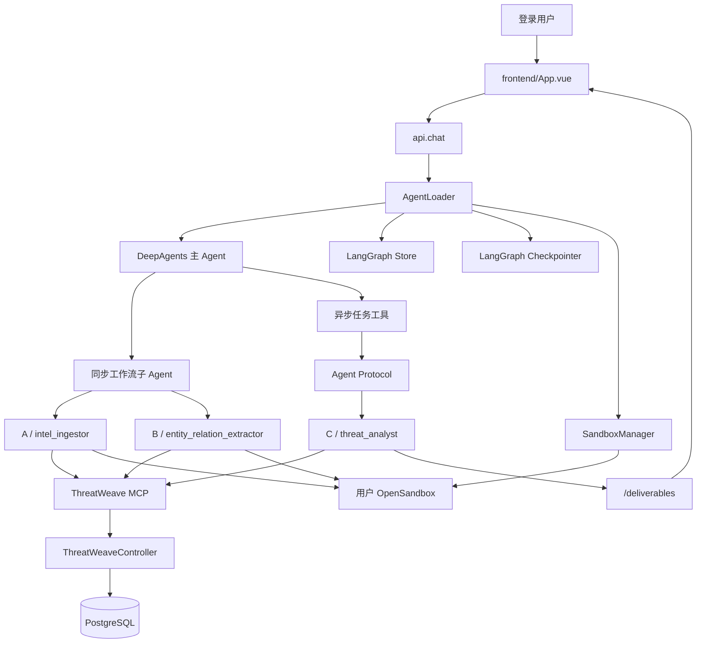

### 12.2 主要对象职责

| 对象 | 主要职责 |
| --- | --- |
| `AgentLoader` | 初始化持久化和沙箱，按用户缓存主 Agent，维护会话、任务和交付件索引。 |
| `SandboxManager` | 预热、创建、复连、续期和关闭用户沙箱。 |
| `SandboxBackendProxy` | 保持 Agent 图中 backend 引用稳定，将操作转发到当前沙箱。 |
| `IntelligenceWorkflow` | 确定性来源采集、批次切分、状态迁移及 A/B 调用顺序。 |
| `intelligence_workflow_orchestrator` | 主 Agent 的同步任务入口，只调用工作流工具。 |
| `intel_ingestor` | 深度格式化文档并写入规范文档。 |
| `entity_relation_extractor` | 预览时保存结构化草稿，提交时写入实体、关系和 provenance。 |
| `threat_analyst` | 只读查询并生成按需分析交付件。 |
| `ThreatWeaveController` | 暴露 Java 文档、抽取和图谱 REST 接口。 |
| `threatweave_tools.py` | 为 Agent 提供最小权限 MCP 工具。 |
| `ThreadHistoryReader` | 从 checkpoint 恢复前端所需的会话状态。 |
| `visualization_artifacts.py` | 管理本地图表文件和过期清理。 |

### 12.3 持久化边界

```text
认证用户和会话       -> PostgreSQL auth schema
用户长期记忆         -> LangGraph Store，namespace=(user_id,)
会话索引             -> LangGraph Store，namespace=("sessions", user_id)
异步任务绑定         -> LangGraph Store，namespace=("async_tasks", ...)
沙箱绑定和交付元数据 -> LangGraph Store
会话消息和执行状态   -> LangGraph Checkpointer，按 thread_id
文章处理状态、草稿和授权 -> PostgreSQL workflow.document_processing / extraction_drafts / *_access_grants
规范情报文档         -> PostgreSQL threatweave.documents
实体和别名           -> PostgreSQL threatweave.entities / entity_aliases
关系                 -> PostgreSQL threatweave.relations
精确出处             -> PostgreSQL threatweave.provenance
用户 Agent 文件与交付件 -> 用户 OpenSandbox；技能位于 /skills/，交付件位于 /deliverables/
调度 Agent 文件       -> system-scheduler OpenSandbox；技能位于 /skills/
本地图表缓存         -> runtime/visualizations/，可清理、可再生
技能源文件           -> src/agent/skills/（同步源）；实际读取副本位于用户或 system-scheduler 沙箱 /skills/
```

Store、Checkpointer、用户/系统沙箱和 ThreatWeave 业务数据库解决不同问题：Store 保存索引和长期状态，Checkpointer 保存会话执行状态，沙箱保存 Agent 文件，Java/PostgreSQL 保存威胁情报业务事实。它们不能互相替代。
