# 1. 项目总览

## 1.1 项目简介

ThreatWeave 是一套基于 **Harness 工程（Agent Harness）** 设计的多 Agent 系统，以**公开威胁情报的采集、整理与分析**为核心业务。

项目基于 DeepAgents 与 LangGraph 构建 Agent 协作机制，将大语言模型、工具调用、技能编排、沙箱执行环境、状态持久化及运行时防护组织为完整的执行体系。**主 Agent 负责意图理解与任务编排，同步与异步子 Agent 按各自职责执行具体业务**，协同向用户交付结果。

用户可通过对话式交互导入文章、下达分析任务，按需获取结构化报告或知识图谱可视化。前端工作台为上述能力提供统一的操作入口。

项目将来源站点或用户提供的文章 URL 转换为规范化正文，从中抽取威胁实体（IoC、TTPs、威胁行为者等）及其关联关系，并保留对应的原文证据以支持溯源。

核心工作分为两类：

- **构建情报数据**：将分散在网页中的非结构化内容整理为结构化、可追溯的威胁事实。
- **消费情报数据**：通过查询、统计与关联分析回答具体问题。

**下表列出主要使用场景及其结果：**

| 使用场景 | 项目提供的能力 | 主要结果 |
| --- | --- | --- |
| 导入指定文章或已配置来源的文章 | 采集正文、清洗格式、写入文档并抽取实体关系。 | 规范文章、结构化事实和处理结果。 |
| 查看某篇已入库文章 | 查询规范正文，以及该文章支持的实体、关系和证据。 | 对话结果，或用户要求的 Markdown 文件。 |
| 分析库内情报 | 查询文章、实体、关系和出处，进行跨文章统计与关联分析。 | 对话结果，或用户要求的 Markdown 报告、HTML 关系图。 |
| 持续积累来源情报 | 按已启用来源的采集间隔自动执行导入流程。 | 持续更新的情报数据和处理状态。 |

**已入库的规范正文是情报事实的依据。** 实体和关系的出处记录包含原文引文及其在正文中的位置，使结果可以追溯到支持它的文章。

外部搜索用于补充背景，分析器也可以提出推断；回答中需要**明确区分库内事实、分析推断和外部背景**。

当前业务范围是**情报采集、查询和分析**，不包含封禁 IOC、下发检测规则或自动响应等安全处置能力。

来源配置、实体关系值域和处理语义在第 3 章展开。

## 1.2 系统组成

系统由**前端工作台、Python 应用、Java 业务服务、PostgreSQL 和 OpenSandbox** 组成，通过 HTTP、MCP 和数据库连接协作。

Python 应用承载对话 API、Agent、情报处理 Pipeline、查询 MCP 适配服务和定时调度器。它们与其他服务的关系如下。

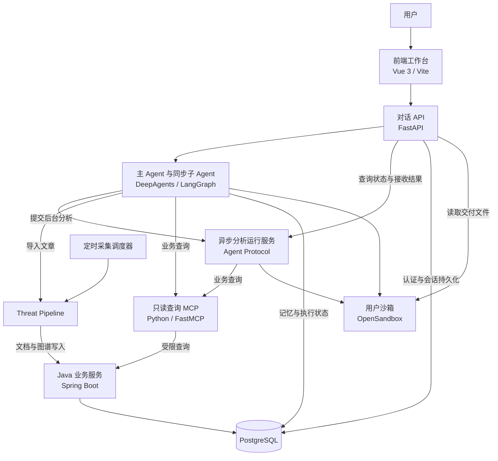

**用户交互与任务执行**分为三个部分：

- **前端工作台**：提供登录、会话切换、消息展示和文件访问入口。
- **FastAPI 应用**：验证身份、管理会话请求，将文本、工具状态和中断信息转换为前端事件。主 Agent 和同步子 Agent 在该进程中运行。
- **Agent Protocol 服务**：独立执行后台分析。前端通过 FastAPI 查询任务状态并取得结果。

**业务数据的读写由 Java 服务统一承接：**

- **写入路径**：Threat Pipeline 通过类型化 HTTP 命令写入规范文章和图谱事实。
- **查询路径**：Agent 通过 Python 查询 MCP 调用 Java 服务，由 Java 执行受限查询。

**PostgreSQL 保存数据和状态，OpenSandbox 提供执行环境并保存交付文件。** 文件归属和下载所需元数据登记在 PostgreSQL，文件内容保存在用户沙箱。详细存储边界见第 4 章。

外部服务提供三类支持：

- **模型服务**：支持对话、正文清洗、实体关系抽取和上下文处理。
- **公共搜索 MCP**：按需要补充外部背景。
- **图表 MCP**：为用户明确要求的关系图生成 HTML 内容。

## 1.3 核心模块

仓库**按照运行职责组织代码**。前端与 Java 服务各有独立工程目录，Python 模块位于 `src/` 下。主要代码入口及职责如下。

| 模块 | 主要代码位置 | 职责 |
| --- | --- | --- |
| 启动编排 | `start_web.py` | 准备子进程环境，检查端口，按顺序启动服务，转发日志并管理进程退出。 |
| 前端工作台 | `frontend/src/` | 管理登录态、会话与页面状态，消费 SSE，展示任务、中断、图表和下载入口。 |
| 对话与用户 API | `src/api/` | 提供认证、聊天、历史、异步任务状态和交付件访问接口，并验证数据归属。 |
| Agent 编排 | `src/agent/main_agent.py`、`src/agent/subagents/` | 组装主 Agent 和子 Agent，配置能力，完成同步委派和异步任务接入。 |
| Agent 执行支持 | `src/agent/backends/`、`src/agent/middlewares/` | 提供沙箱后端、技能同步、身份上下文、记忆更新及调用保护。 |
| 工具与技能 | `src/agent/tools/`、`src/agent/skills/` | 提供本地工具、远端 MCP 接入和按角色配置的任务指引。 |
| 情报采集 | `src/intel_ingestor/` | 管理来源配置，发现和抓取文章，解析正文并生成初步格式化内容。 |
| 情报处理 | `src/threat_pipeline/` | 控制清洗、文档写入、抽取和图谱替换流程，维护幂等和失败状态。 |
| 采集调度 | `src/scheduler/` | 按来源配置的间隔直接执行 Pipeline，处理采集失败后的重试。 |
| 查询 MCP | `src/mcp_server/` | 将 Java 的读模型描述和受限 SQL 查询接口适配为模型可调用的工具。 |
| Java 业务服务 | `java-backend/` | 维护业务表，提供文档和抽取结果的事务写入，以及受限业务查询。 |
| 交付资源服务 | `src/services/` | 校验与登记交付文件，管理兼容图表资源及其清理。 |

文章处理中的职责分工是：**采集器取得内容，Pipeline 控制处理顺序，Java 服务保证业务写入的一致性，Agent 理解任务并使用结果。**

定时调度器直接复用 Pipeline，因此**自动采集和用户发起的导入遵循同一套处理规则**。

其他项目文件按用途组织：

- **文档与测试**：`doc/` 保存项目说明及相关文档；`tests/` 和 `frontend/tests/` 保存相关行为的测试。
- **依赖配置**：Python、前端和 Java 分别使用 `requirements.txt`、`frontend/package.json` 和 `java-backend/pom.xml`。
- **沙箱镜像**：`sandbox/` 保存运行镜像的构建文件。

## 1.4 服务启动

项目主要在 Windows 本地开发环境运行，**统一启动入口是根目录的 `start_web.py`**。

- **托管进程**：Java、查询 MCP、异步 Agent Protocol、FastAPI 和 Vite 五个服务，以及按配置启用的定时采集调度器。
- **外部依赖**：PostgreSQL、OpenSandbox、模型服务和远端 MCP 服务，需要独立准备。

**运行依赖**

| 依赖 | 用途与准备要求 |
| --- | --- |
| Python 3.12 与 uv | 使用仓库根目录的 `.venv` 环境，安装 `requirements.txt` 中的依赖。 |
| Java 17 与 Maven | 编译并运行 `java-backend/`；Maven 命令需可用，也可通过 `MYAGENT_JAVA_MAVEN_COMMAND` 指定。 |
| Node.js 与 npm | 安装并运行前端。Windows 启动器默认使用 `%ProgramFiles%\nodejs\npm.cmd`。 |
| PostgreSQL | 提供认证、Agent 持久化和情报业务存储；Python 与 Java 使用同一组 `DB_*` 配置。 |
| 模型服务 | 提供有效的 DeepSeek 模型配置和密钥，供 Agent 与 Pipeline 调用。 |
| OpenSandbox | 提供可访问的管理 API、有效密钥和可用运行镜像；由独立部署负责启动。 |
| 公共搜索与图表 MCP | 按所需功能配置；搜索不可用时会降级，HTML 关系图生成依赖图表服务。 |

Python 和前端依赖的安装命令如下，均在项目根目录执行：

```powershell
uv venv --python 3.12 .venv
uv pip install --python .\.venv\Scripts\python.exe -r requirements.txt
npm --prefix .\frontend install
```

**运行配置**

**根目录 `.env` 保存运行连接配置**，模板见 [`.env.example`](../.env.example)。主要配置如下。

| 配置 | 作用 |
| --- | --- |
| `DEEPSEEK_API_KEY`、`DEEPSEEK_BASE_URL`、`DEEPSEEK_MODEL` | 模型鉴权、服务地址和模型选择。 |
| `DB_HOST`、`DB_PORT`、`DB_NAME`、`DB_USER`、`DB_PASSWORD`、`DB_SSLMODE` | PostgreSQL 连接。 |
| `OPEN_SANDBOX_HOST`、`OPEN_SANDBOX_PORT`、`OPEN_SANDBOX_API_KEY`、`OPEN_SANDBOX_IMAGE` | 沙箱服务连接与运行镜像。管理 API 默认地址为 `127.0.0.1:18083`，默认镜像为 `myagent-sandbox:1`。 |
| `MODELSCOPE_BING_SEARCH_MCP_TOKEN` | 公共搜索 MCP 的连接标识。 |
| `MODELSCOPE_CHARTS_MCP_URL` | 图表 MCP 的完整服务地址。 |
| `THREATWEAVE_SCHEDULER_ENABLED` | 是否由启动器托管定时采集调度器。 |

启动器将 `.env` 配置注入托管进程，并补充 `PYTHONPATH=src`、UTF-8 日志编码、异步服务地址和默认 Java API 地址。

当前配置有两点需要注意：

- **图表服务使用完整 URL**：工具实际读取 `MODELSCOPE_CHARTS_MCP_URL`；模板中的 `MODELSCOPE_CHARTS_MCP_TOKEN` 是旧配置项，需要按实际服务补充 URL。
- **显式设置定时采集开关**：模板将 `THREATWEAVE_SCHEDULER_ENABLED` 设为 `false`；进程环境和 `.env` 均未设置时，启动器默认启用调度器。

**Agent 执行需要有效的 OpenSandbox 配置。** 缺少密钥时会跳过预热，实际 Agent 请求会在获取沙箱时失败；页面和部分非 Agent 接口仍可能可用。沙箱机制见第 5 章。

**启动入口与服务地址**

```powershell
.\.venv\Scripts\python.exe .\start_web.py
```

统一启动器使用以下默认服务地址：

| 服务 | 默认地址 | 运行职责 |
| --- | --- | --- |
| Vue / Vite | `http://127.0.0.1:19000/` | 用户访问工作台的入口。 |
| FastAPI | `http://127.0.0.1:18000/` | 认证、对话、历史、任务状态和交付文件接口。 |
| Java Spring Boot | `http://127.0.0.1:18080/` | ThreatWeave 业务 REST 服务。 |
| ThreatWeave 查询 MCP | `http://127.0.0.1:18081/mcp` | 读模型描述与受限业务查询。 |
| Agent Protocol | `http://127.0.0.1:18082/` | 托管异步分析图 `threat_analyst_async`。 |
| 定时采集调度器 | 无监听端口 | 配置启用时运行的后台采集进程。 |

**监听地址由 `MYAGENT_*` 进程环境变量控制**，应在启动前通过 PowerShell 设置。例如，修改 API 和前端端口：

```powershell
$env:MYAGENT_BACKEND_PORT = "18001"
$env:MYAGENT_FRONTEND_PORT = "19001"
.\.venv\Scripts\python.exe .\start_web.py
```

其余服务端口分别使用 `MYAGENT_JAVA_BACKEND_PORT`、`MYAGENT_MCP_PORT` 和 `MYAGENT_ASYNC_AGENT_PORT` 设置。

前端访问地址取决于启动方式：

- **统一启动器**：显式指定 Vite 默认使用 `19000` 端口。
- **直接运行 Vite**：在 `frontend/` 中执行 `npm run dev`，未设置 `MYAGENT_FRONTEND_PORT` 时默认使用 `4000` 端口。

Vite 将 API 请求代理到本机 FastAPI，**代理主机固定为 `127.0.0.1`**。修改后端监听主机不会自动改变代理目标。

**启动流程**

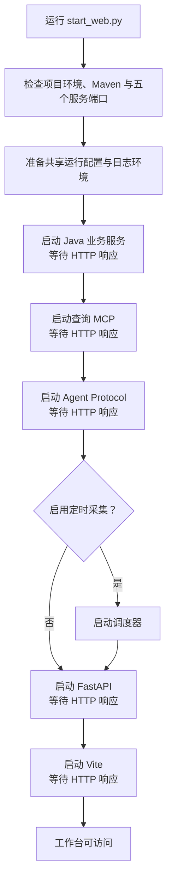

启动顺序体现了服务依赖：**Java 提供业务接口，查询 MCP 提供工具入口，异步服务随后加载分析工具。**

FastAPI 启动时初始化持久化资源，**用户级主 Agent 在请求时构建**。启用的调度器直接进入采集循环，无需等待用户登录或创建会话。

**“服务已启动”表示进程存活且 HTTP 入口可以响应。** 启动探测接受 `200—499` 状态码，查询 MCP 的普通 GET 返回 `406` 也可能通过检查。

模型调用、沙箱创建和来源采集等能力，需要通过对应业务请求确认。

**进程退出**

**在启动器终端按 `Ctrl+C` 可停止托管进程。** 启动失败或任一托管进程退出时，启动器也会清理已启动的进程。

Windows 按 PID 强制结束进程树，覆盖 Maven、npm 等包装进程产生的子进程；这一方式**不保证每个应用的优雅关闭逻辑都执行**。正常关闭时的资源释放顺序见第 4、5 章。

外部 PostgreSQL 和 OpenSandbox 服务由各自的部署方式管理。


# 2. Agent 架构

## 2.1 Agent 分工

ThreatWeave 的 Agent 体系采用**主 Agent 统一编排、子 Agent 按职责执行**的组织方式。主 Agent 面向用户理解需求、确定任务范围，并选择对应的执行单元；业务子 Agent 则在各自的工具和任务边界内完成工作。

项目显式配置了**主 Agent、同步处理器 `threat_handle` 和异步分析器 `threat_analyst`**。此外，DeepAgents 默认提供 `general-purpose` 通用子 Agent，用于承接可委派的通用任务。

**角色与职责**

| Agent | 主要职责 | 执行方式 |
| --- | --- | --- |
| **主 Agent** | 理解请求、编排任务、组织回答和管理后台任务。 | FastAPI 中的用户级执行图。 |
| **`threat_handle`** | 文章导入、指定单篇文章查询与 Markdown 导出。 | 本地同步子 Agent。 |
| **`threat_analyst`** | 全库查询、跨文章统计、关联分析及报告或图表生成。 | Agent Protocol 托管的异步子 Agent。 |
| **`general-purpose`** | 承接通用检索、文件处理等多步骤任务。 | DeepAgents 默认装配的本地同步子 Agent，继承主 Agent 的工具能力。 |

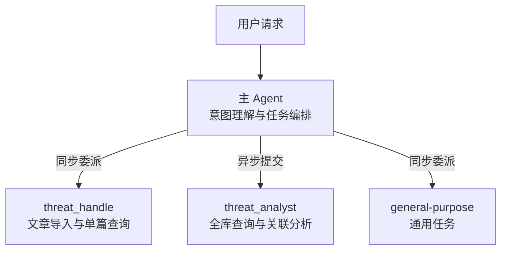

**Agent 与固定业务流程各有职责：**

- **业务处理流程由 Pipeline 控制**：`threat_handle` 发起文章导入，采集、清洗、抽取和入库由固定代码流程完成。Pipeline 内的模型调用承担内容转换工作，不作为独立业务 Agent 注册。
- **定时采集由调度器直接执行**：调度器调用同一 Pipeline，无需主 Agent 委派，也不创建用户对话。

具体请求的路由规则在 2.2.3 节说明，跨 Agent 的任务交接在 2.5 节展开。

## 2.2 主 Agent

主 Agent 是用户对话的统一执行入口，也是多 Agent 系统的**任务编排中心**。它结合当前请求、会话上下文和用户偏好，选择工具或子 Agent，并向用户组织最终回答。

主 Agent 的装配入口位于 `src/agent/main_agent.py`，实例管理位于 `src/api/agent_loader.py`。前者定义 Agent 具备哪些能力，后者负责在请求到达时取得对应用户的 Agent。

### 2.2.1 构建与用户级复用

**主 Agent 在用户首次需要执行 Agent 任务时构建，并在当前服务进程内按 `user_id` 缓存。** FastAPI 启动时准备持久化资源和 Agent 工厂，后续请求再取得用户沙箱并完成构图。

构建时，项目将以下组件交给 DeepAgents，组成可执行的 LangGraph 图：

| 组件 | 在主 Agent 中的作用 |
| --- | --- |
| **模型** | 主模型负责理解请求、选择工具与生成回答；摘要模型用于上下文压缩和记忆更新。 |
| **系统提示词** | 规定任务路由、业务范围、输出形式和结果表达，并补充已注册异步子 Agent 的委派说明。 |
| **工具** | 接入公共搜索、异步任务管理、信息补充和交付件等能力。 |
| **子 Agent** | 注册本地同步 `threat_handle` 与远端异步 `threat_analyst`；框架同时提供默认通用子 Agent。 |
| **文件后端** | 使用 CompositeBackend，将记忆文件路由到 PostgreSQL，其余文件和命令操作交给用户沙箱。 |
| **指引与技能** | 加载沙箱中的 `/AGENTS.md` 和 `/skills/main/`，提供固定指引与任务技能。 |
| **中间件** | 接入用户上下文、技能同步、运行保护、工具可见性和长期记忆更新。 |
| **持久化与运行上下文** | Store 保存长期数据，Checkpointer 保存会话执行状态，运行上下文传递当前用户身份。 |

用户首次构图前会准备默认偏好文件。工具发现、子 Agent 配置和后端装配完成后，Agent 图保存在用户分组中，供后续请求复用。

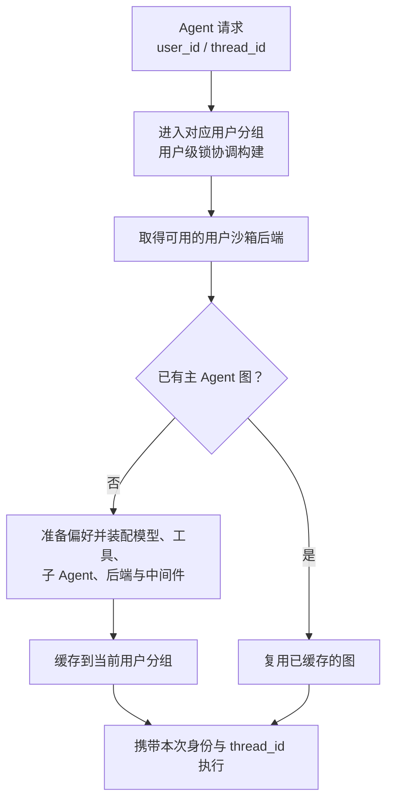

**复用 Agent 图与恢复会话状态是两个不同层次：**

- **用户层**：同一用户的多个会话复用主 Agent 图、用户沙箱和长期记忆命名空间。
- **会话层**：每次执行携带对应的 `thread_id`，从 Checkpointer 读取该会话的消息和执行状态。
- **进程层**：服务重启后重新构建 Agent 图，PostgreSQL 中的会话和记忆仍可恢复。

每次取得用户 Agent 时都会检查沙箱可用性。沙箱恢复后通过稳定的后端代理替换底层连接，已缓存的图可以继续使用新的执行环境。

### 2.2.2 工具与技能配置

主 Agent 的工具来自**框架内置能力、项目本地工具和远端 MCP**。工具配置决定模型可以调用什么，提示词则规定这些能力应在什么任务中使用。

| 能力 | 主要工具或来源 | 用途 |
| --- | --- | --- |
| **任务规划** | DeepAgents 内置规划能力 | 整理多步骤任务和执行进度。 |
| **文件与命令执行** | DeepAgents 文件工具及 `execute` | 读取指引与记忆，处理用户文件，在沙箱执行命令。 |
| **同步委派** | `task` | 调用 `threat_handle` 或默认通用子 Agent。 |
| **公共搜索** | `web_search` | 获取外部背景；远端服务不可用时返回降级提示。 |
| **异步任务管理** | `start_async_task`、`check_async_task`、`list_async_tasks`、`cancel_async_task` | 提交、查询、列出和取消当前会话的后台任务。 |
| **信息补充** | `request_additional_info` | 在缺少必要信息时暂停执行，等待用户补充后恢复。 |
| **文件交付** | `write_deliverable` | 写入用户要求的 Markdown、HTML 或 JSON 文件，返回结构化交付声明。 |
| **主动压缩** | `compact_conversation` | 压缩已完成的中间过程，保留继续执行所需的结论和状态。 |
| **技能管理** | 下载、分配、查询、更新和删除技能的本地工具 | 根据用户请求维护技能；仅在本轮消息涉及技能管理时向模型显示。 |

**情报导入和业务查询工具分配给专用子 Agent。** `run_threat_pipeline`、`describe_read_model` 和 `execute_read_query` 不在主 Agent 的直接工具列表中。主 Agent 通过委派使用这些业务能力。

文件访问使用统一接口，存储位置由路径决定。构建时的文件后端将 **`/memories/` 路由到当前用户的 PostgreSQL Store**，模型无需为不同存储位置选择不同的读写工具。

**主 Agent 只发现 `/skills/main/` 中的技能。** 当前内置 `skill-management`，用于技能下载、校验、分配和维护。子 Agent 的专用技能配置在各自目录中，由对应角色加载。

运行前，项目将本地技能和固定指引同步到沙箱，供框架读取。**技能提供任务指引，工具提供实际执行能力**；例如，技能说明如何分配文件，而注册的管理工具负责完成校验与持久化。

主 Agent 同时接入自动摘要、调用次数限制和长期记忆更新等运行支持。具体中间件机制在第 6 章展开，技能加载与维护在第 9 章展开。

### 2.2.3 请求路由与任务委派

每轮执行时，运行上下文将用户身份和偏好文件路径加入模型可见的系统信息。系统提示词要求主 Agent 先读取 `/memories/{user_id}/preferences.md`，再根据**当前请求的任务类型与数据范围**选择执行方式。

**用户偏好用于理解和表达，当前请求决定业务范围与交付形式。** 近期查询或长期偏好不能自动成为本轮任务的筛选条件，也不能自动触发报告或图表生成。

| 当前请求 | 主 Agent 的处理方式 |
| --- | --- |
| 导入文章 URL 或已配置来源的文章 | 通过 `task` 委派 `threat_handle`，执行完整 Pipeline。仅提供 URL 时使用直链采集。 |
| 查看指定单篇文章的规范正文、实体关系或中间产物 Markdown | 同步委派 `threat_handle`，查询该文章并按需交付文件。 |
| 全库查询、文章列表、跨文章统计、图谱分析或独立分析报告 | 使用 `start_async_task` 提交 `threat_analyst`。 |
| 基于当前会话已有结果重画或改进 HTML | 主 Agent 处理文件内容，通过 `write_deliverable` 登记交付声明。 |
| 一般解释、通用检索或文件处理 | 根据任务直接回答、调用工具，或委派默认通用子 Agent。 |
| 技能安装、分配、更新或删除 | 加载相应技能指引，使用本轮可见的技能管理工具执行。 |

异步委派需明确以下一种输出模式：

- **聊天文本**：查询、列举、统计或简要说明的默认模式，不生成文件或图。
- **HTML 图**：用户明确要求图表或可视化时，只生成图，不附加 Markdown 报告。
- **Markdown 报告**：用户明确要求报告时，只生成报告，不附加 HTML 图。
- **报告与图**：用户在当前请求中同时明确要求两者时，才生成两种交付件。

缺少执行所必需的信息时，主 Agent 可以调用 `request_additional_info` 暂停任务。**范围已经足以执行的请求应直接处理**，例如全库列表和统计本身就是有效范围。

用户询问后台进度、全部任务或要求停止任务时，分别使用查询、列举和取消工具。常规后台状态轮询由前端通过 API 完成，结果投递机制在第 10 章展开。

最终回答以工具确认的事实和状态为依据，简洁说明结果与失败项。**文件交付成功后提示使用页面下载入口**，不把内部任务标识、沙箱路径或机器声明作为业务回答展示。

## 2.3 同步子 Agent：threat_handle

`threat_handle` 的配置与执行围绕**文章导入和指定单篇文章查询**两条路径组织。文章处理的具体业务规则在第 3 章展开。

### 2.3.1 配置与注册

子 Agent 配置位于 `src/agent/subagents/configs/threat_handle.yaml`。主 Agent 构建时读取该配置，绑定可用工具，并将它作为**本地同步子 Agent**交给 DeepAgents。

| 配置内容 | 当前设置与作用 |
| --- | --- |
| **名称** | `threat_handle`，供主 Agent 在 `task` 中指定委派对象。 |
| **描述** | 说明文章导入和单篇文章查询、Markdown 导出的职责，供主 Agent 选择角色。 |
| **系统提示词** | 规定导入方式、查询范围、结果表达和文件交付约定。 |
| **业务工具** | 声明 Pipeline、读模型描述、受限查询和交付件四个工具。 |
| **模型** | 未独立指定，使用主图提供的模型。 |
| **自定义中间件** | 当前 YAML 未声明；框架仍装配默认运行支持。 |

注册过程分为四步：

1. **准备工具**：从查询 MCP 加载两个只读工具，并创建绑定当前用户的 Pipeline 工具和沙箱交付件工具。
2. **读取配置**：将 YAML 中的名称、描述和提示词转换为子 Agent 配置。
3. **校验并绑定**：按声明名称选择工具；缺少必需配置、工具重复或工具不可用时，构图失败并报错。
4. **注册到主图**：DeepAgents 构建本地子 Agent，并通过 `task` 向主 Agent 暴露委派能力。

**`threat_handle` 随用户级主 Agent 图一起构建和复用。** 它在 FastAPI 应用进程中执行，共享主图的文件后端，不需要独立监听端口或 Agent Protocol 服务。

### 2.3.2 工具配置与能力边界

`threat_handle` 显式配置的业务工具如下。

| 工具 | 来源 | 职责 |
| --- | --- | --- |
| **`run_threat_pipeline`** | 本地 Pipeline 工具 | 接收来源或文章 URL，执行完整导入，并返回处理摘要。 |
| **`describe_read_model`** | ThreatWeave 查询 MCP | 描述允许查询的数据集、字段语义和关联方式。 |
| **`execute_read_query`** | ThreatWeave 查询 MCP | 通过参数化只读 SQL 查询文档、实体、关系、证据和处理状态。 |
| **`write_deliverable`** | 本地交付件工具 | 将用户要求的 Markdown 写入当前用户沙箱，返回可登记的文件声明。 |

**Pipeline 工具绑定发起用户身份，交付件工具绑定该用户的沙箱。** 模型提供文章目标和处理参数，用户身份与文件执行环境由主 Agent 构建时确定。

**业务工具列表与框架基础能力需要区分。** DeepAgents 还会为本地子 Agent 装配文件访问、摘要和工具调用修复等基础支持；四个业务工具并不代表它完全没有其他框架工具。

当前子 Agent **没有独立技能配置**，任务指引主要来自 YAML 系统提示词和工具说明。技能不会因主 Agent 配置了 `/skills/main/` 而自动成为它的专用技能。

**单篇查询范围由路由和子 Agent 提示词约束。** 通用查询接口负责限制可读数据集和 SQL 执行行为，本身不强制每条查询只能涉及一篇文章。交付件工具支持多种文本类型，但该角色的导出约定是单篇文章 Markdown。

### 2.3.3 同步执行流程

`threat_handle` 接到任务后，选择导入或查询路径：

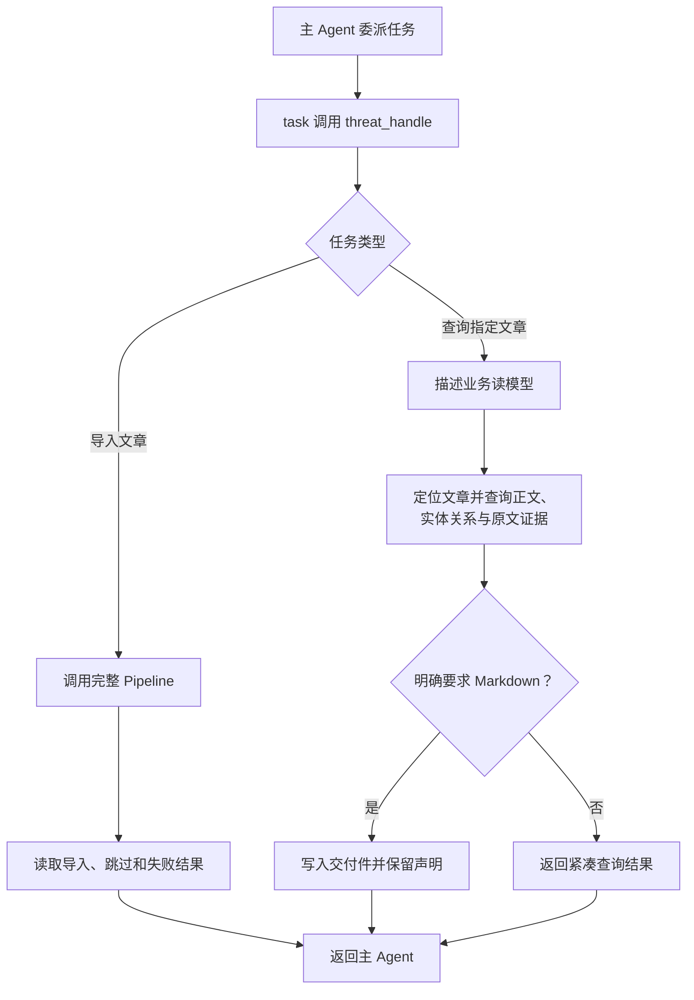

**文章导入路径**

1. **确定采集目标**：明确指定 `source_id` 时使用对应来源解析器；仅提供 `article_url` 时使用通用直链采集。
2. **提交完整处理**：一次导入委派只调用一次 `run_threat_pipeline`，等待处理完成。一个来源任务可以导入多篇文章；子 Agent 不选择 Pipeline 内部阶段，也不自行调用 Java 写入接口。
3. **解释返回结果**：区分已导入、正文未变而跳过、正在处理中而跳过，以及采集或处理失败的文章，向主 Agent 返回紧凑摘要。

**单篇查询与导出路径**

1. **确认读模型**：获取当前可查询的数据集和关联方式，再按文章 ID、URL 或标题定位用户指定的文章。
2. **读取所需内容**：使用参数化查询取得规范正文、相关实体关系及其证据。查询以已入库数据为依据，不自动重新导入文章。
3. **按需生成文件**：用户要求 Markdown 时，将查询结果组织成文件内容，调用 `write_deliverable` 写入用户沙箱。
4. **回传结果**：返回查询摘要或文件交付声明，由主 Agent 继续回答。

**文件写入和下载入口登记是两个步骤。** 子 Agent 写入文件后，需要在最终结果中保留工具返回的结构化声明；当前提示词使用 `SYNC_DELIVERABLE` 标记传递这一信息。API 在本轮执行结束时收集声明，登记文件归属并将下载资源写回会话。

该标记属于内部交付协议，页面向用户展示登记后的下载入口。交付件登记、历史恢复和下载鉴权的完整链路在第 10 章展开。

## 2.4 异步子 Agent：threat_analyst

`threat_analyst` 通过独立的 Agent Protocol 服务托管。它的配置、运行状态和资源连接单独管理，以下说明其装配方式与分析过程。

### 2.4.1 配置与注册

异步分析器的注册分为两部分：**主 Agent 获得远端任务描述，Agent Protocol 服务加载实际执行图**。两者通过 Agent 名称、图 ID 和服务地址对应起来。

| 配置或模块 | 作用 |
| --- | --- |
| `src/agent/subagents/configs/threat_analyst.yaml` | 定义角色提示词、业务工具和专用技能目录。 |
| `src/agent/subagents/async_registry.py` | 集中登记名称 `threat_analyst`、图 ID `threat_analyst_async`、工具加载器和委派说明。 |
| `src/agent/subagents/async_entry.py` | 加载配置与工具，在执行时连接用户沙箱并构建分析图。 |
| `langgraph.json` | 将 `threat_analyst_async` 映射到异步图入口，供 Agent Protocol 服务注册。 |
| `start_web.py` | 启动 Agent Protocol 服务，默认监听 `127.0.0.1:18082`，并向主应用提供对应地址。 |

配置与运行准备按以下顺序完成：

1. **预加载配置和工具**：异步服务加载入口模块时，发现查询 MCP 工具并校验 YAML 声明。必需查询工具不可用会导致加载失败；公共搜索可以降级。
2. **接收任务**：主 Agent 提交分析描述，Agent Protocol 创建独立任务线程与运行记录。
3. **连接执行环境**：执行图工厂读取任务上下文中的 `sandbox_id`，连接发起用户已有的沙箱。
4. **构建分析图**：装配主模型、角色提示词、查询与交付工具、技能同步和运行保护，开始执行。

**执行任务必须提供 `sandbox_id` 和有效的 OpenSandbox 密钥。** 图工厂在仅用于读取任务状态的访问中不连接沙箱，避免查询状态时创建执行资源。

### 2.4.2 工具与技能配置

异步分析器显式配置五个业务工具，覆盖证据查询、背景补充、图表生成和文件交付。

| 工具 | 作用 | 使用约定 |
| --- | --- | --- |
| **`describe_read_model`** | 获取可查询的数据集、字段和关联方式。 | 开始业务查询前先确认当前读模型。 |
| **`execute_read_query`** | 查询文档、实体、关系、出处及处理状态。 | 读取已描述的数据集，用户提供的值使用 `?` 占位符和参数列表。 |
| **`web_search`** | 补充外部背景与消歧信息。 | 区分搜索内容与库内证据；服务不可用时使用现有数据并说明限制。 |
| **`get_chart_spec`** | 发现 Charts MCP 的可用图表类型，或读取指定类型的真实输入 Schema。 | 仅在用户明确要求图表或可视化时调用。 |
| **`generate_visualization`** | 按选定图表类型和 Schema 调用 Charts MCP，生成 HTML 图内容。 | `get_chart_spec` 确认类型和参数后调用，返回 HTML 后再写入交付件。 |
| **`write_deliverable`** | 将用户要求的 Markdown 报告或 HTML 图写入共享沙箱。 | 使用工具返回的结构化声明交付文件。 |

**它具备业务读取和文件交付能力，未配置 Pipeline 或 Java 业务写入工具。** 文件、命令执行和任务规划等基础能力由 DeepAgents 装配，情报分析仍遵循只读角色约定。

专用技能目录为 **`/skills/subagents/threat_analyst/`**，当前内置 `threat-analysis`。系统提示词要求分析开始前读取该技能，运行前由技能中间件同步并刷新可发现的技能信息。

技能主要规定四类分析行为：

- **确定范围**：从当前任务识别分析对象、时间范围和目标；全库列表和统计可以直接执行。
- **查询证据**：扩展关联时需要新增直接证据，已有结果足以回答时结束查询。
- **组织结论**：明确区分库内事实、分析推断和外部背景，图中关系应有证据支持。
- **按要求交付**：遵循委派描述中的输出模式，具体模式在 2.2.3 节说明。

**分析器只发现自己的技能目录，不自动继承主 Agent 技能。** 其运行图独立配置自动摘要、模型调用上限和工具调用上限，相关保护机制在第 6 章展开。

HTML 图生成依赖 Charts MCP。**服务未配置、调用失败或未返回 HTML 时，应说明原因并结束图表生成**；成功取得 HTML 后，由交付件工具保存，页面预览由既有下载与 CSP 边界处理。

### 2.4.3 独立运行与任务执行

**异步任务拥有独立执行状态，复用发起用户的沙箱。** 各类资源的边界如下：

| 资源 | 异步任务的使用方式 |
| --- | --- |
| **任务状态** | 由 Agent Protocol 管理独立线程和运行记录；不接入主会话的 PostgreSQL Checkpointer。 |
| **用户沙箱** | 通过 `sandbox_id` 连接已有实例，读取技能并保存交付文件。 |
| **文件后端** | 所有路径使用沙箱后端，没有主 Agent 的 `/memories/` PostgreSQL 路由。 |
| **任务归属** | FastAPI 将远端任务绑定到发起用户和主会话，后续查询与投递检查该绑定。 |

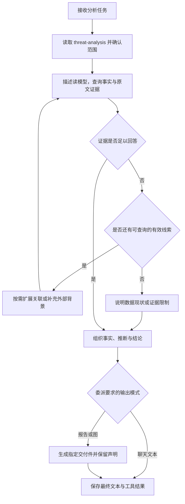

分析结果留在远端任务状态中，供 API 读取。**扩展查询应服务于当前问题**，不要求每次分析都遍历完整图谱；查询失败或现有证据不足时，应说明限制。

**查询确认没有可分析实体或关系时，停止图谱扩展并说明现状，不生成空图。** 用户明确要求报告时，可以将这项说明写入 Markdown。

任务到达终态后，API 会检查结果与交付要求。用户要求的 Markdown 报告缺失、结果为空或出现调用限额错误时，会返回对应错误或失败状态。交付件按请求类型筛选，**同一类型只保留本次任务最后生成的文件**。

**结果投递由任务状态查询触发。** 主会话正在执行或处于中断状态时，投递暂缓，后续查询再次尝试；项目当前没有独立的结果投递守护进程。状态查询、幂等投递和页面恢复的详细机制在第 10 章展开。

执行结束后，图工厂释放本次沙箱客户端连接，**保留远端共享沙箱及其中的交付文件**。文件登记后由页面提供预览或下载入口。

## 2.5 Agent 协作流程

**协作顺序由主 Agent 根据工具结果在运行中组织**，项目没有将所有用户请求固定成同一条多 Agent 工作流。同步处理器与异步分析器没有彼此直接调用的业务入口，需要衔接的任务由主 Agent 交接。

**任务交接**

委派描述是子 Agent 理解任务的主要依据。当前同步处理器与异步分析器都以描述作为初始任务消息，**不会自动复制主会话的完整消息历史**；因此，主 Agent 需要把执行所需的信息写入描述。

| 交接信息 | 应说明的内容 | 对协作的作用 |
| --- | --- | --- |
| **任务目标** | 导入、查询、统计或分析的具体问题。 | 让子 Agent 明确本次工作的结束条件。 |
| **对象与范围** | 文章 URL、已确认的文档 ID、分析范围及必要的筛选条件。 | 避免子 Agent 从缺失的对话背景中猜测对象。 |
| **已有结果** | 前一步实际返回的处理状态、标识和与本次任务有关的事实。 | 为后续工作提供可核对的输入。 |
| **交付要求** | 当前请求需要聊天文本、Markdown 报告还是 HTML 图。 | 使结果形式与用户要求对应。 |

共享沙箱提供文件交接条件，但**文件存在不代表任务背景已经传递**。后续任务需要使用已有文件时，委派描述仍应说明文件位置、用途和需要完成的工作。

**复合请求的协作示例**

以“导入这篇文章，再分析它与库内已有情报的关联，生成 Markdown 报告”为例，请求同时包含情报入库与关联分析。主 Agent 需要先取得可用于分析的文章标识，再启动后台任务。

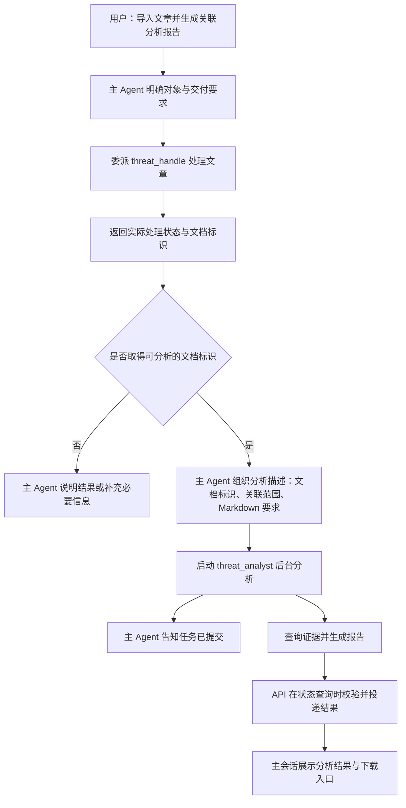

这条路径的关键是**确认前一步结果，再组织下一步输入**。已存在且可查询的文章也可以成为分析对象；处理失败且无法确定文档标识时，不能假定文章已经入库。部分处理成功时，只使用已确认的数据衔接后续任务，并说明未完成的范围。

**结果返回与协作边界**

同步委派返回后，主 Agent 获得子 Agent 的最终结果作为工具消息，可以继续组织回答或提交后续任务。**异步提交返回的是任务回执**，只表示任务已启动；本轮回答应准确区分“已提交”和“已完成”。

后台分析完成后的结果由 API 写入主会话，**不会自动触发主 Agent 再进行一轮模型推理**。用户继续提问时，主 Agent 再结合会话中已有结果开展后续工作。异步任务的具体投递条件在 2.4 节说明，请求与页面的完整链路在第 10 章展开。


# 3. 威胁情报处理业务

## 3.1 业务范围与核心组件

ThreatWeave 的情报业务围绕**公开文章的采集、内容整理和证据分析**展开。业务层将网页文章转换为可保存、可查询的规范文档，提取正文支持的实体与关系，并保留这些信息的原文出处，为后续统计和关联分析提供依据。

**规范正文、结构化事实和原文证据共同构成业务结果。** 规范正文便于阅读与复核；实体和关系便于跨文章查询；证据将抽取结果连接回具体文章，帮助读者判断结论来自哪里。

**业务范围**

- **采集文章**：接收指定文章 URL，或从已配置来源发现并获取文章；来源配置控制解析方式和定时采集条件。
- **整理内容**：从网页提取正文，清洗导航、广告和重复内容，形成保留情报内容的规范 Markdown 正文。
- **构建结构化情报**：识别正文中的威胁主体、恶意软件、漏洞、网络指标等实体，以及正文明确支持的关系，关联原文引文和位置。
- **查询与分析**：读取已入库正文、实体、关系和出处，支持文章查询、跨文章统计与关联分析；根据当前任务形成回答、报告或关系图。

采集与分析使用不同的输入：**导入处理以采集到的文章为输入，库内分析以已保存的数据为依据**。分析时可以补充外部背景，但需要区分库内证据、外部信息和分析推断；生成报告或图表本身不会把新的推断写入情报库。

**核心组件**

| 组件 | 实现入口 | 业务职责 |
| --- | --- | --- |
| **来源配置与采集器** | `src/intel_ingestor/` | 管理来源配置，发现文章、抓取网页并提取初步正文，输出带来源信息的采集文档。 |
| **Threat Pipeline** | `src/threat_pipeline/pipeline.py` | 组织完整导入过程，衔接采集、模型转换、业务写入和处理状态，返回本次处理结果。 |
| **清洗与抽取支持** | `src/threat_pipeline/models.py`、`extraction.py` | 调用模型整理正文和生成抽取候选，再由代码规范化、校验字段与原文证据，形成可提交的业务数据。 |
| **处理状态仓库** | `src/threat_pipeline/repository.py` | 保存文章处理状态、正文指纹和失败信息，支持重复处理判断、并发协调与失败重跑。 |
| **Java 命令适配器** | `src/threat_pipeline/gateway.py` | 将 Pipeline 的规范文档与抽取结果转换为 Java REST 请求，并确认业务接口的返回结果。 |
| **Java 业务服务** | `java-backend/src/main/java/com/threatweave/threatweave/` | 维护文档、实体、关系与出处的存储一致性，提供业务写入、读取和受限查询接口。 |
| **只读查询 MCP** | `src/mcp_server/tools/threatweave_tools.py` | 将 Java 读模型与受限查询接口转换为 Agent 可调用的工具。 |
| **定时采集调度器** | `src/scheduler/runner.py` | 按来源启用状态和采集间隔提交导入任务，维护进程内的调度与失败重试节奏。 |

这些组件形成两条相互衔接的业务通路：**导入通路负责积累和更新情报，查询通路负责利用已有情报回答问题**。

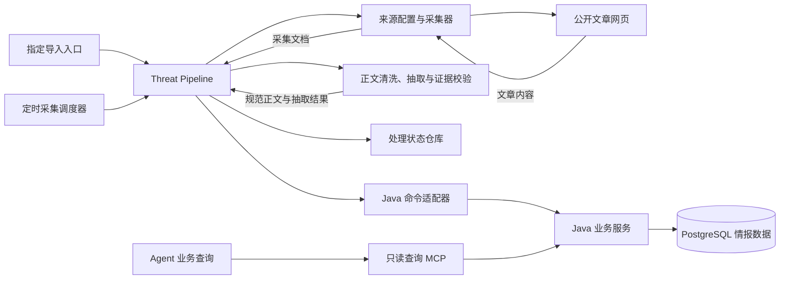

图中，Pipeline 通过命令适配器提交业务数据，通过处理状态仓库记录执行情况；查询 MCP 则访问 Java 的读取接口。**业务内容与处理状态分别管理**：文章已经保存，并不必然表示实体关系抽取也已完成，调用方需要结合实际处理结果判断。

情报图谱由 PostgreSQL 中的实体、关系和出处数据构成，供关联查询使用。用户看到的 HTML 关系图是按任务生成的展示产物，**其生成与情报数据入库是不同的业务动作**。

来源与采集方式在 3.2 节说明，数据关系在 3.3 节展开；Pipeline、定时调度、Java 服务和查询 MCP 的具体机制分别在 3.4—3.7 节说明。

## 3.2 情报来源与采集方式

情报采集支持**按来源采集**和**按文章地址采集**。两种入口共用抓取、正文解析和采集结果汇总能力，区别在于候选文章的确定方式：

**采集入口与目标选择**

| 输入方式 | 目标确定方式 | 适用场景 |
| --- | --- | --- |
| **来源采集** | 根据来源配置取得入口并发现文章。 | 按已维护来源批量获取公开文章。 |
| **文章地址采集** | 直接处理用户指定的文章地址。 | 导入单篇文章或处理尚未纳入来源列表的文章。 |

来源配置用于描述**从哪里发现文章以及如何定位正文**，通常包含来源标识、入口地址、文章链接筛选规则、正文和标题定位规则、字符编码、需要排除的页面区域及采集间隔等信息。配置只选择已有的解析能力，具体抓取和解析逻辑由 `src/intel_ingestor/` 中的代码实现。

来源配置集中描述“从哪里发现文章”和“如何取得正文”，通用配置项如下：

| 配置项 | 作用 |
| --- | --- |
| **来源标识与入口** | 标识来源并指定发现文章的入口地址。 |
| **文章链接规则** | 从入口页面筛选候选文章地址。 |
| **正文定位规则** | 指定正文、标题和日期的提取位置，以及需要排除的页面区域。 |
| **解析参数** | 设置字符编码及已有的解析类型。 |
| **采集间隔** | 为定时调度提供来源级的执行间隔。 |

采集前会检查配置是否完整、入口和文章地址是否可用；定时调度还会根据来源是否启用及采集间隔决定是否提交任务。调度行为在 3.5 节说明。

**解析能力由代码实现，配置只负责选择和调整已有能力。**

**采集流程与输出**

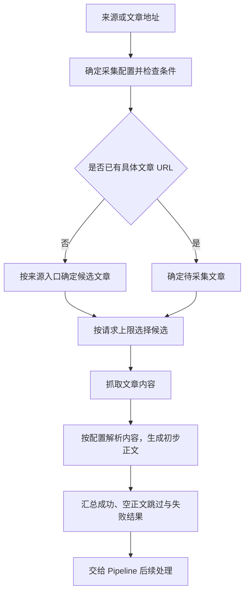

采集器负责取得页面和生成初步正文，**不直接写入威胁情报业务表**。成功结果通常包含来源信息、文章地址、标题、可取得的发布时间、文章标识和初步正文；正文为空、抓取失败或解析失败时，会保留对应的跳过或失败状态，供上层流程解释。

采集使用 HTTP 请求取得页面，不执行页面 JavaScript。正文定位失败时可能回退到更宽的页面范围，因此抓取成功不等于正文质量已经满足入库要求。后续的模型清洗、规范文档写入、实体关系抽取和出处保存由第 3.4 节的 Threat Pipeline 继续完成。

## 3.3 业务数据模型

业务数据模型以**文档、实体、关系和出处**为核心。文档保存整理后的正文，实体与关系构成可复用的情报图谱，出处记录某篇文章对某个实体或关系的具体支持。实体别名辅助名称查询，处理记录说明文章导入的执行情况。

**核心数据对象**

| 对象 | 数据表 | 主要内容 | 身份与关联约束 |
| --- | --- | --- | --- |
| **文档** | `threatweave.documents` | 来源、文章标题与 URL、发布时间、规范正文及正文哈希。 | `id` 为数据库主键，`doc_key` 为唯一的来源文章标识。 |
| **实体** | `threatweave.entities` | 实体类型、规范值、展示名称、语义角色及可选置信度等信息。 | 按 `entity_type + canonical_value` 唯一，同一实体可以被多篇文章引用。 |
| **实体别名** | `threatweave.entity_aliases` | 同一实体的其他名称及可选来源 URL。 | 通过 `entity_id` 关联实体，同一实体的同一别名不重复保存。 |
| **关系** | `threatweave.relations` | 源实体、目标实体、关系类型及可选置信度等信息。 | 按源实体、目标实体和关系类型唯一，两端不能是同一实体。 |
| **出处** | `threatweave.provenance` | 所属文档、被支持的实体或关系、原文引文、字符范围和抽取器标识。 | 每条记录关联一个文档，并且只支持一个实体或一个关系。 |
| **处理记录** | `workflow.document_processing` | 文章处理状态、输入与正文指纹、当前运行标识、失败信息和阶段时间。 | 以 `doc_key` 为主键，与文档按文章标识逻辑关联。 |

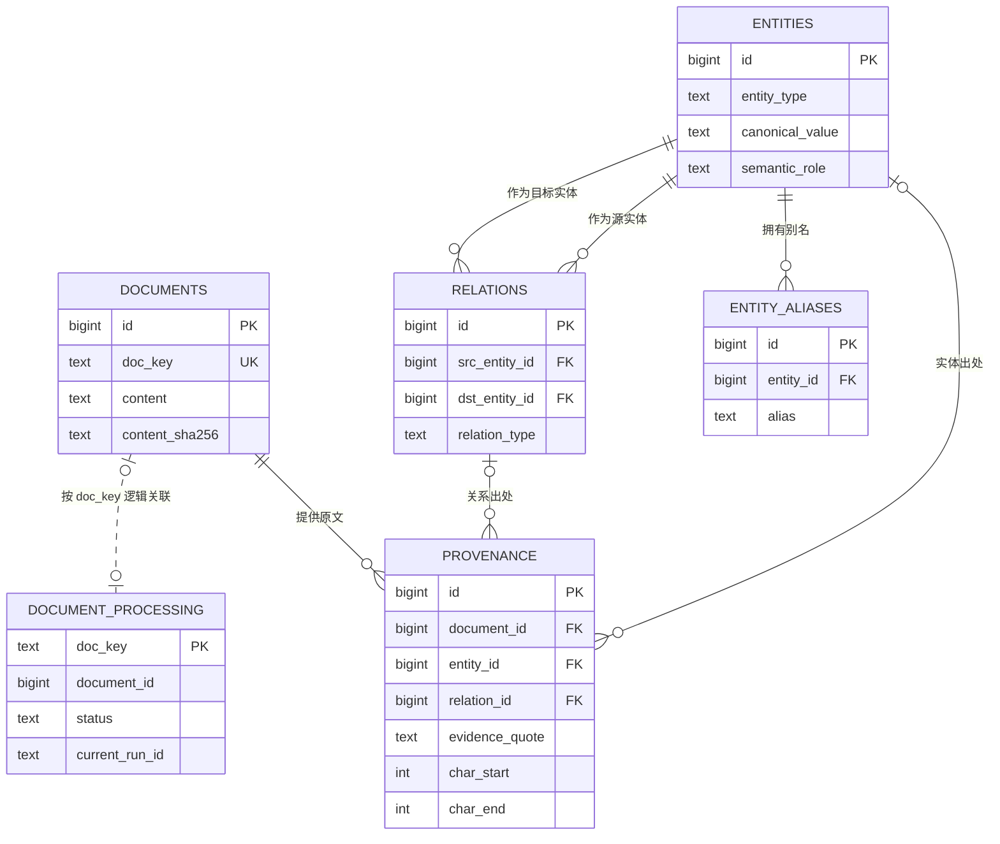

图中实线表示业务表之间的外键关联，虚线表示处理记录与文档的逻辑关联。**处理记录可以先于规范文档存在**，因此其 `document_id` 可以为空；该字段当前没有数据库外键约束。

**文档身份与正文版本**

文档中的三类标识承担不同职责：

- **`id`**：Java 写入文档后返回的主键，供抽取结果、出处和查询引用。
- **`doc_key`**：由来源标识和外部文章标识生成；没有外部标识时使用文章 URL。它用于识别来源内的同一文章，不随正文变化而改变。
- **`content_sha256`**：规范正文的内容哈希，用于识别正文版本；它不作为文章身份。

同一 `doc_key` 再次写入时更新已有文档，当前模型保存其最新规范正文，不维护正文历史版本。**相同文章以不同来源身份导入时，不保证合并为同一文档**，因为来源标识参与文章身份生成。

文档时间也分为不同含义：`published_at` 表示可取得的来源发布时间，`formatted_at` 和 `ingested_at` 表示系统整理、写入时间，`created_at` 表示文档记录首次创建时间。查询某段时间的情报时，应根据问题选择对应时间字段。

**实体、别名与有向关系**

实体类型限定为以下类别，便于查询时区分网络指标与威胁语义对象：

| 类别 | 当前允许的 `entity_type` |
| --- | --- |
| **网络与文件指标** | `ipv4`、`ipv6`、`domain`、`url`、`file_hash` |
| **漏洞与攻击方法** | `cve`、`attack_technique` |
| **威胁活动对象** | `threat_actor`、`malware`、`campaign` |
| **工具与组织** | `tool`、`organization` |

**规范值决定实体身份，展示名称和别名用于阅读与检索。** 名称相似或别名相同不会自动合并实体；当前共享身份依赖类型与规范值的精确匹配。

`semantic_role` 补充实体在情报中的角色，允许 `malicious_infrastructure`（恶意基础设施）、`victim`（受害对象）、`research`（研究相关）和 `unknown`（未确定）。该字段保存在共享实体记录上，后续写入可以更新它；分析特定文章时仍应结合该文章的出处理解角色。

关系具有方向，当前允许的类型如下：

| `relation_type` | 表达的关系 |
| --- | --- |
| **`USES`** | 源实体使用目标实体。 |
| **`ATTRIBUTED_TO`** | 源实体被归因于目标实体。 |
| **`INDICATES`** | 源实体指示目标实体。 |
| **`RESOLVES_TO`** | 源实体解析到目标实体。 |
| **`TARGETS`** | 源实体以目标实体为攻击目标。 |
| **`EXPLOITS`** | 源实体利用目标实体所表示的漏洞。 |
| **`COMMUNICATES_WITH`** | 源实体与目标实体通信。 |

关系类型与端点方向共同表达含义，交换端点会形成不同记录。实体和关系可保存置信度与观察时间，但这些字段可能为空；当前 Pipeline 不主动填充首次、最后观察时间，**不能把空值解释为已经完成时间线判断**。

**出处与跨文章关联**

`provenance` 将文章与图谱连接起来。一条出处包含文档 ID、原文引文和对应字符范围，并通过 `entity_id` 或 `relation_id` 指向被支持的对象；两个目标字段必须有且只有一个非空。

**证据位置相对于已保存的规范正文**，使用起点包含、终点不包含的范围。引文必须与该范围内的正文一致，具体校验在 3.4.3 节说明。`extractor` 标识证据的生成来源，证据置信度与实体、关系上的置信度分别保存，可按需要查询。

例如，两篇文章都提到同一恶意软件时，可以共用一条实体记录，同时各自保留出处。若它们还支持同一条有向关系，则关系也可以共用，证据仍分别归属于两篇文章。查询单篇文章的抽取结果时，需要通过出处限定文档；跨文章分析则可以沿共享实体和关系查找其他文章的支持证据。

正文更新后，旧证据的字符位置可能失效。当前写入行为会在规范正文变化时清除该文章的旧出处，重新抽取时替换其出处，其他文章的证据独立保留。文档更新与抽取并非同一次完整业务事务，**暂时没有出处也可能表示文章尚未完成抽取**，需要结合处理记录判断。

**处理记录与业务结果**

处理记录按文章保存当前执行情况，主要字段分为四组：

- **身份与关联**：`doc_key`、来源信息、URL 和写入后确认的 `document_id`。
- **内容指纹**：`source_fingerprint` 记录采集所得初步正文的哈希，`formatted_content_sha256` 记录规范正文的哈希，两者对应不同处理阶段。
- **执行状态**：`status` 表达待处理、运行中、完成或失败，`current_run_id` 标识当前运行。
- **诊断信息**：失败阶段、错误说明、格式化时间、抽取完成时间及更新时间。

该表保存文章的当前处理情况，不是每次运行的完整历史，也不保存模型中间文本。重复处理判断、运行租约和失败重跑规则在 3.4.4 节展开。

上述情报对象与处理记录没有按用户设置归属字段，当前构成共享业务数据。用户会话、记忆和交付文件的归属另行管理，相关持久化边界在第 4 章说明。

## 3.4 Threat Pipeline

Threat Pipeline 是情报导入的**固定业务执行流程**，实现入口为 `src/threat_pipeline/pipeline.py`。它接收采集目标与处理参数，完成正文整理、规范文档写入、实体关系抽取和图谱写入，最后返回处理摘要。

**代码决定阶段顺序，模型负责内容转换。** Pipeline 内的模型调用只返回清洗或抽取数据，不选择阶段、不调用业务工具。用户指定导入与定时采集使用同一流程，进入方式分别在第二章和 3.5 节说明。

### 3.4.1 固定处理流程

每次运行先取得采集结果，再对成功采集的文章分批处理。采集入口与网页解析在 3.2 节说明，进入 Pipeline 后的主要步骤如下：

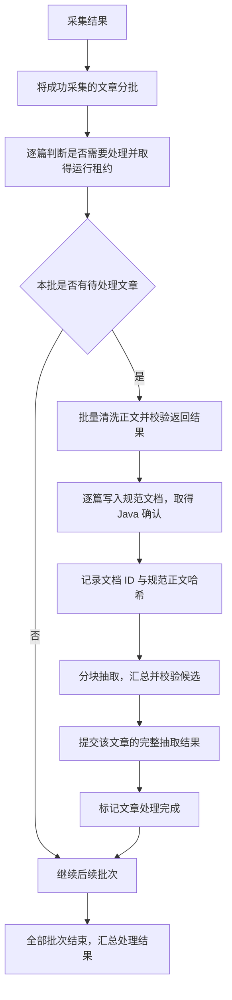

图中展示成功处理路径，跳过和失败行为在 3.4.4 节说明。**当前批次按顺序执行，清洗完成后逐篇写入和抽取**，没有为每篇文章另行启动后台分析任务。

Pipeline 的输入包含来源或文章 URL、最大文章数与 `force_refresh`。模型清洗结果写入 Java 后，后续抽取使用 Java 返回的规范正文及文档 ID，确保抽取对象与已保存文档对应。

**返回结果**

| 结果项 | 含义 |
| --- | --- |
| **`run_id`** | 标识本次 Pipeline 运行，用于关联文章处理记录。 |
| **`documents`** | 记录成功导入和各类跳过结果，包含可取得的文档标识、标题或说明。 |
| **`failures`** | 汇总列表采集、文章采集、清洗或后续处理失败的简要信息。 |

同一次运行可以同时包含成功、跳过和失败。**`ingested` 表示该文章已经完成文档与抽取结果写入**，不表示一定抽取到实体或关系；返回空列表也不等于导入了文章，可能是没有发现候选或采集未产生有效正文。

### 3.4.2 正文清洗与规范文档

清洗接收采集器输出的初步正文，目标是**保留情报事实并恢复可读结构**。模型提示词要求删除导航、广告、页脚、联系方式、乱码和重复内容，整理标题、段落、列表与表格，不摘要文章或补充分析结论。

**分批与清洗输出**

- **批次规模**：默认每批最多 3 篇，按初步正文、标题与 URL 的合计长度估算 24000 字符的输入预算。
- **长文章处理**：分批不截断文章；单篇超过预算时独立成批，因此该预算不是严格的模型输入上限。
- **返回结构**：模型按文章返回 `doc_key`、标题和正文。Pipeline 要求每个输入文章标识恰好出现一次，正文非空，且不接受本批之外的文章标识。
- **批次失败**：清洗调用或整体结果校验失败时，本批取得租约的文章均记录清洗失败，不将部分清洗结果继续入库。

上述校验确认文章对应关系和基本结构，**不等于自动验证清洗前后的全部事实一致**。内容保真主要由清洗提示词约束，后续查询和抽取以实际保存的正文为依据。

清洗通过后，命令适配器将正文和标题提交给 Java，来源标识、文章 URL、外部标识与发布时间仍来自采集文档。标题为空时使用采集标题，规范正文哈希由代码计算；模型不能借清洗输出改写来源身份。

Java 确认写入后，Pipeline 记录文档 ID、正文哈希与格式化时间，再进入抽取。此时保存的是供业务读取的规范文档，按需导出 Markdown 的文件交付由 Agent 工具完成。

**模型返回协议**

清洗与抽取共用 JSON 模型适配器。当前支持解析 JSON 外的 Markdown 代码围栏；返回内容无法解析为 JSON 时，再调用一次模型，最多两次。**JSON 可解析但业务字段校验失败，不会触发这次解析重试**；网络或模型服务异常也不由该适配器自动重试。

### 3.4.3 实体关系抽取与证据校验

抽取以已保存的**完整规范正文**为依据，模型返回实体、关系及支持它们的原文引文。提示词要求只提取正文明确支持的事实，不把两个对象共同出现解释为已经存在关系；类型与字段含义在 3.3 节说明。

**正文分块与候选汇总**

长正文优先按段落切分，每块最多 **8000 字符**，超长段落继续拆分。切分不丢弃正文字符，但当前没有重叠窗口或额外的跨块推理步骤。

Pipeline 按顺序调用模型处理各块，收集实体和关系候选，再统一相对于整篇正文校验。关系端点可以来自同一文章的不同块，但**端点必须包含在本次汇总后通过校验的实体集合中**；仅在其他文章中存在的实体不能替代本次抽取的端点输入。

**候选校验**

| 校验对象 | 当前规则 | 不满足时的处理 |
| --- | --- | --- |
| **列表结构** | 实体与关系候选应为对象数组。 | 结构异常使该文章的抽取处理失败。 |
| **字段与类型** | 必需名称和值非空，实体类型、语义角色与关系类型在允许范围内。 | 剔除不合格候选。 |
| **关系端点** | 两端类型与规范值必须对应本次有效实体。 | 剔除无法对应的关系候选。 |
| **原文证据** | 引文非空，在整篇规范正文中存在且只出现一次。 | 剔除缺失、无法定位或重复出现的引文对应候选。 |
| **置信度** | 可为空；提供时转换为整数并限制在 0—100，布尔值不接受。 | 剔除不合格候选。 |
| **重复对象** | 实体按类型与规范值、关系按端点与类型去重。 | 保留首次通过校验的候选，不合并后续重复候选的引文。 |

通过校验的引文由代码定位起止位置，并标记抽取器为 `threat_pipeline`。模型不直接指定最终证据偏移；Java 写入时还会核对字符范围、正文片段与引文是否一致。

**候选剔除与整篇失败是不同结果。** 当前 Pipeline 保留通过校验的候选，不把剔除原因逐项加入最终摘要。即使全部候选被剔除，也会提交空的实体和关系数组；Java 确认写入后仍可标记完成，因此完成状态不能用来判断抽取是否充分。

所有正文块完成后，Pipeline 一次提交该文章的完整抽取结果。若某块模型调用失败，则本次文章不提交部分块的抽取结果；若 Java 拒绝写入，则按后续处理失败记录。单篇抽取写入的事务与图谱一致性规则在 3.6 节展开。

### 3.4.4 幂等处理与失败重跑

Pipeline 在调用清洗模型前，根据文章标识、采集正文指纹和处理状态判断是否需要继续。**先采集，再决定是否跳过后续处理**，因此正文未变的文章仍可能发生网页请求，但可以省去清洗、抽取与业务写入。

| 条件 | 行为 | 对应结果 |
| --- | --- | --- |
| **首次处理，或此前未完成且没有有效运行租约** | 取得租约，执行完整处理。 | 成功后返回 `ingested`。 |
| **此前已完成，采集正文指纹未变，未要求强制刷新** | 跳过模型转换和业务写入。 | `skipped_unchanged`。 |
| **同一文章仍有有效运行租约** | 保留已有运行归属，本次跳过。 | `skipped_in_progress`。 |
| **正文指纹改变，或显式要求 `force_refresh`，且没有有效运行租约** | 重新执行完整处理，覆盖同一文章的最新内容。 | 成功后返回 `ingested`。 |
| **采集得到空正文** | 不进入后续清洗和抽取。 | `skipped_collection`。 |

**`force_refresh` 不抢占仍有效的运行租约。** 它用于重新处理已经完成或可重新取得租约的文章，不是取消其他运行的控制接口。

**运行租约与状态更新**

处理记录以 `current_run_id` 保存文章当前归属，取得租约后进入 `running`；Java 确认规范文档后记录格式化信息，抽取写入成功后进入 `completed`，处理异常时进入 `failed`。

租约有效期默认 **7200 秒**，通过 `THREATWEAVE_PIPELINE_RUNNING_LEASE_SECONDS` 配置，最小为 60 秒。是否过期按处理记录的 `updated_at` 判断，当前没有独立的定时续租任务；再次检查同一文章也会更新该时间。

后续状态更新只接受记录中的当前运行标识。运行被接管后，旧运行不能继续更新该记录，会收到租约失效错误。**这项检查保护处理状态归属，不构成覆盖全部 Java 写入过程的全局锁**。

**失败范围与重跑行为**

- **采集失败**：进入返回摘要的失败列表，未取得有效采集文档的文章不建立本轮处理记录。
- **清洗失败**：影响当前清洗批次；记录失败后可以继续处理后续批次。
- **文档写入或后续抽取失败**：按单篇文章记录，通常继续处理本批其他文章。当前失败阶段统一记为 `extraction`，可能包含文档写入、抽取或图谱写入异常，诊断时需要结合错误说明。
- **基础资源或状态记录失败**：例如数据库连接不可用、状态更新本身失败，可以直接中断运行，不能保证所有异常都被转换为完整摘要。

再次提交失败文章时，Pipeline **从采集与清洗开始重新执行**，不从失败阶段续跑，也不复用模型中间文本。模型 JSON 解析重试属于 3.4.2 节中的局部行为，定时调度的再次提交在 3.5 节说明。

文档写入、抽取写入和处理状态更新分别确认，整条 Pipeline 不属于一个数据库事务。前一步已经提交的数据不会因后一步失败自动整体回滚；调用方应结合文档、出处和处理记录判断当前可用结果，而不能把失败直接理解为没有任何数据写入。

## 3.5 定时采集调度

定时采集调度器以独立进程运行，实现入口为 `src/scheduler/runner.py`。它定期检查已登记来源的启用状态与下次执行时间，将到期来源提交给 Threat Pipeline，持续补充情报库。

**调度器直接等待 Pipeline 完成**，不经过用户对话或 Agent 委派，也不创建用户沙箱、Agent Protocol 任务和任务卡片。处理结果保存在共享业务数据与文章处理记录中，运行情况通过调度日志记录。

**启用与配置**

统一启动器通过 `THREATWEAVE_SCHEDULER_ENABLED` 决定是否托管调度进程，开关优先读取进程环境，其次读取项目 `.env`。启动默认值及服务启动顺序在 1.4 节说明。

调度进程启动后立即检查来源，不等待一个完整轮询周期再首次执行。来源级配置与进程级参数承担不同职责：

| 配置项 | 当前默认值 | 作用 |
| --- | --- | --- |
| **来源 `enabled`** | 未填写时为 `true` | 决定该来源是否参与采集。 |
| **来源 `minimum_interval_seconds`** | 未填写时为 `86400` 秒 | 本次提交成功后，计算该来源下次可执行时间。 |
| **`THREATWEAVE_SCHEDULER_POLL_SECONDS`** | `60` 秒 | 一轮来源检查与提交结束后的等待时间。 |
| **`THREATWEAVE_SCHEDULER_RETRY_SECONDS`** | `300` 秒 | 本次提交失败后，计算该来源再次尝试的时间。 |
| **`THREATWEAVE_SCHEDULER_LOG_LEVEL`** | `INFO` | 控制调度日志级别。 |

每轮检查都会重新读取来源配置，因此来源启停与采集间隔的修改可在后续轮次生效。轮询和重试参数在模块加载时读取，修改后需要重启调度进程。

**调度循环**

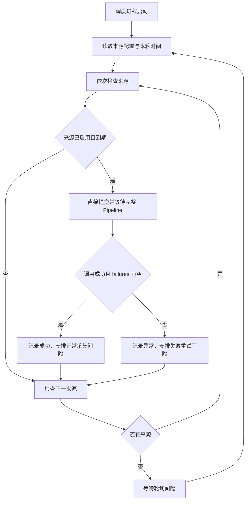

来源按来源标识排序后依次检查。**单个调度进程串行提交来源任务**，前一个来源完成后才处理下一个；较慢来源会延后其他来源的执行。

每次提交使用 `actor_id="system-scheduler"`、对应的 `source_id` 和固定的 `max_articles=3`，不指定文章 URL，也不启用强制刷新。采集目标按来源入口确定，已处理文章的跳过规则由 Pipeline 统一判断。

下次执行时间使用事件循环的单调时钟计算，基准为**本轮开始时取得的时间**，并非该来源处理完成的时间。所有来源检查结束后才等待轮询间隔，因此实际执行时间还受处理耗时与轮询节奏影响；当前机制按间隔检查到期任务，不承诺精确到某个时刻执行，也不补齐错过的历史轮次。

**成功与失败判定**

Pipeline 返回且 `failures` 为空时，调度器记录成功并安排正常间隔。成功包括文章完成导入、正常跳过，或未发现候选文章，**不表示这一轮一定新增了情报**。

返回任何失败项或提交过程中抛出异常时，调度器记录异常并安排重试，再继续检查其他来源。一次来源提交部分成功、部分失败时，整次提交仍按失败安排重试；已提交的数据保留，下一次运行根据 Pipeline 状态决定哪些文章需要重新处理。

失败重试再次提交同一来源，文章目标重新按当前入口发现，**没有单独保存失败 URL 的待重试队列**。文章重跑行为在 3.4.4 节说明。

来源配置加载发生在单次提交的异常处理之外。配置非法、缺少声明的环境变量等导致来源加载失败时，可以使调度进程退出，不能视为已安排正常的来源重试。统一启动器对托管进程退出的处理在 1.4 节说明。

**调度状态与进程生命周期**

下次执行时间保存在进程内的 `next_run` 中，不写入数据库。重启后该记录重新为空，启用来源会重新进入首次检查；文章内容和 Pipeline 处理记录仍保留，重复导入判断继续使用已有数据。

当前没有跨调度进程的来源级选主或任务锁。部署多个调度实例时，各自维护时间表，可能重复抓取同一来源；文章处理阶段的租约用于协调后续处理，相关边界在 3.4.4 节说明。

## 3.6 Java 业务服务

Java 业务服务负责**规范文档、图谱对象和原文出处的持久化读写**。Python Pipeline 提交处理结果，Java 按业务约束写入 PostgreSQL；Agent 的业务查询通过查询 MCP 访问 Java 读取接口。

当前实现采用 Java 17、Spring Boot 与 Spring JDBC。**Python 组织处理过程，Java 维护业务写入事务**，模型转换和任务调度在 Python 侧完成。

**服务组成**

主要实现位于 `java-backend/src/main/java/com/threatweave/threatweave/`：

| 模块 | 职责 |
| --- | --- |
| **`ThreatWeaveController`** | 提供 REST 路由，接收与校验请求，调用业务服务并包装响应。 |
| **`ThreatWeaveRequests`** | 定义文档写入、实体关系、证据和查询请求结构。 |
| **`ThreatWeaveServiceImpl`** | 实现文档更新、抽取替换、图谱清理和业务读取，通过 JDBC 执行数据库操作。 |
| **`ThreatWeaveSchemaInitializer`** | 在应用启动时创建业务 schema、数据表与索引，并执行已有的兼容调整。 |
| **`ThreatWeaveReadQueryPolicy`** | 检查通用查询的 SQL 与数据集范围；具体规则在 3.7 节说明。 |

数据库连接由 `java-backend/src/main/resources/application.yml` 配置，读取项目的 `DB_*` 环境变量。Java 初始化业务表，Pipeline 管理处理状态表；两者的数据职责在 3.3 节说明，持久化资源组织在第 4 章展开。

**业务接口**

接口统一位于 `/api/threatweave` 下。下表列出相对于该前缀的路径：

| 方法与路径 | 用途 | 主要返回内容 |
| --- | --- | --- |
| **`POST /documents`** | 按 `doc_key` 写入或更新规范文档。 | 已保存的文档记录，包含主键与正文。 |
| **`GET /documents/{documentId}`** | 按文档 ID 读取文章。 | 文档记录。 |
| **`GET /documents/by-key`** | 按 `docKey` 查询文章。 | 文档记录。 |
| **`GET /documents/{documentId}/extraction`** | 读取指定文章的抽取结果及证据。 | 文档 ID、实体列表与关系列表。 |
| **`POST /extractions`** | 提交单篇文章的完整最新抽取结果。 | 文档 ID 与本次处理的实体、关系数量。 |
| **`GET /graph`** | 按关键词和可选文档范围查询图谱对象。 | 实体列表与关系列表。 |
| **`GET /read-model`** | 描述允许查询的数据集、字段与关联。 | 读模型、示例与查询约束。 |
| **`POST /read-query`** | 执行受限、参数化的业务查询。 | 结果行、返回行数与最大行数。 |

**Java REST 接口与 Agent 工具不是一一对应。** 当前查询 MCP 只暴露读模型描述与受限查询两个工具；文档和抽取写入由 Pipeline 的命令适配器调用，其他读取接口仍属于 Java 服务能力。

**规范文档写入**

文档写入以 `doc_key` 为更新依据，数据库唯一约束防止同一标识重复建文档。更新时保留文档主键与首次创建时间，刷新来源信息、正文、正文哈希和本次整理、入库时间。

Java 使用请求提供的正文哈希判断内容变化；在项目的 Pipeline 调用路径中，该哈希由 Python 计算。**正文更新与该文章旧出处的清除在同一事务中完成**，避免新正文继续使用旧字符位置。具体数据含义在 3.3 节说明。

这一阶段只确认规范文档保存成功，后续抽取由另一接口提交。若后续处理失败，已提交的文档事务不会被回滚，完整流程的失败边界在 3.4.4 节说明。

**完整抽取替换与图谱一致性**

抽取写入以 `documentId` 指定文章，提交的数据代表该文章的完整最新结果，不能作为只增加几条事实的增量接口使用。单次写入在一个事务中完成：

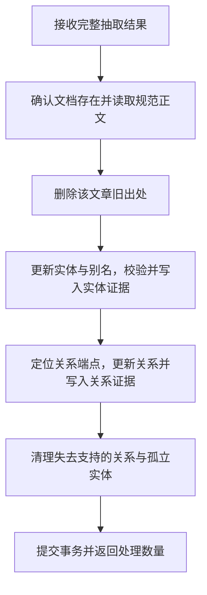

关键更新规则如下：

- **实体复用**：同类型、同规范值的实体更新共享记录。新展示名称为空时保留已有名称；语义角色和置信度按本次输入更新，空角色使用 `unknown`。
- **别名维护**：非空别名按实体去重插入，不因当前文章未再次提交某个别名就移除已有别名。别名表不按文章分别维护，实体删除时关联别名随之删除。
- **关系复用**：通过类型与规范值定位源、目标实体，拒绝同一实体连接自身。已有关系更新置信度；有观察时间输入时，首次时间取较早值、最后时间取较晚值。
- **证据核对**：Java 将证据范围与当前正文片段比对，范围无效或引文不一致时拒绝写入。上游候选筛选在 3.4.3 节说明。
- **失去支持的数据清理**：先删除没有任何关系出处的关系，再删除既无实体出处、也未连接任何关系的实体。其他文章仍支持的对象继续保留。

**任一步抛出异常时，本次抽取事务整体回滚**，包括旧出处删除与已经进行的实体、关系更新。回滚只涉及当前接口事务，不恢复此前独立文档事务已清除的出处。

成功响应中的 `entitiesProcessed` 与 `relationsProcessed` 是本次输入被处理的数量，不是新增数量，也不是情报库总量。共享实体的角色与置信度目前按写入更新，没有自动综合所有文章证据计算统一评分。

**读取行为**

按文档 ID 或 `doc_key` 读取时，文档不存在会返回业务错误。读取文章抽取结果前也会先确认文档存在，再通过该文章的出处查询实体与关系；**存在文章但没有抽取结果，与文章不存在是不同情况**。

单篇抽取结果按出处返回，同一实体或关系有多条证据时可能出现多行。调用方汇总对象数量时，需要区分对象记录和证据行。

图谱接口使用 `query` 搜索实体规范值或展示名称，并按关系端点的规范值匹配关系；提供有效 `documentIds` 时，通过出处限定文档范围。实体与关系列表分别排序、限制数量，**不保证返回所有关系端点的完整闭合子图**。统计和灵活关联查询可使用受限查询接口，规则在 3.7 节展开。

**响应与调用边界**

REST 响应统一包含 `code`、`message`、`data` 和 `timestamp`。成功业务码为 `200`；参数校验、业务异常和系统异常由统一异常处理器转换为对应响应。

**HTTP 请求成功不等于业务操作成功。** 当前异常响应可以使用 HTTP 200 返回非 200 业务码，Python 命令适配器与查询 MCP 都会继续检查业务码，再读取 `data`，避免把错误响应当作已确认结果。

Java 当前处理共享情报数据，没有接入 FastAPI 的用户登录会话校验。用户身份、会话归属与文件下载权限由 FastAPI 管理，认证流程在第 11 章说明。

## 3.7 只读查询 MCP

只读查询 MCP 将 Java 业务读取能力转换为模型可调用的工具。它通过 **Streamable HTTP** 提供服务，使用 HTTP 客户端转发查询，数据库访问与 SQL 校验由 Java 执行。

业务查询采用**先发现读模型，再提交参数化查询**的方式。模型可以围绕当前问题选择字段、筛选条件、统计与关联，而不需要为每一种业务问题注册一个专用查询工具。

**工具契约**

| 工具 | 输入 | 输出与作用 |
| --- | --- | --- |
| **`describe_read_model`** | 无业务参数。 | 返回 schema 版本、可查询数据集、主键、字段语义、关联方式、SQL 示例及部分查询约束。 |
| **`execute_read_query`** | 非空 `sql`，以及与 `?` 占位符对应的可选 `parameters` 列表。 | 返回查询结果行、实际返回行数和最大行数；查询被拒绝或执行失败时返回工具错误。 |

当前可查询范围为 `threatweave` 下的文档、实体、别名、关系与出处五类数据，以及 `workflow.document_processing` 处理记录。各对象的关系在 3.3 节说明；会话 checkpoint、用户记忆和认证数据不在查询允许清单中。

模型应根据读模型使用完整数据集名称，例如 `threatweave.documents`。**用户提供的值放入参数列表，不直接拼接进 SQL**，例如按指定文档 ID 查询正文：

```json
{
  "sql": "SELECT id, title, content FROM threatweave.documents WHERE id = ?",
  "parameters": [42]
}
```

该示例说明工具参数格式。占位符按出现顺序绑定，参数数量或类型不匹配时会产生执行错误；读取单篇文章的实体、关系或证据时，仍需按读模型通过出处限定文档范围。

**调用链路与工具加载**

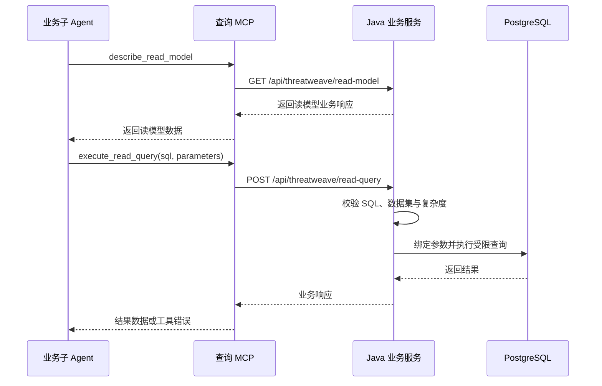

服务入口为 `src/mcp_server/server_main.py`，工具注册位于 `src/mcp_server/tools/threatweave_tools.py`。Agent 侧通过 `src/agent/tools/mcp_client.py` 发现工具，再按需要的名称选择和绑定；当前两个业务子 Agent 都使用这两个查询工具。

MCP 服务地址由 `MYAGENT_MCP_HOST`、`MYAGENT_MCP_PORT` 和 `MYAGENT_MCP_PATH` 决定，Java 请求基址由 `JAVA_API_BASE_URL` 配置。默认服务地址在 1.4 节说明。

**业务查询工具是构图依赖。** MCP 连接或工具发现失败、缺少要求的工具名称时，加载会报错，影响对应 Agent 的构建或异步服务加载。公共搜索具有独立的降级实现，业务查询没有用空结果代替不可用服务的降级逻辑。

**SQL 校验与执行限制**

Java 使用 SQL 解析器确认语句结构，再检查数据集和项目规定的限制：

| 检查项 | 当前规则 |
| --- | --- |
| **语句类型** | 只接受单条 `SELECT` 或受支持的非递归 `WITH SELECT`，拒绝多语句和常规写入语句。 |
| **数据集范围** | 解析得到的表必须位于业务允许清单，不能查询任意数据库表。 |
| **锁定与递归** | 拒绝 `FOR UPDATE`、`FOR SHARE` 和递归查询。 |
| **查询复杂度** | 最多 4 个显式 JOIN；规范化 SQL 中的 SELECT 数量最多为 3。 |
| **函数限制** | 拒绝当前列入清单的 `pg_sleep`、`dblink`、`lo_import`、`lo_export`、`set_config` 和 `current_setting` 调用。 |
| **结果行数** | 在查询外层追加最大 200 行限制，并设置 JDBC 最大返回行数。 |
| **查询超时** | JDBC 查询超时设置为 3 秒。 |
| **结果内容预算** | 按字段值转换为文本后的 UTF-8 长度累计，预算为 1 MiB，超出时停止收集后续行。 |

复杂度限制采用规范化 SQL 文本中的关键词计数，不等同于数据库执行计划的真实成本；内容预算也不是完整 JSON 响应的精确字节上限。**接口用于受限业务读取，模型仍需控制查询范围和字段数量**，尤其应避免在列表或统计任务中读取大量全文。

**结果含义与完整性**

`execute_read_query` 的成功结果包含：

- **`rows`**：本次实际收集到的结果行，每行按 SQL 返回列名组织。
- **`rowCount`**：`rows` 的长度，不是满足条件的全部记录数。
- **`maxRows`**：当前最大返回行数，值为 200。

接口没有额外的总量或截断标记。达到行数上限、内容预算或 SQL 自身的 `LIMIT` 时，返回结果可能只是部分数据。需要总量时应提交聚合查询；需要继续读取列表时，应明确排序并设计后续范围查询，不能将一次返回的结果称为全库完整列表。

**错误处理与资源生命周期**

MCP 服务在生命周期内共用一个异步 Java HTTP 客户端，默认 HTTP 超时配置为 15 秒，关闭时释放连接。该超时与 Java 的 3 秒数据库查询超时处于不同层次，不能理解为同一个执行时限。

连接失败、HTTP 错误、响应无法解析、非成功业务码或 Java 查询拒绝均转换为 MCP 工具错误；Java 响应协议在 3.6 节说明。业务错误信息经过长度和敏感关键词检查后用于诊断，不直接返回完整响应体。**查询失败与成功返回空行必须区分**，失败不能被解释为库中没有相关情报。

当前 HTTP 适配层不自动重试请求。Agent 可根据错误修正范围、参数或 SQL，但不能通过反复扩大查询绕过限制。角色的单篇查询范围和分析目标由 Agent 提示词、技能与任务描述确定，查询 MCP 本身只约束允许的数据集与查询行为。


# 4. 资源持久化

项目将持久化资源分为**数据库记录、远端执行文件和宿主文件**。不同资源有不同的保存位置与生命周期：恢复会话依赖 PostgreSQL，恢复交付文件还依赖原沙箱，恢复技能则依赖宿主维护的技能目录。

## 4.1 存储资源与职责划分

| 存储资源 | 保存内容 | 主要管理入口 | 恢复边界 |
| --- | --- | --- | --- |
| **PostgreSQL 业务表** | 情报文档、图谱对象、出处和文章处理记录。 | Java 业务服务、Pipeline 状态仓库。 | 数据独立于用户会话与沙箱存在。 |
| **PostgreSQL Store** | 用户记忆、会话索引、沙箱绑定、异步任务归属和交付件元数据。 | `AgentLoader`、StoreBackend 及相关服务。 | 保存长期记录和资源定位信息，不复制远端文件正文。 |
| **PostgreSQL Checkpointer** | 主会话消息、执行状态、待处理写入与中断恢复信息。 | LangGraph、`ThreadHistoryReader`。 | 按会话恢复状态，Agent 图本身重新构建。 |
| **PostgreSQL 认证表** | 用户账号、密码哈希和登录会话令牌摘要。 | `src/api/auth.py`。 | 登录会话还受有效期约束。 |
| **OpenSandbox 文件系统** | 用户工作文件、技能运行副本、指引和交付文件。 | 沙箱后端、文件交付工具。 | 原实例仍可用时继续访问；数据库绑定不等于文件备份。 |
| **宿主技能目录** | 项目维护的技能，以及管理工具完成发布的技能文件。 | `src/agent/skills/`、技能管理工具。 | 同步到沙箱，随宿主目录保留；维护方式在第 9 章说明。 |
| **宿主图表资源目录** | 图表 artifact 与历史兼容资源。 | `runtime/visualizations/`、图表资源服务。 | 依赖本地文件且受有效期清理；当前用户文件交付主要使用沙箱。 |

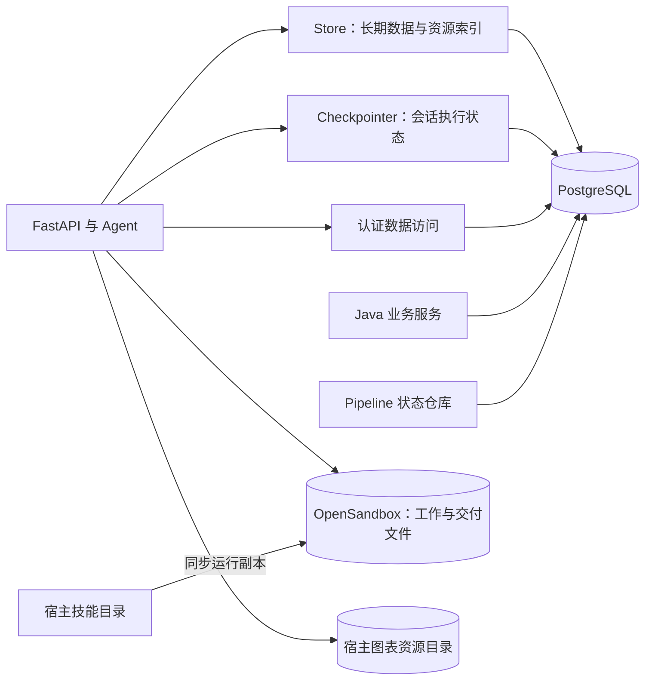

**进程内缓存不承担跨重启保存。** 用户 Agent 图、会话写入互斥标记、沙箱客户端、验证码和调度时间表等均属于运行时资源；重启后根据数据库与文件记录重新组织，其中验证码和调度时间表不会恢复。

异步分析线程与运行记录由独立 Agent Protocol 服务管理，不接入主会话 Checkpointer。当前使用本地开发服务，项目未为其配置同一套 PostgreSQL 持久化；**Store 中的任务绑定只保存归属，不能代替远端任务状态**。

## 4.2 PostgreSQL 数据分区

Python 与 Java 使用项目的 `DB_*` 配置连接 PostgreSQL。当前通过 schema、框架表和 Store 命名空间区分数据职责，**没有为每个用户单独建立数据库，也没有使用按用户划分的物理分区表**。

| 数据区域 | 当前内容 | 结构维护者 |
| --- | --- | --- |
| **`threatweave` schema** | 文档、实体、别名、关系和出处表。 | Java 启动初始化器。 |
| **`workflow` schema** | `document_processing` 文章处理状态表。 | Pipeline 状态仓库，在运行前准备。 |
| **`auth` schema** | `users` 和 `sessions` 认证表。 | 认证仓库，在首次使用时初始化。 |
| **Store 框架表** | `store` 及 `store_migrations` 等框架结构。 | `AsyncPostgresStore.setup()`。 |
| **Checkpoint 框架表** | `checkpoints`、`checkpoint_blobs`、`checkpoint_writes` 和迁移记录。 | `AsyncPostgresSaver.setup()`。 |

框架建表语句使用未带 schema 前缀的名称，实际位置由数据库连接的搜索路径决定，通常位于默认 `public` schema。**框架升级和应用业务表更新由不同入口维护**，不能只准备业务表就认为会话持久化已就绪。

业务情报表与文章处理记录共享使用，没有用户归属字段；用户记忆与会话索引则按身份区分。Checkpoint 以 `thread_id` 区分会话，访问前由 API 检查用户会话索引，数据库中的线程标识本身不是登录凭据。

各类结构在服务启动或首次使用时准备。框架 setup 保留已有历史记录，业务初始化执行当前代码定义的建表与兼容调整；Pipeline 还会清理已废弃的工作流结构，**结构准备不等于保留所有旧版本表**。

## 4.3 Store 与 Checkpointer

Store 和 Checkpointer 共用 PostgreSQL 配置，分别使用独立异步连接，由 `src/agent/config.py` 创建。**Store 管理可按键读取的长期数据，Checkpointer 管理图执行的会话状态**，两者不能互相代替。

**Store 的数据组织**

Store 使用“命名空间 + 键”定位记录，当前主要约定如下：

| 用途 | 命名空间 | 键 | 保存内容 |
| --- | --- | --- | --- |
| **用户记忆文件** | `(user_id,)` | 路由后的文件路径，例如 `/{user_id}/preferences.md`。 | 文件内容、编码及创建、修改时间。 |
| **会话索引** | `("sessions", user_id)` | `thread_id`。 | 会话标题、创建与更新时间。 |
| **用户沙箱绑定** | `("sandboxes", user_id)` | `"current"`。 | 当前 `sandbox_id`。 |
| **异步任务归属** | `("async_tasks",)` | `task_id`。 | 发起用户、用户名与所属主会话。 |
| **交付件登记** | `("sandbox_deliverables",)` | `artifact_id`。 | 用户归属、沙箱路径、文件名、MIME 类型与展示标签。 |

会话索引用于侧边栏与归属校验，完整对话不写在索引中。沙箱绑定和交付件登记只保存定位信息；没有对应远端资源时，记录仍可能存在。

主 Agent 的 `/memories/` 是虚拟文件路由。例如模型读取 `/memories/{user_id}/preferences.md` 时，StoreBackend 使用当前用户命名空间和去掉 `/memories` 前缀后的路径访问记录。**数据库记忆不是沙箱磁盘上的同名文件**，沙箱替换不直接删除该记忆。

当前 Store 未配置向量索引或默认过期策略，项目主要使用键读取和命名空间搜索。记忆如何形成和更新在第 7 章说明。

**Checkpointer 的保存与恢复**

主 Agent 执行携带 `thread_id`，框架保存消息和状态变化。Checkpoint 还使用内部命名空间与版本信息区分图及子图状态，这些结构由框架维护，不由 API 手工拼接为完整对话。

历史读取通过 `src/agent/history_reader.py` 构建只读状态图，重建消息增量并恢复当前中断信息。该读取只访问持久化状态，**不调用模型，也不需要用户沙箱**，因此历史展示与继续执行具备不同的资源要求。

服务重启后，可以用原 `thread_id` 恢复会话，用原 `user_id` 读取记忆与索引；需要继续 Agent 执行时，再构建用户图并取得可用沙箱。恢复机制不保存模型请求的网络连接或进程内对象。

会话索引更新、Checkpoint 写入与其他 Store 登记是独立操作，没有覆盖全部资源的统一事务。会话写入协调在当前 FastAPI 进程内进行，**现有部署按单 worker 使用**；数据库持久化本身不能替代多 worker 所需的分布式协调。

## 4.4 沙箱文件与交付件元数据

沙箱文件后端保存实际文件字节，数据库保存其归属与访问元数据。当前交付支持 Markdown、HTML 和 JSON，统一写入用户沙箱的 **`/deliverables/`** 目录。

文件写入工具校验文件名、扩展名与 MIME 类型，限制 UTF-8 文本为 4 MiB 以内。可读展示标签与实际安全文件名分别管理；声明中的路径供服务登记使用，页面通过资源标识访问文件。

**文件、登记与消息引用**

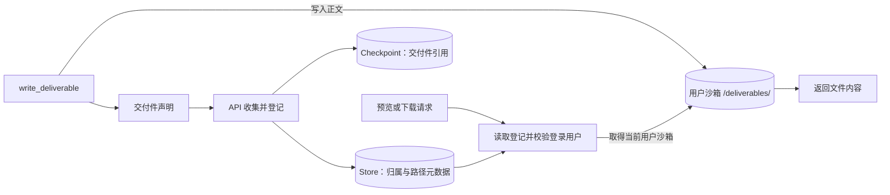

**文件写入成功、登记完成、消息包含下载引用是三个不同环节。** Store 登记不复制文件正文，也不创建文件快照；历史消息恢复后通过保存的 `artifact_id` 重建访问入口，具体交付链路在第 10 章展开。

登记使用交付标识与沙箱路径生成稳定的 artifact ID，同一次交付重复声明同一路径时只登记最后一份元数据。文件本身仍按路径保存，因此不同任务复用同一文件名时可能覆盖内容，**旧下载引用不会自动保留旧版本**。

下载时，API 先校验登记中的用户归属，再从该用户当前沙箱读取文件。登记没有保存原沙箱 ID；若用户已经更换沙箱，元数据与历史引用可以保留，但新沙箱缺少旧文件时仍无法下载。恢复任务和记忆不能自动重新生成这些文件。

**文件保留与可恢复范围**

- **正常应用关闭**：关闭用户沙箱客户端，保留远端用户实例；原实例未到期且仍可用时，可以重新连接其中的文件。
- **沙箱确认失效**：管理器分配替代实例，项目未实现旧工作文件或交付件的自动迁移。技能运行副本可以从宿主重新同步，普通文件无法据登记恢复正文。
- **当前交付策略**：Store 登记和 `/deliverables/` 文件没有独立的七天清理任务，实际文件可用期依赖沙箱生命周期与后续路径写入。

另有宿主图表 artifact 服务使用 `runtime/visualizations/` 保存文件，供已有图表引用与兼容路径访问。该目录默认保留 7 天，每小时检查清理一次，分别由 `MYAGENT_VISUALIZATION_TTL_DAYS` 和 `MYAGENT_VISUALIZATION_CLEANUP_INTERVAL_SECONDS` 调整。**这项保留策略不适用于沙箱交付文件**；宿主图表文件过期或缺失时，访问接口返回“图表已过期”占位图。

## 4.5 持久化资源生命周期

资源创建与释放跟随各服务的生命周期。FastAPI 启动时初始化 Store、Checkpointer、历史读取器与沙箱管理器；Java 准备业务表，认证和 Pipeline 的结构按各自使用入口准备。用户 Agent 图与用户沙箱在请求需要时取得，构图和沙箱细节分别在第二、五章说明。

初始化未完成时，已取得的数据库连接和管理资源会被回收，避免暴露半初始化对象。正常关闭时，FastAPI 先停止本地图表清理任务，再释放 AgentLoader 资源：清空用户图缓存、关闭沙箱管理器，最后关闭 Checkpointer 与 Store 连接。

**关闭连接与删除数据是不同操作。** 沙箱管理器等待已接纳的资源操作结束，终止尚未分配给用户的预热实例，关闭用户客户端；不主动终止已分配的用户沙箱，也不删除持久化绑定。各服务连接关闭后，数据库记录仍保留。

| 操作或事件 | 当前影响 | 后续恢复条件 |
| --- | --- | --- |
| **FastAPI 正常重启** | 进程缓存与连接重新创建，数据库记录保留。 | PostgreSQL 可访问，原用户与会话索引仍在；文件还要求沙箱有效。 |
| **删除一条会话** | 先删除该线程 checkpoint，再删除用户会话索引。 | 本会话不再作为有效历史恢复；其他持久化资源不随之整体删除。 |
| **退出登录或登录会话到期** | 注销对应令牌或使其不可用。 | 再次登录后可访问仍保留的用户数据。 |
| **用户沙箱到期或确认终止、失败** | 分配新实例并更新当前绑定。 | 会话与记忆可恢复，旧普通文件不保证可恢复。 |
| **宿主图表文件过期** | 文件清理，历史中的 artifact 引用可继续存在。 | 页面显示过期占位，数据库不重建文件正文。 |
| **调度进程重启** | 来源下次执行时间重新计算。 | 文章处理记录保留，按 Pipeline 规则判断重复处理。 |

删除会话不自动删除用户记忆、沙箱文件、交付件登记、异步任务绑定或情报业务数据，也不自动取消远端任务。异步结果投递会检查所属会话是否仍存在，避免延迟结果重新创建已删除会话。

会话删除分两步确认，不属于跨 Store 与 Checkpointer 的原子事务；异常中断时可能出现只完成其中一步的情况。当前也没有对任务绑定、交付件元数据和全部历史 checkpoint 统一执行期限清理，不能把某一资源到期理解为相关记录都已清除。

用户沙箱按访问续期，创建与续期默认有效期为 86400 秒，通过 `OPEN_SANDBOX_SANDBOX_TIMEOUT_SECONDS` 配置；没有独立的周期保活任务。**长期不访问时，数据库中保留绑定仍不能保证实例和文件长期可用**，具体续期、失效判断和清理过程在第 5 章说明。

本章的关闭顺序描述应用正常生命周期。统一启动器在 Windows 上强制结束进程树时不保证全部清理逻辑执行，启动与退出行为在 1.4 节说明。


# 5. 沙箱机制

## 5.1 核心组件与职责

**沙箱是 Agent 执行脚本、处理文件和生成交付结果的工作环境。** 主 Agent 与子 Agent 通过统一后端使用 OpenSandbox，命令在远端实例中执行，普通工作文件也保存在该实例中。

在 Harness 中，这一层承担执行环境的管理与衔接：业务工具决定要完成什么任务，沙箱后端提供文件和命令能力，管理器负责取得可用实例。

| 组件 | 主要职责 | 实现入口 |
| --- | --- | --- |
| **`SandboxManager`** | 按用户创建、连接、复用和续期沙箱，管理预热实例与关闭过程。 | `src/agent/backends/sandbox_manager.py`。 |
| **`SandboxBackendProxy`** | 为 Agent 保留稳定的后端引用，协调本地操作与底层客户端替换。 | `src/agent/backends/sandbox_proxy.py`。 |
| **`OpenSandboxBackend`** | 将命令执行、文件上传和下载转换为 OpenSandbox SDK 调用，并返回框架可识别的结果。 | `src/agent/backends/open_sandbox.py`。 |
| **`CompositeBackend`** | 根据文件路径选择沙箱或 StoreBackend，命令执行交给默认沙箱后端。 | `src/agent/main_agent.py` 中的后端配置。 |
| **`SandboxSkillSynchronizer`** | 将宿主技能与 Agent 指引同步为沙箱内的运行文件。 | `src/agent/backends/skill_sync.py`。 |
| **异步沙箱入口** | 在独立 Agent 服务中连接指定实例，建立本次运行的客户端，并在运行结束后关闭连接。 | `src/agent/subagents/async_entry.py`。 |

`OpenSandboxBackend` 实现三个基础操作：**执行命令、上传文件、下载文件**。DeepAgents 的沙箱基类在这些能力上提供其他文件操作，使 Agent 可以使用统一接口读取、检索和修改文件。

**运行环境由沙箱镜像决定。** `OPEN_SANDBOX_IMAGE` 默认使用 `myagent-sandbox:1`；仓库的 `sandbox/Dockerfile` 与 `sandbox/setup-runtime.sh` 定义了 Python、Java、Go 和 Node.js 等运行依赖。实际可用的命令和库取决于部署时使用的镜像，修改镜像配置只影响后续创建的实例，不会自动升级已复用的沙箱。

连接地址与凭据由 `OPEN_SANDBOX_HOST`、`OPEN_SANDBOX_PORT` 和 `OPEN_SANDBOX_API_KEY` 提供。未配置凭据时，主服务可以启动只读页面和历史接口，但不能创建或连接用户沙箱，也不能继续 Agent 执行。

## 5.2 用户沙箱的创建与复用

**沙箱按用户分配。** 同一用户的不同会话取得同一个当前工作环境；不同用户通过各自绑定取得实例。会话状态仍按 `thread_id` 区分，不会因为共用沙箱而合并。

主服务取得用户 Agent 时，会先向管理器申请沙箱，即使用户图已在进程中缓存，也要经过这一入口检查执行环境。管理器按以下优先级处理：

1. **复用健康的进程内代理**：当前客户端仍可用时直接使用，减少重复连接。
2. **连接持久化绑定的实例**：进程缓存缺失或健康检查未通过时，读取该用户的沙箱 ID，再判断原实例能否继续使用。
3. **分配替代实例**：没有绑定，或原实例已确认失效时，优先领取可用预热实例；没有可用预热实例则按需创建。

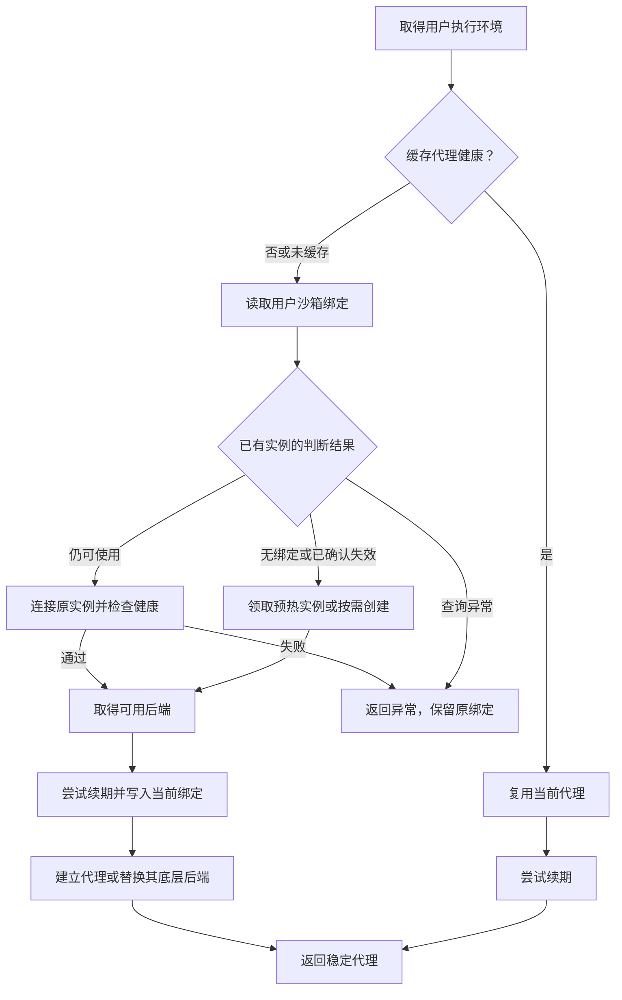

图中的绑定与代理更新只在相应步骤成功后继续。创建、连接或数据库写入失败时，请求返回异常；临时不可用与确认失效的判断标准在 5.6 节说明。

**同一用户的分配过程在当前进程内串行进行。** 用户级锁保护绑定读取、实例恢复和代理更新，避免同一用户的并发请求各自分配沙箱；其他用户可以独立取得执行环境。该锁与预热池均属于当前管理器，不构成多个服务进程之间的分配协调。

取得可用实例后，管理器尝试延长其有效期。续期失败会记录日志，当前实例和绑定仍保留；有效期配置与持久化边界见 4.5 节。

## 5.3 文件路由与命令执行

主 Agent 使用组合后端区分**数据库记忆文件**与**沙箱工作文件**。同步子 Agent 复用这一后端配置，因此文件路径在两者中的含义一致。

| 路径或操作 | 主 Agent 与同步子 Agent 的处理位置 | 用途 |
| --- | --- | --- |
| **文件工具访问 `/memories/`** | 当前用户命名空间下的 PostgreSQL StoreBackend。 | 读取与维护长期记忆，具体组织方式见 4.3 节。 |
| **文件工具访问 `/skills/`** | 当前用户沙箱。 | 读取技能说明及配套脚本。 |
| **文件工具访问 `/AGENTS.md`** | 当前用户沙箱。 | 读取同步到执行环境的项目指引。 |
| **文件工具访问 `/deliverables/`** | 当前用户沙箱。 | 保存供页面预览或下载的交付文件。 |
| **其他普通文件路径** | 当前用户沙箱。 | 保存中间结果、脚本输入输出和临时工作文件。 |
| **shell 命令执行** | 当前用户沙箱的运行环境。 | 调用脚本、命令和镜像中的运行时。 |

**`/memories/` 是文件工具的路由规则，不是挂载到沙箱的数据库目录。** 例如文件工具读取 `/memories/...` 会访问 Store，但 shell 中对同名路径执行命令只会操作沙箱文件系统，不能通过该路径读取数据库记忆。

执行命令时，后端将命令交给远端 SDK，返回执行输出与 SDK 提供的退出码。SDK 调用异常会转换为失败结果，退出码为 `1`，让 Agent 获得本次执行失败的信息；适配器不会自行重试该命令。

**单条命令超时与实例有效期分别控制不同资源。** `OPEN_SANDBOX_DEFAULT_TIMEOUT_SECONDS` 默认是 120 秒，用于限制单次命令执行；调用方显式提供超时时使用该值。实例有效期控制整个沙箱可以保留多久，不由单条命令的超时参数决定。

文件传输按文件分别返回结果。批量上传中某个文件失败，不会回滚此前成功的文件；下载返回原始字节，区分文件不存在、权限不足与其他下载错误。上层需要检查每个文件的结果，不能把收到一组响应理解为整批成功。

`/deliverables/` 是交付工具约定的目录，**并非 shell 只能访问的目录**。Agent 的命令在整个沙箱执行环境中运行；交付件的登记、访问校验和文件保留规则见 4.4 节与第 10 章。

## 5.4 同步与异步任务的沙箱共享

**多个 Agent 共享用户工作环境，但连接方式和文件路由有所区别。** 同步子 Agent 在主服务内使用现有后端；异步分析服务通过任务上下文中的沙箱 ID，建立自己的连接。

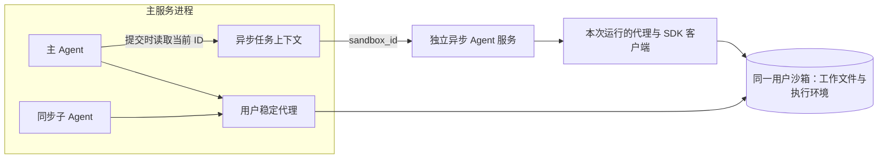

| 执行方 | 沙箱连接 | 文件路由 | 共享与独立范围 |
| --- | --- | --- | --- |
| **主 Agent** | 使用管理器返回的用户稳定代理。 | `/memories/` 进入 Store，其余文件进入沙箱。 | 用户工作区可跨主会话复用，会话状态独立保存。 |
| **同步子 Agent** | 与主 Agent 共用后端及代理。 | 与主 Agent 一致。 | 可以处理主 Agent 准备的文件，子任务状态边界见第二章。 |
| **异步 `threat_analyst`** | 连接提交时指定的同一个沙箱 ID，使用独立客户端。 | 当前组合后端没有 Store 路由，文件访问进入沙箱。 | 可以访问该实例中的工作文件，任务消息与运行状态由独立服务管理。 |

主服务提交异步任务时将当前 `sandbox_id` 写入运行上下文。异步服务只在实际执行时建立连接；单纯查询状态不会为任务连接沙箱。执行结束后，关闭本次客户端，实例仍可供主服务使用。

**共享实例不等于共享全部能力。** 异步分析任务可以读取共享文件，但没有主 Agent 的 PostgreSQL 记忆路由；它的工具与技能可见范围仍由自身配置决定。业务上的只读查询分工，也不代表整个沙箱文件系统被设为只读。

本地代理锁可以协调同一代理上的命令、传输与后端替换，不能协调独立异步进程中的客户端。多个任务同时写入同一文件路径时，仍可能互相覆盖；**共享工作区没有自动按任务划分文件版本或隔离目录**。

异步任务持有的是提交时的实例 ID。主服务之后替换用户代理，只会影响经该代理发起的后续操作，**已经提交的异步任务不会自动迁移到新实例**。异步入口直接连接指定沙箱，也不经过主服务管理器的访问续期流程。

## 5.5 沙箱预热

**预热用于减少首次分配执行环境的等待。** 管理器在后台维护最多一个已就绪、尚未分配给用户的预热实例，供需要新工作区的用户领取。

服务初始化只安排预热任务，创建实例和同步文件在后台执行，不阻塞主服务启动。预热过程包括：

1. **创建空闲实例**：使用当前镜像和有效期配置，此时不绑定任何用户。
2. **准备项目文件**：同步宿主技能目录与 Agent 指引，形成 `/skills/` 和 `/AGENTS.md` 等运行文件。
3. **发布可领取实例**：完整同步成功后才加入预热池；同步失败的实例会被回收。

预热准备的是运行文件，**不会提前执行用户任务，也不会让各 Agent 加载全部技能**。技能发现仍按 Agent 的目录配置进行，同步与加载机制分别在第六、九章说明。

用户需要新实例时，管理器在预热锁内独占领取，再检查其健康状态。领取后安排补充一个预热实例；其他用户无法领取同一实例，补充尚未完成时则可以按需创建。

**已有用户绑定优先于预热池。** 健康的旧工作区继续使用，预热实例只供首次分配或确认失效后的替代使用。空闲实例如果已经过期或不健康，会被丢弃，本次分配转为按需创建。

`OPEN_SANDBOX_PREWARM_ENABLED` 默认开启。关闭该选项只停止提前准备实例，用户仍可按需创建沙箱；预热失败也会回退到按需创建路径，实际创建仍要求 OpenSandbox 服务和配置可用。

## 5.6 失效检测与恢复

**健康检查失败不能单独证明用户工作区已经丢失。** 网络超时、执行服务暂时不可用或续期失败，都可能发生在实例仍存在的情况下。管理器因此将执行可用性检查与实例生命周期查询分开处理。

| 检测结果 | 当前判断 | 后续处理 |
| --- | --- | --- |
| **缓存代理健康** | 当前执行环境可用。 | 复用并尝试续期。 |
| **生命周期查询确认实例仍存在，重新连接后健康** | 原实例可以恢复使用。 | 连接原 ID，更新本地后端。 |
| **生命周期查询返回 404** | 管理服务确认实例不存在。 | 分配替代实例并更新绑定。 |
| **生命周期状态为 `TERMINATED` 或 `FAILED`** | 实例已终止或处于失败状态。 | 分配替代实例并更新绑定。 |
| **生命周期查询超时、503 或其他异常** | 无法确认实例是否失效。 | 返回异常，保留原绑定，等待后续访问重试。 |
| **执行健康检查失败，且原实例未确认失效** | 原工作区暂时不可用。 | 不分配替代实例，返回异常。 |
| **访问续期失败** | 延长有效期未成功，不能据此判定实例失效。 | 保留当前客户端与 ID，记录日志。 |

这里的 404 必须来自**管理接口对实例资源的查询**。执行服务或健康探针返回 404，不足以触发工作区替换。这一边界避免短暂连接故障把仍有用户文件的沙箱误判为失效。

恢复过程中，管理器保持 `SandboxBackendProxy` 对象不变，只替换其内部后端。因此已缓存的 Agent 图与同步工具继续使用同一个引用，后续操作可以进入新连接，无需因沙箱替换重新构建整张图。

**后端替换要等待同一代理正在执行的操作结束。** 多步骤技能同步还会固定整个同步期间使用的后端，避免一部分文件写入旧实例、另一部分写入新实例；这种锁定不提供数据库事务或文件回滚。独立异步任务的连接边界见 5.4 节。

失效判断发生在管理器取得执行环境时。命令执行中途失败，适配器只返回本次失败结果，**不会自动创建沙箱并重放命令**；后续请求重新取得执行环境时，才再次检查并按判断结果恢复。

替代实例是新的工作区。技能与项目指引可以通过同步重新准备，普通工作文件和交付文件没有自动迁移，具体可恢复范围见 4.4 节。

## 5.7 沙箱资源清理

**清理以资源是否已经分配给用户为边界。** 客户端连接可以释放，已经承载用户工作的远端实例则由其生命周期继续管理；未分配的预热实例由当前管理器负责终止。

| 场景 | 本地资源处理 | 远端实例处理 |
| --- | --- | --- |
| **主服务正常关闭** | 关闭用户代理持有的 SDK 客户端。 | 保留已分配用户实例及其绑定。 |
| **代理替换底层后端** | 安装新后端并关闭旧客户端。 | 替换动作本身不再额外终止旧实例。 |
| **预热同步失败、空闲实例不健康或服务关闭时仍未领取** | 关闭预热客户端及相关管理连接。 | 终止这个未分配实例；已不存在时按完成清理处理。 |
| **异步任务执行结束或异常退出** | 关闭本次运行的代理与 SDK 客户端。 | 保留与主服务共享的实例。 |
| **取得客户端的请求被取消** | 等待已开始的同步 SDK 操作收尾，回收其返回的客户端。 | 按实例是否属于未分配预热资源决定，不把取消等同于终止用户沙箱。 |
| **用户绑定写入失败或被取消** | 关闭此次取得的后端客户端。 | 保留实例，也不放回预热池，避免误删或重新分配可能已成功绑定的资源。 |

绑定写入异常不一定意味着数据库完全没有提交。管理器保留对应远端实例，是为了避免请求在提交后被取消时删除已经归属于用户的工作区。

管理器关闭后停止接纳新的沙箱获取请求，等待已接纳的获取、恢复操作以及预热任务结束，再统一释放资源。关闭操作可以重复调用，调用方取消也不会直接遗弃仍由后台 SDK 操作持有的客户端。

**这一等待范围是沙箱管理器自身的资源操作，不代表所有 Agent 业务任务都已完成。** 独立异步分析任务仍遵循自己的运行生命周期；应用总体退出顺序与强制终止进程的限制见 4.5 节。

正常释放连接不删除 Store 中的当前沙箱绑定，也不执行用户工作文件的统一清空。资源最终可用多久由远端实例状态和有效期决定，数据库记录的保留期限在第四章说明。


# 6. 中间件体系

## 6.1 中间件组成与执行顺序

**中间件为 Agent 的执行过程提供统一的运行支持。** 它们在运行开始、模型调用、工具调度和运行结束等阶段介入，准备上下文、同步技能、控制调用次数，并维护用户记忆。业务工具仍负责具体的威胁情报处理任务。

主图通过 `src/agent/main_agent.py` 装配中间件，异步分析图通过 `src/agent/subagents/async_entry.py` 独立装配。项目显式接入的主要组件如下，表格按主图传入配置的顺序排列：

| 中间件 | 主要介入阶段 | 职责 | 显式接入范围 |
| --- | --- | --- | --- |
| **`ContextInjectionMiddleware`** | 每次模型请求。 | 注入当前用户身份与偏好文件路径。 | 主 Agent。 |
| **`SandboxSkillsMiddleware`** | 每次 Agent 运行开始。 | 先同步技能运行文件，再刷新技能索引。 | 主 Agent、异步分析 Agent。 |
| **`SummarizationMiddleware`** | 模型请求。 | 压缩较早的上下文并保留近期消息。 | 主 Agent、异步分析 Agent。 |
| **`SummarizationToolMiddleware`** | 模型请求与工具调用。 | 提供主动压缩提示及 `compact_conversation` 工具。 | 主 Agent。 |
| **`ModelCallLimitMiddleware`** | 模型调用前后。 | 检查与记录本次运行的模型调用次数。 | 主 Agent、异步分析 Agent。 |
| **`ToolCallLimitMiddleware`** | 模型返回工具请求后。 | 检查本批工具调用是否超过运行上限。 | 主 Agent、异步分析 Agent。 |
| **`SkillManagementVisibilityMiddleware`** | 每次模型请求。 | 按最近用户消息控制技能管理工具的可见性。 | 主 Agent。 |
| **`MemoryUpdateMiddleware`** | 主 Agent 运行结束。 | 提取近期查询和明确表达的长期偏好，合并写入 Store。 | 主 Agent。 |

DeepAgents 还装配文件操作、同步子 Agent 委派、异步任务支持和消息配对修复等内置中间件。主图的 `memory=["/AGENTS.md"]` 会接入 **`MemoryMiddleware`**，用于加载固定指引；它与更新用户偏好的 `MemoryUpdateMiddleware` 职责不同。

**传入列表会与框架内置栈合并，不能直接把表格理解为执行流水线。** 当前项目使用 DeepAgents `0.7.13`，同名中间件在原位置替换，新组件插入到核心栈之后、固定指引等尾部组件之前：

- **技能与摘要保留框架位置**：`SandboxSkillsMiddleware` 替换内置技能中间件，项目创建的摘要实例替换内置摘要实例。
- **新增组件保持相对顺序**：用户上下文、主动压缩、模型限制、工具限制、技能管理可见性、长期记忆更新依次插入。
- **具体阶段由钩子决定**：`before_*` 按最终栈顺序执行，`after_*` 反序执行；模型包装按外层进入、内层返回的方式嵌套。只实现某个钩子的组件，只在相应阶段工作。

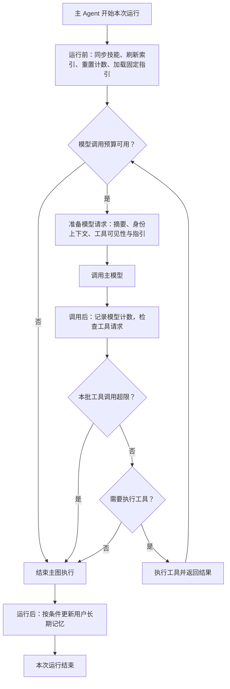

图中展示的是主图完成一次运行的主要阶段。信息补充中断、取消和异常具有各自的退出路径，不保证都进入正常结束钩子；请求与恢复过程在第 10 章说明。异步图只接入自己的技能同步和运行保护，固定指引、用户上下文及长期偏好更新不因共享沙箱而自动继承。

## 6.2 用户上下文注入

**用户上下文注入让模型知道当前服务于谁，以及应读取哪份偏好。** `ContextInjectionMiddleware` 从 `runtime.context` 中取得 `user_id` 与 `username`，在每次主模型调用时追加以下信息：

- **用户身份**：当前用户 ID 和展示名称；名称缺失时使用用户 ID。
- **偏好文件路径**：`/memories/{user_id}/preferences.md`，供 Agent 按用户读取长期偏好。
- **使用约定**：处理本轮任务前读取偏好，近期查询由系统自动维护。

身份说明加入本次模型请求的系统消息，保留原有系统内容，**不作为额外对话消息写入持久化历史**。同一用户图可以跨会话复用，模型每次调用仍从本次运行上下文取得身份信息。

这一组件只提供模型可见的说明，**不会替模型读取偏好文件，也不承担登录认证或访问授权**。真实身份由 API 认证与绑定，用户记忆的存储范围由后端确定，分别在第 11 章和 4.3 节说明。

上下文缺少有效 `user_id` 时跳过注入，不构造其他用户的文件路径。主图构建时会准备新用户的默认偏好文件，使首次读取也有明确目标，文件内容与维护规则在第七章说明。

## 6.3 技能同步

**技能同步发生在技能发现之前。** `SandboxSkillsMiddleware` 在每次运行开始时，先通过同步器准备沙箱文件，再调用框架的技能发现逻辑，避免本次任务使用宿主已经修改、沙箱尚未更新的技能副本。

这一阶段包含两个相互衔接的动作：

1. **同步运行文件**：以宿主技能目录和项目指引为来源，将变化同步到当前沙箱。
2. **刷新线程技能索引**：重新发现该 Agent 配置目录中的技能，并刷新加载错误信息，避免沿用当前线程之前保存的元数据。

同步器使用沙箱内的 `/.myagent/skills-manifest.json` 记录已管理文件的内容摘要。未变化的文件不重复上传，来源中已删除的受管理文件从沙箱移除；**全部文件操作成功后，才更新清单**。

清单更新不是整批文件的原子事务。部分上传成功后若后续操作失败，已完成的写入不会回滚，但旧清单仍保留，后续运行可以重新比较并同步。清单不存在可以按首次同步处理；读取失败或格式损坏则停止同步，避免把未知状态误认为空目录。

技能同步与技能管理共用进程内协调锁，并在多步骤操作期间固定当前代理后端。这样可协调本进程中的管理与同步操作，也避免沙箱恢复把同一次同步分散到不同实例；跨进程共享边界见 5.4 节。

**文件同步范围与技能发现范围分别配置。** 同步器准备项目维护的技能文件，各 Agent 仍只发现自身目录中的技能。目录组织、渐进式加载及技能发布后的同步关系在第九章展开。

## 6.4 上下文摘要与主动压缩

**上下文压缩减少后续模型请求携带的中间过程，保留继续任务所需的信息。** 主图与异步分析图通过统一的运行保护工厂配置自动摘要；主图额外提供 `compact_conversation`，让模型在适合的阶段主动压缩。

两种入口使用同一个摘要实例，复用摘要状态和历史归档位置。主动压缩后，自动摘要会基于已压缩的有效上下文继续处理，避免两份摘要各自演化。

| 入口 | 触发方式 | 当前用途 |
| --- | --- | --- |
| **自动摘要** | 模型调用时检查上下文规模，达到框架阈值后处理。 | 控制长对话、长工具结果和多阶段执行带来的上下文增长。 |
| **主动压缩** | 主模型调用 `compact_conversation`。 | 在消化长报告、完成一个分析阶段后，为后续任务腾出上下文。 |

摘要与偏好提取使用 **`SUMMARY_MODEL`**。当前它与主模型使用同一组 DeepSeek 服务和模型名称配置，独立设置摘要调用参数。

项目没有另外指定自动摘要阈值，采用当前框架根据摘要模型容量信息选择的默认值：

| 摘要模型容量信息 | 自动摘要触发条件 | 保留近期上下文的目标 |
| --- | --- | --- |
| **提供 `max_input_tokens`** | 上下文达到输入容量约 85%。 | 保留约 10% 容量对应的近期消息。 |
| **没有可识别的容量信息** | 上下文达到约 170000 tokens。 | 保留最近 6 条消息。 |

容量估计与保留范围由框架计算，并考虑工具请求和结果的配对，不能把比例理解为对每个业务任务长度的保证。当前框架还可以缩短较早消息中的大段文件写入参数；遇到识别为 `ContextOverflowError` 的模型拒绝时，尝试压缩后再次调用。

主动压缩也有可执行条件。当前框架通常在有效上下文达到自动摘要触发阈值约一半后允许处理；未达到条件或没有可压缩的早期消息时，工具返回无需压缩的结果，**调用工具不保证每次生成新摘要**。

较早过程可归档到后端的 `/conversation_history/` 目录，摘要保留文件引用，Agent 必要时通过文件工具回看。当前目录进入用户沙箱，归档文件的可用性遵循第五章的实例生命周期。

**摘要主要改变模型使用的消息视图，并记录摘要事件，不把原始消息历史整体替换成一段摘要。** Checkpoint 中的会话状态与沙箱内的回看文件承担不同职责；归档写入失败时自动摘要仍可能继续，但不能再依赖该文件恢复细节。

项目的主动压缩提示要求保留已确认结论、补充信息或审批状态、异步任务 ID、交付资源标识和未完成事项。摘要属于模型生成结果，这些要求提供保留约束，关键业务事实仍以工具返回和业务数据为依据。

## 6.5 模型与工具调用保护

**调用次数保护用于结束持续循环的单次 Agent 运行。** 项目分别限制模型调用和工具调用，并采用 `exit_behavior="end"`：达到限制时结束当前图执行，返回说明限制原因的消息。

当前生效范围与配置如下：

| 执行图 | 模型调用上限 | 工具调用上限 | 保护来源 |
| --- | --- | --- | --- |
| **主 Agent** | 每次运行 50 次。 | 每次运行 50 次。 | `MAIN_AGENT_MODEL_RUN_LIMIT`、`MAIN_AGENT_TOOL_RUN_LIMIT`。 |
| **异步 `threat_analyst`** | 每次运行 50 次。 | 每次运行 60 次。 | `ASYNC_SUBAGENT_MODEL_RUN_LIMIT`、`ASYNC_SUBAGENT_TOOL_RUN_LIMIT`。 |
| **同步 `threat_handle`** | 当前未显式接入项目次数限制。 | 当前未显式接入项目次数限制。 | YAML 未配置该保护工厂，使用框架默认运行支持。 |
| **默认 `general-purpose`** | 当前未显式接入项目次数限制。 | 当前未显式接入项目次数限制。 | 按框架规则装配，主图新增的次数限制不自动传入。 |

数值集中定义在 `src/agent/config.py`。其中同步子 Agent 的限制常量目前没有接入实际装配，**配置中存在数值，不等于所有子 Agent 都已受同一上限控制**。

模型限制在下一次模型调用前检查，已完成调用后更新计数。工具限制在模型发出工具请求后检查；若同一批请求包含超限调用，当前结束策略会阻止整批尚未执行的调用，并补充对应工具失败消息，保持消息配对完整。

**计数范围是本次运行，不是整条会话，也不是全部 Agent 共用的总预算。** 同一会话发起新一轮运行或恢复中断时，运行计数重新开始；主图把一次同步委派计为一次 `task` 工具调用，子任务内部的模型和工具循环不逐项累加到主图计数。

摘要和长期偏好提取直接调用专用模型，不经过主图模型节点，不能把表中次数当作项目全部模型请求的总上限。已提交到独立服务的异步任务也有自己的运行过程，主图触及限制不会因此自动取消该任务。

调用次数限制与沙箱命令超时、图递归步数分别控制不同问题。**次数保护不回滚已经执行的工具，也不证明业务任务已经完成**；退出后需依据已有结果判断哪些事项仍未完成。

## 6.6 技能管理工具的动态可见性

**技能管理工具只在相关对话中向主模型展示。** `SkillManagementVisibilityMiddleware` 注册这些工具后，在每次模型请求中根据最近一条用户消息决定是否保留它们的工具定义。

当前判断采用文本规则，识别“技能”、`skill`、`skills`、安装或更新技能的表述，以及 GitHub 技能目录链接等内容。列表形式的消息内容会提取文本后判断，模型自己的回复不作为开启依据。

| 最近用户消息 | 本次模型请求中的处理 |
| --- | --- |
| **未命中技能相关规则的请求** | 移除技能管理工具定义，保留其他工具。 |
| **命中技能相关规则的请求** | 保留已注册的技能管理工具，模型可按任务决定是否调用。 |
| **没有用户消息** | 隐藏技能管理工具。 |

这一处理减少普通业务对话中的无关工具信息，也避免模型在不需要维护技能时主动选择管理操作。**关键词命中只表示工具可见，不代表工具一定执行**；简单提及技能也可能触发可见性，并非严格的业务意图分类。

可见性过滤只修改当前模型请求，不动态安装或卸载工具，**也不代替工具本身的参数校验与操作约束**。技能下载、分配、删除及保存过程在 9.5 节说明。

## 6.7 长期记忆更新

**长期记忆在主 Agent 的结束钩子中自动维护。** `MemoryUpdateMiddleware` 从当前状态取得最近用户消息和最近非空助手文本，提取本轮查询摘要及用户明确表达的稳定偏好，再合并到当前用户的偏好文件。

更新按以下过程进行：

1. **判断是否纳入记忆**：最近用户消息包含威胁情报相关关键词，或当前消息状态存在 `task`、`start_async_task` 委派记录时，进入提取流程。委派判断扫描当前可见消息，因此也可能受到历史委派记录影响。
2. **提取记忆增量**：调用 `SUMMARY_MODEL`，要求返回查询摘要与明确的长期偏好；一次性业务条件、业务数据和助手推测不应被当作稳定偏好。
3. **读取并合并已有记忆**：新查询置顶并去重，偏好按返回的键更新，保留未被覆盖的已有偏好。
4. **写入用户 Store**：更新文件内容与修改时间，供后续运行通过偏好文件读取。

**更新对象是用户长期偏好，不是业务情报库，也不替代 Checkpointer。** 记忆模型的输入只选取最近用户消息与截取后的助手文本，没有把全部子 Agent 过程或异步后台结果自动转成长期记忆。偏好结构、近期查询数量和存储形式在第七章说明。

提取结果格式无效或调用失败时，本次偏好增量为空。没有取得查询摘要时，已判定需要记录的用户消息会按长度限制作为查询回退值；若仍提取到了有效偏好，则继续合并。Store 读取或写入失败会记录日志，**不因记忆更新失败中止已完成的主图回答**。

更新是一次“读取、合并、写入”的操作，没有跨进程原子合并保证；同一用户多会话同时修改偏好仍可能发生覆盖，状态与并发约束在 7.6 节说明。

偏好提取调用可能产生模型流事件。API 将 `MemoryUpdateMiddleware.after_agent` 标记的内部事件从聊天流中过滤，避免把记忆用的 JSON 展示为助手回答；更新本身仍属于结束阶段的工作，可能增加本次运行的收尾时间。


# 7. 记忆与状态管理

## 7.1 记忆与状态的分类

**项目按信息的归属与用途管理记忆和状态。** 用户偏好服务于跨会话个性化，会话状态记录当前对话及其执行进度，子任务状态支撑委派、恢复和结果关联。它们具有不同的共享范围，不能只因都能保留信息就合并为同一种“记忆”。

| 类型 | 主要内容 | 归属与共享范围 | 管理方式 |
| --- | --- | --- | --- |
| **固定 Agent 指引** | 角色行为、业务边界、偏好使用约定。 | 由项目维护，供配置了对应来源的 Agent 使用。 | 宿主指引同步到沙箱，主图通过固定指引中间件加载。 |
| **用户长期记忆** | 稳定偏好和近期查询摘要。 | 属于用户，同一用户的多个会话共享。 | 通过 Store 保存偏好文件。 |
| **主会话状态** | 消息、工具请求与结果、摘要事件、技能索引和异步任务记录等。 | 属于一个主会话。 | 由图维护，Checkpointer 保存可恢复状态。 |
| **同步子任务状态** | 委派描述、子任务消息、工具过程与待恢复执行。 | 属于父会话中的一次子任务调用。 | 使用独立消息上下文，随父线程的执行体系保存。 |
| **异步任务状态** | 远端任务消息、运行状态与输出。 | 属于独立 Agent Protocol 线程和运行。 | 由异步服务管理，通过任务记录与归属绑定关联主会话。 |
| **进程内管理状态** | 用户图缓存、已访问会话集合、活跃会话标记和客户端引用。 | 只在当前服务进程内有效。 | 重启后重建，不承担长期数据保存。 |

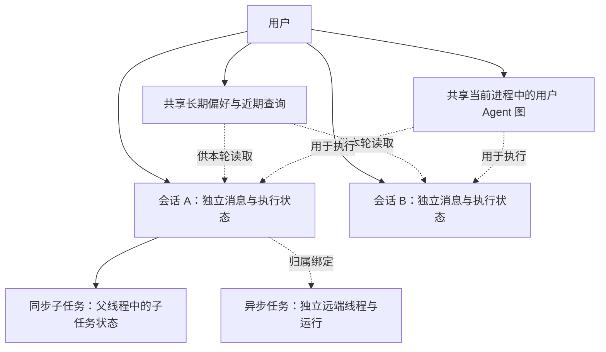

**共享 Agent 图不等于共享对话状态。** 图提供可复用的执行结构，每次运行携带自己的 `thread_id`，框架据此读取和更新对应会话；用户级偏好则可以影响该用户的不同会话。

情报文档、实体、关系和出处构成业务事实库，具体模型见第三章。普通沙箱文件承担执行和交付用途，文件共享与保留规则见第五章；数据库分区和存储键约定见第四章。

## 7.2 用户长期记忆

**当前长期记忆主要保存在用户偏好文件中。** Agent 通过 `/memories/{user_id}/preferences.md` 访问，文件正文采用 YAML，使用 `UserPreferences` 表示其结构。

| 字段 | 内容 | 当前规则 |
| --- | --- | --- |
| **`preferred`** | 用户明确表达、希望后续交互沿用的稳定偏好。 | 使用开放对象，键名不预先固定；可以描述语言、详略或展示方式等。 |
| **`recent_queries`** | 最近记录的威胁情报请求摘要。 | 自动更新时将新记录置顶、忽略大小写去重，最多保留 5 条；自动新增记录最长 160 字符。 |

新用户的默认内容如下：

```yaml
preferred: {}
recent_queries: []
```

主图首次构建时只在文件缺失的情况下准备默认值，保留已有记录。模型每轮读取偏好是提示词中的行为约定；上下文中间件提供文件路径，自动更新过程在 6.7 节说明。

**偏好合并以顶层键为单位。** 新增键与已有键一起保留，同名键由新值覆盖；嵌套对象也作为该键的整体值替换，没有任意深度的递归合并。近期查询则按条目更新，不随着某个偏好变化而整体清空。

自动维护器只解析这两个字段并按统一结构写回，**额外的顶层字段不会保留**。无法解析的 YAML 或类型不符合要求的字段按空值处理，下一次更新可能以恢复后的结构覆盖旧内容。

长期记忆的使用遵循当前提示词约束：

- **当前明确要求优先**：已有偏好可以补充表达方式，不能覆盖本轮的明确要求。
- **近期查询只提供背景**：不能根据历史条目自行决定当前文章、分析对象或查询范围。
- **交付类型由当前请求决定**：偏好可以影响已请求文件的样式，不得把普通查询自动升级为报告或图。

偏好没有按会话复制。同一用户在会话 A 更新后，会话 B 后续读取时可以取得新内容；会话 B 已经读取到的本轮上下文不会因为数据库更新而自动重新加载。

## 7.3 会话消息与执行状态

**主会话保存消息，也保存图下一步如何继续。** `thread_id` 标识会话，Checkpoint 在执行过程中记录状态变化，使下一轮对话可以承接历史，暂停的任务也可以按原会话恢复。

会话快照中，与项目行为直接相关的信息包括：

| 信息 | 主要内容 | 用途 |
| --- | --- | --- |
| **状态值 `values`** | 用户和助手消息、工具调用与结果，以及各中间件维护的运行字段。 | 为后续模型调用、历史恢复和任务管理提供上下文。 |
| **后续节点 `next`** | 尚待继续执行的节点。 | 判断图是否仍有未完成调度，避免外部消息写入改变暂停任务的后续执行。 |
| **任务信息 `tasks`** | 当前执行任务的信息，可能包含错误、子图信息或中断。 | 识别执行停留位置，恢复相关任务状态。 |
| **中断信息 `interrupts`** | 中断标识及要求补充或确认的内容。 | 在页面重新打开后还原待处理问题，并将恢复输入关联到暂停调用。 |

工具请求和结果通过 `tool_call_id` 配对。保存工具过程不仅用于展示，也为后续执行提供已完成步骤的依据；助手正文、工具结果与交付件引用分别保留各自的消息角色和内容。

正常对话与信息补充的状态关系如下：

```mermaid
stateDiagram-v2
    state "已创建会话索引" as Created
    state "正在执行" as Running
    state "等待用户补充" as Paused
    state "本轮结束" as Finished
    [*] --> Created
    Created --> Running: 首条用户消息
    Running --> Paused: 触发信息补充中断
    Paused --> Running: 同一会话提交恢复输入
    Running --> Finished: 本轮执行完成
    Finished --> Running: 下一条用户消息
```

图中描述执行阶段，不代表项目为主会话另外维护了同名状态枚举。空会话可以只有索引而尚无消息；进入运行后，状态随图步骤保存，遇到 `interrupt()` 时保留恢复所需信息。

恢复时使用同一个 `thread_id`，通过 `Command(resume=...)` 提交补充内容，让暂停调用继续处理。**运行时用户身份仍由本次已认证请求提供**，历史中曾经出现的用户名或客户端提交字段不能代替当前身份绑定。

DeepAgents 的消息以增量方式持久化，项目通过 `ThreadHistoryReader` 使用已编译状态图重建消息，不能把一条原始 checkpoint 记录直接当作完整聊天内容。读取器还补全当前待处理中断，避免最小读取图缺少某些执行节点时遗漏暂停信息。

历史读取不会执行模型或连接用户沙箱；继续运行则需要取得可用执行环境。摘要事件对模型消息视图的影响见 6.4 节，页面如何筛选和展示历史见第 12 章。

**断开页面连接不等于清空会话。** 已保存的状态仍可供历史读取，但普通取消或异常与信息补充中断具有不同的执行含义；能否继续及从哪里继续，要以保存的任务和中断信息为依据。

## 7.4 同步子 Agent 的状态

**同步子 Agent 的消息上下文独立，恢复归属仍在父会话中。** 当前 `threat_handle` 由主 Agent 的 `task` 工具调用，框架为本次委派准备子任务状态，使用委派描述作为起始用户消息。

| 环节 | 当前状态处理 |
| --- | --- |
| **准备输入** | 传递框架允许的公开状态字段，将消息上下文设置为本次委派描述。 |
| **内部执行** | 子 Agent 维护自己的消息与工具过程，在父线程关联的子图命名空间下运行。 |
| **返回结果** | 最终非空助手文本作为 `task` 的 `ToolMessage` 返回主图；允许回传的公开状态字段按框架规则更新。 |
| **保留内部边界** | 原始子任务消息、待办和结构化响应等不直接作为同名状态整体覆盖主图；标记为 Agent 私有的技能和摘要字段也被过滤。 |

主 Agent 不把整段聊天历史自动复制给该子任务，因此委派描述需要包含任务所需的文章目标、已知条件和预期输出。共享沙箱中的文件可以补充输入，但**文件可访问不等于子 Agent 已获得主会话全部语境**。

框架利用父会话的 Checkpointer 保存嵌套执行状态，并通过内部命名空间区分调用。同步子任务不创建独立的用户会话索引，也不因角色名称相同就在多次委派之间自动沿用同一份完整消息历史。

如果嵌套执行产生中断，待恢复内容仍与父线程关联，项目读取器可以补读当前相关任务的中断。当前 `threat_handle` 未配置专用信息补充或审批机制，不应把框架具备恢复能力理解为该角色每次处理都会暂停。

**父会话的用户可见记录主要保留委派和返回结果。** 子 Agent 内部文本和工具事件不会直接作为普通助手回答实时展示；结果随后参与主 Agent 的回答。具体流式过滤和历史序列化分别见第 10、12 章。

## 7.5 异步任务的独立状态

**异步分析拥有独立的远端线程和运行记录。** 主 Agent 提交 `threat_analyst` 时，把任务描述作为远端输入；远端状态由 Agent Protocol 服务维护，主会话只保存管理和关联任务所需的信息。

当前 `task_id` 使用远端线程 ID，`run_id` 标识该线程的一次执行；两者都不同于所属主会话的 `thread_id`。异步图没有接入主服务的 Store 和 PostgreSQL Checkpointer，任务上下文也不会自动包含主会话全部历史或用户偏好。

任务关联涉及四类记录：

| 记录 | 保存内容 | 职责 |
| --- | --- | --- |
| **主图 `async_tasks`** | 任务 ID、Agent 名称、远端线程与运行 ID、最近状态和相关时间。 | 供当前主会话中的查询、列举和取消工具定位任务。 |
| **Store 任务绑定** | 任务 ID、发起用户、用户名与所属主会话 ID。 | 供 API 校验归属，并找到结果应投递的会话。 |
| **远端线程与 run** | 子任务消息、真实执行过程、服务报告的运行状态和输出。 | 支撑异步任务执行与状态查询。 |
| **主会话结果消息** | 返回文本、交付引用及异步任务关联标识。 | 让完成结果进入主会话，供后续对话和历史读取使用。 |

主图的 `async_tasks` 按任务 ID 合并更新，一个任务的状态变化不会替换整份任务列表。它保存的是最近已知状态：列举工具直接读取该记录，查询工具在记录尚未终态时向远端请求更新；记录已是终态时直接返回已有状态。**页面轮询不会自动刷新主图任务表中的状态字段**，页面 API 与主图工具分别维护各自的查询结果。

共享执行文件的方式见 5.4 节。主服务重启后可以恢复任务绑定和主会话记录，但远端状态能否读取还依赖独立服务的保留机制，不能由本地绑定记录重建异步执行过程。

**运行是否结束与结果是否已进入主会话分别表示。** 状态接口中的 `done` 表示查询到终态，`delivered` 表示结果已写入或已确认存在于所属主会话。

| 状态组合 | 含义 |
| --- | --- |
| **`done=false`、`delivered=false`** | 本次查询尚未取得任务终态，不进行终态结果投递。 |
| **`done=true`、`delivered=false`** | 已取得终态，结果尚未写入；父会话忙碌或暂停时可出现这种情况。 |
| **`done=true`、`delivered=true`** | 终态结果已经进入主会话，或重复查询确认该结果消息已经存在。 |

远端 `success` 也要结合输出校验解释。例如调用限额导致图正常结束时，运行服务可能报告成功，但项目会将未完成的业务交付转换为错误说明。当前终态集合包含 `success`、`error`、`interrupted`、`cancelled` 和 `timeout`，不能把 `done=true` 等同于分析成功。

结果消息使用固定 ID `async-task-result:{task_id}`，重复查询通过已有消息确认投递，避免重复追加。父会话已有待执行节点或中断时延后写入，保持原恢复路径；具体查询、校验与投递链路见第 10 章。

结果投递通过状态更新写入消息，**不会自动触发一次主 Agent 对话或重新执行长期记忆更新钩子**。投递后的结果可以成为下一轮对话的上下文，偏好仍按其自身更新机制维护。

## 7.6 状态隔离与并发约束

**项目同时使用用户隔离、会话隔离和进程内写入协调。** 它们分别控制资源归属、图状态和并发修改，不能仅凭 checkpoint 分线程保存就认为所有共享资源都已隔离。

| 范围 | 当前隔离或协调方式 | 实际边界 |
| --- | --- | --- |
| **不同用户** | API 绑定登录身份，记忆按用户命名空间保存，执行环境按用户取得。 | 会话、任务与交付访问还需各自归属校验。 |
| **同一用户的不同会话** | 使用不同 `thread_id` 保存消息和执行状态。 | 可以并行执行，但共享该用户的偏好与沙箱文件。 |
| **同一主会话的写操作** | `thread_operation` 协调聊天、恢复、删除和异步结果投递。 | 活跃写操作期间拒绝冲突请求，异步投递可以延后。 |
| **用户图与沙箱获取** | 用户级锁保护首次构图、实例获取和缓存更新。 | 锁不覆盖这个用户所有会话的完整业务执行。 |
| **同一代理的文件与命令操作** | 代理锁协调操作、同步与后端替换。 | 不覆盖独立异步进程的客户端，具体边界见 5.4 节。 |
| **多个主服务 worker** | 当前没有分布式会话锁或跨进程缓存协调。 | 现有部署按单 worker 使用。 |

同一会话发生写入冲突时，普通接口返回 409；已进入 SSE 响应的请求通过错误事件携带对应状态码。流式处理在整个生成过程持有会话标记，结束、取消和异常时释放，避免页面断开后留下永久的“处理中”状态。

**暂停状态与活跃标记分别判断。** 等待用户补充时，原请求可以已经结束、进程内标记已经释放，但 checkpoint 仍有待恢复内容。异步结果投递因此同时检查会话是否忙碌，以及保存状态中是否还有后续节点或中断。

归属校验在写入协调范围内再次执行，防止先检查有效、随后会话被删除、延迟操作又写回的情况。已删除父会话不会由迟到异步结果重新创建；会话删除对其他资源的影响见 4.5 节。

同一用户的会话并行时，**偏好读改写可能互相覆盖，文件路径也可能发生写入冲突**。当前会话标记不提供用户级偏好事务、文件版本管理或跨进程原子合并；需要保留的文件应使用明确的任务或交付路径。

宿主技能目录与业务情报库由项目共享维护，不按用户拆成独立副本。用户记忆和工作区隔离不意味着技能发布或情报写入只影响当前用户，具体规则分别在第九、三章说明。

**Checkpoint 保存图状态，不提供外部副作用的整体回滚。** 工具已经写入的业务数据或文件，不会因本轮取消、超限或异常自动撤销；重试与恢复仍需遵循对应工具的重复处理规则。Pipeline 的重复处理机制见 3.4 节。


# 8. 工具系统

## 8.1 工具分类与接入方式

**工具把 Agent 的决策连接到可执行操作。** 模型根据工具名称、说明和参数结构选择调用，框架解析请求并执行相应实现，再将结果作为工具消息或状态更新交回 Agent。

项目使用框架工具、MCP 工具和本地 Python 工具三种接入方式，按职责组成各 Agent 的工具集合：

| 接入方式 | 当前工具或工具组 | 主要用途 | 配置入口 |
| --- | --- | --- | --- |
| **框架中间件** | 文件与命令工具、同步委派 `task`。 | 提供通用执行能力和同步子任务入口。 | `create_deep_agent` 与文件后端配置。 |
| **公共 MCP** | 公共搜索，当前将 `bing_search` 适配为 `web_search`。 | 检索外部公开信息。 | `src/agent/tools/mcp_client.py`。 |
| **业务 MCP** | `describe_read_model`、`execute_read_query`。 | 发现和读取 ThreatWeave 业务数据。 | 查询 MCP 与子 Agent 工具声明。 |
| **本地业务工具** | `run_threat_pipeline`。 | 将文章导入交给完整 Pipeline。 | `src/agent/tools/threat_pipeline_tools.py`。 |
| **本地运行工具** | 信息补充、异步任务管理、图谱生成和交付件写入。 | 衔接人工输入、远端执行与结果交付。 | `src/agent/tools/`、`src/services/deliverables.py`。 |
| **技能管理工具** | 下载、分配、删除和保存技能等。 | 维护项目技能资源。 | `src/agent/tools/skill_tools.py`，详见 9.5 节。 |

```mermaid
flowchart LR
    FRAMEWORK["框架中间件"] --> TOOLS["Agent 工具集合"]
    LOCAL["本地工具工厂"] --> TOOLS
    CONFIG["MCP 服务配置"] --> DISCOVERY["异步发现工具定义"]
    DISCOVERY --> ADAPT["名称适配与按需选择"]
    ADAPT --> TOOLS
    TOOLS --> MODEL["模型选择工具及参数"]
    MODEL --> CALL["框架调度工具实现"]
    CALL --> RESULT["工具消息或图状态更新"]
```

**工具定义与执行位置分别确定。** 文件工具通过后端访问沙箱或 Store；本地 Python 工具在当前 Agent 服务进程中运行，可进一步调用 Pipeline、Agent Protocol、Charts MCP 或沙箱 SDK；MCP 工具将请求发送到对应服务。把 Python 函数注册成工具，不会自动将函数搬到沙箱执行。

MCP 加载使用 `MultiServerMCPClient` 和 Streamable HTTP。业务工具按需要的名称选择，子 Agent 的 YAML 再声明最终接入项；缺少声明的工具、名称重复或配置结构无效时，加载报错。公共搜索有独立降级策略，具体行为见 8.3 节。

主 Agent 接入公共搜索、信息补充、异步任务管理和交付件工具；业务查询分别交给 `threat_handle` 和 `threat_analyst`，Pipeline 只接入前者，图谱生成只接入后者。默认 `general-purpose` 按框架规则取得主图显式工具。角色分工见第二章，工具可见性的动态变化见 6.6 节。

模型只提供工具声明中的参数。用户身份、当前沙箱和运行时状态由工具工厂或框架注入，例如 Pipeline 的发起者绑定在构图时确定，交付件工具绑定用户沙箱，异步工具从当前运行状态定位任务。

自动压缩及 `compact_conversation` 属于运行保护支持，机制在 6.4 节说明。业务查询的参数、SQL 限制和错误契约已在 3.7 节展开，本章不重复其校验规则。

## 8.2 文件与命令执行工具

**文件与命令工具由 DeepAgents 的文件中间件提供。** 它们让 Agent 使用同一套接口准备脚本、读取技能、处理工作文件和检查执行结果。

| 工具 | 主要输入 | 行为 |
| --- | --- | --- |
| **`ls`** | 目录路径。 | 列出文件与目录信息，了解当前工作区内容。 |
| **`read_file`** | 文件路径，可选读取起点与数量。 | 读取文件；文本支持按行分段读取，避免一次带入过长内容。 |
| **`write_file`** | 文件路径和文本内容。 | 创建文件，或用新内容整体替换已有文件。 |
| **`edit_file`** | 文件路径、原文本、新文本和可选替换全部标记。 | 按匹配文本修改文件；原文本不存在或匹配含糊时返回错误。 |
| **`delete`** | 文件路径。 | 调用后端删除文件，具体能力随后端确定。 |
| **`glob`** | 路径模式和搜索目录。 | 按文件名模式寻找路径，支持目录层级匹配。 |
| **`grep`** | 文本模式、搜索路径和输出方式。 | 查找字面文本，可返回命中文件、匹配内容或数量。 |
| **`execute`** | shell 命令与可选单次超时。 | 在沙箱中运行命令，返回执行输出及退出状态。 |

`write_file` 与 `edit_file` 分别适合整体写入和局部修改。后者默认要求明确的匹配位置，重复匹配时需显式决定是否全部替换；**文件修改是否成功以工具结果为依据**，不能仅凭模型发出了调用就继续使用预期内容。

`grep` 的模式是字面文本，正则表达式需求可以通过沙箱命令处理。检索和文件读取具有输出预算，命中结果或长内容可能截断；需要完整内容时，应缩小搜索范围或继续分段读取。

执行工具在没有显式超时时使用沙箱后端默认值；当前框架还限制单次超时覆盖值最高为 3600 秒。运行依赖、后端默认超时和命令失败行为见第五章。

**文件路径决定存储后端，命令使用沙箱文件系统。** 主 Agent 与同步子 Agent 的 `/memories/` 文件访问进入 Store，其余普通路径进入沙箱；异步分析图的文件后端全部进入沙箱。具体路径规则见 5.3 节。

文件传输是后端提供的基础能力，并不意味着模型工具列表中额外存在名为 `upload_files` 或 `download_files` 的工具。页面下载通过交付件 API 完成；普通 `write_file` 成功也不会自动创建页面下载入口。

## 8.3 公共搜索工具

**公共搜索用于补充外部背景和公开资料。** 当前接入 ModelScope 托管的 Bing Search MCP，由 `MODELSCOPE_BING_SEARCH_MCP_TOKEN` 配置连接所需的服务标识。

加载器将发现的 `bing_search` 统一命名为 **`web_search`**，保留原工具的参数结构与调用实现。这样 Agent 配置使用稳定名称，外部服务的命名变化由接入层适配；响应格式仍以实际 MCP 工具返回为准。

主 Agent 可使用公共搜索，异步 `threat_analyst` 也在 YAML 中显式声明 `web_search`。同步 `threat_handle` 当前没有声明搜索工具，其文章导入由 Pipeline 完成，业务读取通过查询 MCP 完成。

| 加载情况 | 当前行为 |
| --- | --- |
| **服务配置与工具发现成功** | 提供发现并适配名称后的远端工具。 |
| **默认配置缺少搜索令牌** | 提供同名本地降级工具，使 Agent 仍可构建。 |
| **加载失败或名称适配发生冲突** | 记录日志，回退到同名本地降级工具。 |

**降级工具只返回搜索不可用的说明，不执行真实检索。** Agent 应基于已有资料处理任务，并说明外部检索限制；不能把降级说明当作“未搜索到相关信息”。

降级在工具加载阶段决定。已经取得远端工具后，某次检索调用失败不会由该加载器自动替换为本地工具；后续行为以当前工具返回或异常为依据。

搜索结果用于补充背景，不能直接当作库内文章状态、实体关系或已验证出处。分析应区分库内事实、外部资料和推断，业务库读取仍以查询工具为入口。

## 8.4 信息补充工具

**`request_additional_info` 用于取得继续执行所必需的人类输入。** 它位于 `src/agent/tools/hitl_tools.py`，是本地工具，当前显式接入主 Agent，并按默认工具继承规则对 `general-purpose` 可用。

| 参数 | 含义 |
| --- | --- |
| **`information_needed`** | 需要用户补充、选择或确认的内容，以及当前无法继续的原因。 |
| **`context`** | 可选的已知信息，默认空字符串，帮助用户理解问题。 |

工具调用 `interrupt()`，中断内容包含 `information_request` 类型、待补充问题和上下文。主图暂停后，页面展示输入面板；用户提交恢复内容后，该内容序列化为工具结果，Agent 据此继续任务。

**这是暂停当前执行的入口，不是普通问句生成器。** 只有缺少必要对象或条件时才使用；当前范围已足以执行的请求应直接处理，避免把有效的全库查询再次变成不必要的信息确认。

该工具也不自动完成业务审批或授予写入能力。补充信息与工具审批是不同的中断内容，具体恢复协议见 10.3 节；当前 `threat_handle` 与异步分析器没有显式配置这个信息补充工具。

## 8.5 异步任务管理工具

**异步任务工具让主 Agent 提交和管理当前会话的后台分析。** 四个工具由 `src/agent/tools/async_sandbox_tools.py` 创建，使用注册表定位 Agent Protocol 服务，并结合主图任务记录执行操作。

| 工具 | 主要输入 | 当前行为与返回 |
| --- | --- | --- |
| **`start_async_task`** | `description`、`subagent_type`。 | 创建远端线程和运行，提交任务描述及当前沙箱 ID，返回任务回执并更新 `async_tasks`。 |
| **`check_async_task`** | `task_id`。 | 查询当前会话任务；本地已知为终态时直接返回，否则读取远端最新运行状态并更新记录。 |
| **`list_async_tasks`** | 无业务参数。 | 列出当前会话任务及最近已知状态，不向远端逐个查询。 |
| **`cancel_async_task`** | `task_id`。 | 对当前会话中尚未终态、具有运行 ID 的任务发送取消请求，成功后更新本地取消状态。 |

启动工具按 `subagent_type` 选择已注册对象。未知名称返回失败说明；有效提交使用本次读取到的沙箱 ID，让远端任务连接同一个用户工作环境。沙箱共享及替换边界见 5.4 节。

**每次启动都会创建新的远端线程，不按任务描述自动去重。** 因此重复启动不是查询原任务的方式；需要进度、列表或停止操作时，应调用对应管理工具。

查询和取消先从当前主会话的 `async_tasks` 中查找任务，没有登记的 ID 不直接作为任意远端任务处理。远端不可用、没有运行记录或任务已经结束时，工具返回对应说明，Agent 应据此调整后续动作。

取消工具返回成功说明后，本地任务标记为 `cancelled`；最终远端结果仍由状态接口读取和解释，已经发生的工具副作用不会因取消自动回滚。任务状态、归属绑定与主会话消息的关系见 7.5 节。

**管理工具的状态查询不承担完整结果投递。** 前端通过状态 API 查询终态输出，并将结果关联到主会话；提交、查询和投递链路在第 10 章展开。

## 8.6 通用可视化工具

**`get_chart_spec` 和 `generate_visualization` 将 Charts MCP 暴露为按需发现的通用 HTML 可视化能力。** 它们位于 `src/agent/tools/threat_graph_tools.py`，仅接入异步分析器。项目不再固定关系图、节点和边参数；可用图表类型及其输入模型以 Charts MCP 当前暴露的 `generate_*` 工具为准。

调用过程通过 `MODELSCOPE_CHARTS_MCP_URL` 取得服务地址。`get_chart_spec` 的空 `chart_type` 返回可用类型及简短说明；指定类型时返回底层工具名称、JSON Schema 和最小调用示例。分析器据此选择类型，并将符合 Schema 的 `chart_config` 传给 `generate_visualization`；后者强制请求 HTML 格式，并兼容 MCP 以 HTML 正文、代码围栏、结构化字段或临时 HTML URL 返回内容。

图表工具不自行查询 ThreatWeave 数据，也不从展示数据推断业务事实。**传入图表的所有业务数据必须来自本次已查询的证据**；选择柱状图、时间线、关系图或其他可用类型不改变分析器的只读边界。

| 结果 | 返回内容 | 后续处理 |
| --- | --- | --- |
| **未配置、服务不可用、未知类型或没有返回 HTML** | 带 `status="unavailable"` 或 `error` 的 JSON 说明。 | 分析器说明失败原因，按当前角色约束结束图表生成。 |
| **取得 HTML** | `type="deliverable_content"`、MIME 类型、建议文件名、图表类型与 HTML 正文。 | 分析器按用户请求调用 `write_deliverable` 保存。 |

**生成 HTML 内容、写入交付文件和登记下载入口是不同步骤。** `generate_visualization` 不直接生成 artifact ID 或下载 URL；完成保存后由既有交付链路登记、投递和提供页面入口。当前分析器只在用户明确要求图表或可视化时调用这些工具。

## 8.7 交付件工具

**`write_deliverable` 是受控文本交付件的统一写入入口。** 它由 `src/services/deliverables.py` 创建，绑定当前用户的沙箱代理，主 Agent、同步处理器和异步分析器均可按各自任务使用。

| 参数 | 职责 |
| --- | --- |
| **`filename`** | 提供文件名，由服务端校验或归一化为受控路径名。 |
| **`content`** | 文件正文，按 UTF-8 写入沙箱。 |
| **`mime_type`** | 声明 Markdown、HTML 或 JSON 类型，并与扩展名一致。 |
| **`label`** | 页面使用的可读标签，与实际安全文件名分别保存。 |

工具先校验声明，再上传正文。支持类型为 `text/markdown`、`text/html` 和 `application/json`，对应 `.md`、`.html` 和 `.json`；内容限制为 4 MiB 以内，写入目录固定为 `/deliverables/`。

**模型提供文件名，不能选择任意目录。** 包含路径分隔符的输入会被拒绝；带有正确扩展名的中文等非 ASCII 名称可以转换为稳定的安全文件名，展示标签仍保留可读内容。上传失败时抛出写入错误，不返回成功声明。

成功后返回 `type="deliverable_spec"`，包含沙箱路径、安全文件名、MIME 类型与展示标签，**不在这个工具中创建下载 URL 或保存正文到数据库**。API 从工具结果或子任务最终声明中提取这些元数据，完成归属登记与消息关联。

普通文件写入与交付件写入的区别在于这一受控声明。Agent 通过 `write_file` 或命令生成的文件，只有进入项目交付流程后才有页面入口；同步子 Agent 还需要在最终结果中保留可提取的交付声明，使父图能够完成登记。

工具说明要求只写入用户明确请求的交付件，文件类型是否符合本次任务还由角色提示词和结果处理层约束；参数校验本身不会解析原始用户请求，判断是否已经授权生成报告或图。

文件与元数据的保存边界见 4.4 节，登记、预览和下载的完整链路见 10.6 节。对于用户回答，Agent 应简洁说明交付结果并提示使用页面入口，内部路径与机器声明供系统衔接使用。


# 9. 技能系统

## 9.1 技能目录与配置

**技能将可复用的任务方法、判断规则和完成标准组织成文件资源。** Agent 根据任务读取这些指引，再使用已注册的工具执行。技能本身不会新增 MCP 接口、改变数据库权限或自动执行其中的脚本。

项目技能的持久来源为 `src/agent/skills/`，运行时统一映射到沙箱 `/skills/`。目录按主 Agent 和专用子 Agent 划分，当前内置两项技能：

```text
src/agent/skills/                 → 沙箱 /skills/
├── main/
│   └── skill-management/
│       ├── SKILL.md
│       ├── metadata.json
│       └── scripts/
│           ├── skill_management.py
│           └── sandbox_runtime.py
└── subagents/
    └── threat_analyst/
        └── threat-analysis/
            ├── SKILL.md
            └── metadata.json
```

| 文件或目录 | 职责 | 使用方式 |
| --- | --- | --- |
| **`SKILL.md`** | 定义技能名称、适用范围和任务指引。 | 文件开头的 YAML 元信息用于发现；正文按需读取。 |
| **`metadata.json`** | 保存管理流程使用的名称与描述。 | 用于目录校验、技能列表和发布，不是框架发现技能的入口。 |
| **`scripts/`** | 保存技能需要的辅助程序。 | 按指引显式调用；仅被发现或读取时不会执行。 |
| **其他资源** | 保存实际需要的模板、参考数据或辅助说明。 | 与技能目录一同同步和发布，执行时按需读取。 |

`SKILL.md` 的 YAML 部分必须有非空的 `name` 与 `description`。名称用于识别技能，描述帮助模型判断任务是否适用；正文说明工作方法、输入条件、限制与交付要求。

**运行发现与管理校验使用不同的契约。** DeepAgents 从 `SKILL.md` 解析索引；管理流程还要求 `metadata.json` 中的名称和描述与之保持一致。外部下载或沙箱新建技能缺少该 JSON 文件时，管理器可根据有效的 YAML 元信息补齐；已经存在但内容不一致时不会自动覆盖修正。

路径常量由 `src/agent/config.py` 集中定义：`SKILLS_ROOT` 指向项目目录，`MAIN_SKILLS_PATH` 为 `/skills/main/`，子 Agent 的发现路径在各自 YAML 中声明。修改目录内容与修改 Agent 的发现配置是两类变更，文件存在不代表所有角色都已接入。

## 9.2 技能发现与加载

**技能采用渐进式加载：先展示名称、描述和读取路径，再按任务读取正文及资源。** 这样模型能够知道有哪些能力，又不必在每次请求中携带所有技能的完整内容。

```mermaid
flowchart LR
    SOURCE["Agent 配置的技能目录"] --> SYNC["准备沙箱副本"]
    SYNC --> DISCOVER["发现直接子目录中的 SKILL.md"]
    DISCOVER --> INDEX["解析名称、描述与路径"]
    INDEX --> PROMPT["向模型展示技能索引"]
    PROMPT --> SELECT["根据任务选择适用技能"]
    SELECT --> READ["读取技能正文及必要资源"]
    READ --> ACTION["使用已注册工具执行"]
```

这一过程分为三个层级：

- **目录发现**：框架检查配置目录的直接子目录，读取其中的 `SKILL.md` 并解析 YAML 元信息；不会把任意深层目录都当作技能。
- **模型可见索引**：名称、描述和正文路径加入本次系统上下文，技能元数据保存在图状态中；索引不等于正文已经进入模型上下文。
- **按需使用**：模型通过文件工具读取选中的正文，必要时继续读取模板或调用脚本，随后依据指引组织工具调用。

发现阶段需要读取文件才能解析元信息，但**默认加入模型请求的是索引，不是全部正文**。没有有效元信息、内容无法解码或文件无法读取的条目不会成为可用技能；目录读取失败等来源错误会形成加载诊断。

主图和异步分析图使用 `SandboxSkillsMiddleware`，在运行开始时同步文件并重新发现技能，避免沿用当前线程旧索引。**同一次运行中途发布技能，不代表已有索引立刻重建**；新索引在后续运行开始时刷新，模型也可按已知路径显式读取文件。

技能中的工具名称表达执行方法，最终可调用能力仍由 Agent 的工具配置决定。仅增加技能文件，无法让没有查询工具的角色直接读取业务库，也无法把只读分析器变成业务写入者。

## 9.3 技能的沙箱同步

**同步把项目中维护的技能准备成用户沙箱里的运行副本。** Agent 使用沙箱路径读取技能，开发者和管理流程则维护项目目录；同步器连接这两个位置。

| 资源 | 来源 | 沙箱位置 | 用途 |
| --- | --- | --- | --- |
| **技能文件树** | `src/agent/skills/`。 | `/skills/` 下对应相对路径。 | 供各角色发现技能、读取正文及执行辅助程序。 |
| **运行指引** | `src/agent/memory/AGENTS.md`。 | `/AGENTS.md`。 | 为 Agent 提供固定运行规则，不作为技能条目。 |
| **同步清单** | 同步器根据来源文件生成。 | `/.myagent/skills-manifest.json`。 | 追踪当前沙箱已同步文件的内容摘要。 |

这里的运行指引与仓库根目录的开发规范 `AGENTS.md` 是不同文件。前者进入 Agent 的运行环境，后者约束开发和文档修改工作。

同步器按清单比较内容变化，不重复上传未变文件，并清除来源中已经删除的受管理文件。同步执行顺序、失败处理与协调锁已在 6.3 节说明；本节重点说明技能发布后如何进入运行环境。

**只有进入项目目录的技能，才成为后续同步的持久来源。** 下载和新建首先产生当前沙箱里的暂存目录；分配成功后，管理器才将经过校验的完整目录回写项目。其他用户在后续运行时同步该变化，不依赖发布者的沙箱持续存活。

同步不会删除清单从未登记过的暂存技能，这使“下载、检查、测试、分配”可以跨多个工具调用完成。但暂存文件没有项目持久副本，沙箱失效后不能依靠技能同步重建。

**文件准备范围可以大于发现范围。** 同步器准备整个项目技能树，各角色只索引自己配置的目录；具体分配关系见 9.4 节。沙箱共享、替换和进程间协调边界沿用第五章的约定。

## 9.4 主 Agent 与子 Agent 的技能分配

**技能发现由每个执行图的配置确定，业务子 Agent 不自动继承主 Agent 的技能目录。** 当前分配关系如下：

| 角色 | 发现目录 | 当前专用技能 | 配置来源 |
| --- | --- | --- | --- |
| **主 Agent** | `/skills/main/`。 | `skill-management`。 | `src/agent/main_agent.py`。 |
| **默认 `general-purpose`** | 使用所在图传入的技能来源。 | 主图内使用主技能目录。 | DeepAgents 默认装配规则。 |
| **`threat_handle`** | 当前未声明技能来源。 | 无。 | `threat_handle.yaml`，执行规则在角色提示词中。 |
| **`threat_analyst`** | `/skills/subagents/threat_analyst/`。 | `threat-analysis`。 | `threat_analyst.yaml`，由异步图接入。 |

管理流程中的“分配”是文件归属变更：目标为 `main` 时，将沙箱暂存技能发布到主目录；目标为子 Agent 时，将技能移入该角色目录，**主目录不再保留该技能副本**。已有同名子 Agent 技能不能用分配操作覆盖，版本替换应使用更新工具。

当前管理工具的合法目标来自异步子 Agent 注册表，包含 `threat_analyst`，以及单独允许的 `main`。**`threat_handle` 和 `general-purpose` 当前不是可接受的管理目标**，不能仅根据它们能够执行任务就假定可以分配技能。

文件分配和能力接入也需要同时满足：目标角色必须配置对应技能来源，且具备技能要求的工具。注册一个新的异步角色时，需要同步检查其注册信息、YAML 发现路径和工具集合；单独建立目录不会完成接入。

目录划分用于减少索引干扰和明确角色职责，**不构成沙箱文件访问权限隔离**。同步与异步任务共享用户工作环境，文件工具仍按后端能力访问路径；技能正文中的职责约束也不能替代服务端访问控制。

## 9.5 技能管理能力

**技能管理由主 Agent 发起，完成下载或创建、校验、分配、查询、更新和删除。** `skill-management` 保存管理指引，`src/agent/tools/skill_tools.py` 加载其可信脚本并注册五个工具；实际 Agent 使用绑定沙箱的管理实现。

| 工具 | 主要参数 | 当前行为 |
| --- | --- | --- |
| **`download_skill`** | `skill_url`。 | 在沙箱下载并校验技能，放入 `/skills/main/` 暂存，尚未发布到项目。 |
| **`assign_skill`** | `skill_name`、`subagent_name`。 | 校验暂存技能，保留在主目录或移入子 Agent 目录，并持久化完整文件树。 |
| **`list_subagent_skills`** | 可选 `subagent_name`。 | 返回技能名称和描述；省略目标查询已注册子 Agent，传入 `main` 查询主目录，不返回正文。 |
| **`delete_subagent_skill`** | `skill_name`、`subagent_name`。 | 删除目标子 Agent 的技能，并移除项目持久副本。 |
| **`update_subagent_skill`** | `skill_url`、`subagent_name`。 | 下载目标子 Agent 已持有技能的同名新版本，完成替换与持久化。 |

删除和更新工具当前只接受已注册子 Agent，**不提供主 Agent 技能的删除或更新入口**。`skill-management` 本身受到名称保护，不能被这些生命周期操作移动、覆盖或删除，避免管理能力失去自身实现。

**下载、测试和发布是不同阶段。** 用户提供有效链接时，下载器接受 HTTP 或 HTTPS 的 ZIP 资源，也支持指向具体技能目录的 GitHub `tree` 链接；GitHub 方式下载仓库 ZIP 后定位指定子目录，不会安装整个仓库。普通 ZIP 需要在根目录或唯一可识别的顶层目录包含 `SKILL.md`。

用户要求编写技能时，Agent 可通过文件或命令工具在主暂存目录创建正文与资源。检查和测试依据技能指引在沙箱执行，管理工具并不自动替每个技能运行功能测试；**只有分配工具成功返回，才表示项目发布完成**。

```mermaid
flowchart TD
    REQUEST["用户提出技能管理请求"] --> STAGE["沙箱下载或创建技能"]
    STAGE --> REVIEW["检查内容并按需测试"]
    REVIEW --> ASSIGN["选择 main 或已注册子 Agent"]
    ASSIGN --> VALIDATE["校验目录、元信息与文件清单"]
    VALIDATE --> REMOTE["完成沙箱目录变更并保留旧副本"]
    REMOTE --> LOCAL["传回文件并发布到项目技能目录"]
    LOCAL --> SUCCESS["确认提交并返回成功"]
    LOCAL -->|失败| RESTORE["尝试恢复两端旧版本"]
    SUCCESS --> NEXT["后续运行同步并刷新技能索引"]
```

管理器在沙箱执行固定的可信运行脚本，把外部技能内容作为文件数据处理；宿主只在受限技能目录内接收并发布文件，**不会在下载或发布过程中导入外部技能代码**。沙箱需要 Python 3 与 PyYAML，具体镜像依赖见第五章。

目录校验拒绝路径穿越、符号链接和不安全导出路径；下载包与解压内容受 32 MiB、2048 个 ZIP 条目的限制，发布文件树也有大小和目录项数量限制。文件回传还核验路径、大小与内容摘要，避免目录校验完成后发布了不同内容。

分配、更新和删除会协调沙箱与项目两端，失败时尝试恢复旧版本；**这不是跨进程、跨系统的数据库原子事务**。回滚未能确认时返回事务错误，不能把失败报告为安装完成。工具只在技能相关请求中向主模型显示，可见性机制见 6.6 节。

**技能发布属于项目级能力维护。** 当前持久目录没有按用户划分，发布、更新或删除会成为其他用户后续运行的同步来源；每个用户的沙箱副本独立，但持久技能不是私人资源。管理工具的模型可见性也不等于管理员权限认证，不能据此理解为已有完整的多租户技能授权系统。

## 9.6 威胁分析技能

**`threat-analysis` 规定异步分析器如何形成有证据依据的结论。** 它将查询范围、证据关联、停止条件和交付要求组织成一套可复用方法；业务查询和文件写入仍由对应工具完成。

该技能服务于库内查询、情报关联、图谱裁剪和风险分析，不参与文章采集或业务写入。`threat_analyst` 的角色提示词要求任务开始前读取该技能，技能正文进一步说明执行标准。

| 分析阶段 | 技能要求 | 形成的结果 |
| --- | --- | --- |
| **范围确定** | 从任务中识别对象、时间和目标；全库查询、列表和统计本身就是有效范围。 | 可执行的查询边界，必要条件缺失时说明限制。 |
| **证据查询** | 先确认可读模型，再按实际字段查询；文档 ID 按编号精确过滤。 | 与任务相关的文档、实体、关系及出处。 |
| **关联分析** | 根据已有证据扩展必要联系，每次扩展应取得新的直接证据。 | 核心关系、风险判断和证据支持范围。 |
| **结果表达** | 区分库内事实、分析推断和外部背景。 | 可追溯的回答，明确不确定性与资料限制。 |
| **按需交付** | 根据任务明确指定的输出类型形成结果。 | 默认聊天文本，用户要求时才生成对应文件或图。 |

**查询必须服务于当前问题。** 已有结果足以回答时停止扩展，不重复调用相同 SQL；有效查询没有返回可分析实体或关系时，结束进一步图谱查询，说明当前数据不足。

图谱只选择支持当前问题的节点与边，关系不能为了视觉效果补造。完整证据中的类型、置信度和出处应在分析中保留；传给图工具的是精简节点与连接，图的实际展示能力见 8.6 节。

交付遵循三种明确模式：

- **聊天文本**：查询、列举、统计或简要说明直接返回结果，不因为内容较多就生成文件。
- **HTML 图**：仅在明确要求时先发现图表类型与 Schema，再生成并写入 HTML 交付件；服务不可用时说明失败，不自行改用其他生成方式。
- **Markdown 报告**：仅在明确要求时生成，说明范围、证据、主要关联、风险判断、限制和后续建议；多种文件需要分别得到任务文字的支持。

这些规则属于提示词与技能指引，具体参数检查、SQL 只读校验和交付登记由实现层承担。**技能为模型提供执行约束，不能单独保证模型每次都遵循全部规则**；业务服务的能力边界仍以代码为准。

当前 `threat-analysis` 的 `metadata.json` 描述与 `SKILL.md` 不一致。框架仍可从正文文件发现并使用该技能，但管理列表会跳过这个未通过元信息校验的条目，该目录也尚不满足管理发布的一致性要求。运行使用的适用范围和交付约束以当前 `SKILL.md` 为准。


# 10. 端到端请求链路

## 10.1 请求入口与身份绑定

**一次请求从认证后的 HTTP 入口进入，由 API 绑定身份、确定会话，再调用对应执行链。** 页面提交的内容表达用户意图，服务端确认的登录身份决定资源归属。

| 入口 | 请求内容 | 返回形式 | 职责 |
| --- | --- | --- | --- |
| **`POST /chat/stream`** | 消息与可选 `thread_id`。 | SSE 事件流。 | 开始一轮对话，是当前页面的主要发送入口。 |
| **`POST /chat`** | 同样的对话请求。 | `ChatResponse` JSON。 | 一次性返回回答及可能存在的中断，不发送过程事件。 |
| **`POST /chat/{thread_id}/resume`** | `resume` 恢复数据。 | SSE 事件流。 | 在原会话继续暂停的图执行。 |
| **`GET /async-tasks/{task_id}`** | 异步任务 ID。 | `AsyncTaskStatusResponse` JSON。 | 查询任务，取得终态输出并尝试投递主会话。 |
| **`GET /deliverables/{artifact_id}`** | 交付件 ID，可选 `preview`。 | 文件正文。 | 下载交付件，或在指定条件下预览 HTML。 |

这些入口通过 `get_current_user` 取得 Cookie 对应的用户。聊天与恢复请求再由 `src/api/identity.py` 覆盖 `user_id`、`username` 等身份字段；状态查询和下载直接使用认证结果。**正文或 URL 中附带的用户 ID 不用于选择另一个用户的资源**，认证机制详见第 11 章。

会话选择有两种情况：

- **未提供 `thread_id`**：对话 API 创建新的 UUID，并在执行前建立会话索引。
- **提供已有 `thread_id`**：先检查该会话是否属于当前用户；不存在或无权访问时返回 404。页面也可以先通过历史接口创建空会话，再提交首条消息，索引生命周期见第 12 章。

API 使用同一身份构造调用配置与 `ThreatWeaveContext`：配置中的 `thread_id` 选择 checkpoint，用户上下文参与记忆和资源归属。随后 `AgentLoader` 取得该用户的 Agent 与沙箱；图的复用和状态隔离分别见 2.2、7.6 节。

**聊天、恢复和结果投递都需要协调对同一会话的写入。** API 在执行前检查会话归属，并在持有会话 guard 后再次检查；具体并发机制沿用 7.6 节，不由客户端按钮状态替代。

## 10.2 同步对话与 SSE 流式响应

**SSE 将一次主图执行转换为连续的文本、工具和结束事件。** 浏览器通过 `fetch` 发出 POST，再读取响应流；这条连接持续到本轮完成、进入可恢复中断或发生错误。

```mermaid
sequenceDiagram
    participant UI as 页面
    participant API as 对话 API
    participant LOADER as AgentLoader
    participant GRAPH as 主 Agent 图
    participant CP as Checkpointer / Store
    UI->>API: POST /chat/stream
    API->>API: 绑定登录身份、检查会话归属
    API->>LOADER: 进入会话 guard，保存会话索引
    LOADER->>GRAPH: 取得用户图，绑定会话配置
    API->>GRAPH: astream(用户消息)
    GRAPH->>CP: 恢复并保存执行状态
    loop 本轮执行
        GRAPH-->>API: 模型消息、工具结果或图状态
        API-->>UI: token / tool_* 事件
    end
    alt 正常完成
        API->>CP: 读取本轮状态，登记交付并关联消息
        API-->>UI: done，携带 thread_id
    else 进入中断
        API->>CP: 确认根图中断已保存
        API-->>UI: interrupt，再发送 done(interrupted=true)
    end
    API->>LOADER: 释放会话 guard
```

主图通过异步 `astream` 同时订阅 `messages` 和 `values`，前者提供文本及工具过程，后者用于识别中断。订阅包含子图，但 **API 只将主图的普通文本与工具过程作为页面事件发送**；同步子 Agent 的内部输出及长期记忆更新模型的文本被过滤。

同步委派以主图的 `task` 调用和返回结果呈现。子 Agent 完成后，返回内容继续参与主 Agent 回答；用户不需要消费完整子任务执行日志。角色协作见第二章，页面卡片展示见第 13 章。

| SSE 类型 | 主要字段 | 页面含义 |
| --- | --- | --- |
| **`token`** | `message_id`、`content`、`source`。 | 将文本增量追加到对应助手消息。 |
| **`tool_start`** | `tool_call_id`、`tool_name`，可附子 Agent 名称。 | 建立工具或委派的执行记录。 |
| **`tool_args`** | `tool_call_id`、参数文本增量。 | 补充同一次调用的参数或任务描述。 |
| **`tool_result`** | 调用 ID、文本、工具状态，可附交付件。 | 回填执行结果；交付登记后也可再次补充同一卡片。 |
| **`tool_end`** | 调用 ID，可附工具状态。 | 结束本次工具调用的页面加载状态。 |
| **`interrupt`** | 会话、中断 ID 与类型相关内容。 | 展示等待人工输入或确认的面板。 |
| **`done`** | `thread_id`、身份、累计文本、`interrupted`。 | 本轮响应结束；中断标记决定会话是否仍等待恢复。 |
| **`error`** | 错误说明，部分会话错误附状态码。 | 本轮失败，页面结束加载并展示原因。 |

**工具调用 ID 在参数分片、结果和 checkpoint 之间保持关联。** SSE 的 `tool_end` 只结束一次调用的展示，不代表整个异步分析已经完成；同样，`done` 表示这条主图响应结束，不表示所有已提交的后台任务都已结束。

事件以 `data: <JSON>` 和空行分隔，响应声明 `text/event-stream` 并关闭代理缓冲。前端保留未完整的网络分片，按事件边界解析；**一次网络读取不必对应一个完整事件**。

非流式 `/chat` 使用 `ainvoke`，完成后登记同步交付声明、绑定发现的异步任务，并返回回答与首个中断信息。它不将完整 checkpoint 消息或下载件列表直接填入响应；会话内容与交付入口仍可通过历史接口读取。

认证和请求校验失败可以直接返回 HTTP 错误。流式响应开始后的运行错误通过 `error` 事件传达，不能仅根据 HTTP 200 判断成功；前端若在收到 `done` 或 `interrupt` 前遇到断流，会提示回答可能不完整。结束、取消和异常都会关闭 Agent 流并释放会话 guard，已发生的业务副作用不因断流自动回滚。

## 10.3 中断与恢复

**中断保存待继续的执行位置，恢复数据通过原会话送回图。** 补充输入不是重新发送原始任务，恢复也不创建新的用户会话。

| 中断类型 | 发送内容 | 当前页面提交的恢复内容 |
| --- | --- | --- |
| **`information_request`** | 待补充问题 `information_needed` 与可选 `context`。 | `{"information": "用户补充内容"}`。 |
| **`hitl_approval`** | `action_requests`，以及可选 `review_configs`。 | `decisions` 列表，对待确认动作全部同意或全部拒绝。 |
| **未知类型** | 可展示的中断原值。 | 当前页面展示暂停说明，不提供通用恢复表单。 |

信息补充由 8.4 节的工具产生。工具审批则需要图配置实际启用相应中间件；**当前 `threat_handle` 未配置专用审批，不能把页面具备审批面板理解为情报导入必经审批**。

```mermaid
sequenceDiagram
    participant GRAPH as 主图或同步子图
    participant CP as 根图 Checkpointer
    participant API as 对话 API
    participant UI as 页面
    GRAPH->>GRAPH: interrupt，暂停执行
    GRAPH->>CP: 中断冒泡并保存可恢复状态
    API->>CP: 读取根图的最终中断 ID
    API-->>UI: interrupt 事件及本轮结束事件
    UI->>API: 原 thread_id + 按 interrupt_id 组织的 resume
    API->>API: 验证身份、会话归属与写入 guard
    API->>GRAPH: Command(resume=恢复数据)
    GRAPH->>CP: 从原 checkpoint 继续
    GRAPH-->>API: 后续文本、工具或新的中断
    API-->>UI: 沿用同一 SSE 协议
```

API 不在首次看到子图中断时立即关闭流，而是等待中断冒泡和 checkpoint 保存完成，再以根图中的最终 ID 形成恢复事件。**这避免页面持有尚未可恢复的中断，或使用子图中间 ID 重放同一任务**。

页面有 `interrupt_id` 时，将恢复内容组织为 `{中断ID: 恢复内容}`，提交到 `/chat/{thread_id}/resume`；API 转换为 `Command(resume=...)`，使用原来的会话配置与用户上下文继续执行。信息补充结果回到暂停工具，审批决策回到对应审批流程。

恢复链复用普通 SSE 处理，可以再次产生文本、工具调用或新的中断。多个中断按 ID 区分，**恢复当前显示的一项不等于同时批准其他待处理项**。页面恢复失败时保留原面板，便于重试；历史读取也能恢复已保存的中断信息，具体展示见第 12、13 章。

异步状态接口将远端 `interrupted` 作为任务终态处理并投递说明，当前没有为该远端线程提供对应的人类恢复入口。主会话的恢复接口仅用于主图及其同步嵌套执行。

## 10.4 异步任务提交与状态查询

**异步任务通过主 Agent 工具提交，页面通过状态 API 跟踪。** 用户不直接向页面 API 提交任意远端图名称；角色选择与任务描述由主 Agent 的委派流程组织。

提交后的衔接顺序如下：

1. **创建远端执行**：`start_async_task` 按注册信息创建线程与 run，将委派描述作为输入，并传入当前用户沙箱 ID。
2. **记录主图任务**：工具返回 `task_id` 回执，同时更新当前会话的任务记录；工具参数与失败边界见 8.5 节。
3. **登记 API 归属**：流式 API 在工具结果到达时，将任务绑定到发起用户和主 `thread_id`；非流式 API 在最终结果中提取回执并完成同样的绑定。
4. **查询远端状态**：页面取得任务 ID 后请求 `/async-tasks/{task_id}`，API 先检查任务绑定与父会话归属，再读取 Agent Protocol 的运行记录。

**`task_id` 是远端线程 ID，`run_id` 是其中一次执行的 ID。** 主会话 `thread_id` 用于结果回写，三者不互相替代。即使远端任务存在，缺少本地归属登记时也不能通过用户状态接口直接访问。

| 响应字段 | 含义 |
| --- | --- |
| **`status`** | 本次查询解释后的任务状态，包含对服务状态别名和交付有效性的处理。 |
| **`done`** | 是否已取得终态；运行中或尚无 run 时为 false。 |
| **`delivered`** | 终态说明是否已经进入所属主会话。 |
| **`result`、`error`** | 可展示的终态结果或失败原因。 |
| **`deliverables`、`visualization`** | 已处理的交付入口或兼容图表引用，不是原始 HTML 正文。 |
| **`run_id`、`updated_at`** | 本次响应对应的运行标识及服务提供的更新时间。 |

运行尚未结束时返回进度状态，不读取并发布完整结果；没有 run 时返回 `pending`。取得终态后，API 读取远端线程状态，进入 10.5 节的输出处理。终态集合和 `done`、`delivered` 的状态关系见 7.5 节。

页面持续轮询到结果投递确认，遇到查询失败或达到轮询次数上限后提供重试。**停止页面轮询不会取消远端任务**，重新查询也不会重新创建任务；轮询调度、会话切换和资源清理见第 13 章。

## 10.5 异步结果投递

**终态结果由状态查询接口处理并写入主会话，不依赖主 Agent 主动等待或远端回调。** 因此查询既读取状态，也可能登记交付件和修改主会话；当前没有独立的后台投递队列。

```mermaid
sequenceDiagram
    participant UI as 页面
    participant API as 异步状态 API
    participant REMOTE as Agent Protocol
    participant LOADER as AgentLoader
    participant CP as 主会话 checkpoint
    UI->>API: GET /async-tasks/{task_id}
    API->>LOADER: 校验用户、任务与父会话归属
    API->>REMOTE: 查询 run
    alt 尚未终态
        API-->>UI: done=false
    else 已取得终态
        API->>REMOTE: 读取线程输出
        API->>API: 校验结果，筛选请求的交付类型
        API->>LOADER: 登记交付件，尝试投递说明
        LOADER->>CP: 检查已有结果与待执行状态
        alt 已存在结果或可以写入
            LOADER->>CP: 确认或追加结果消息
            API-->>UI: done=true，delivered=true
            UI->>API: 重新读取所属会话历史
        else 主会话忙碌或等待恢复
            API-->>UI: done=true，delivered=false
            Note over UI,API: 后续查询再次尝试投递
        end
    end
```

输出处理优先取得最终助手文本，并从 `write_deliverable` 的工具结果提取文件声明。当前交付筛选按照远端任务中的用户描述，以关键词和报告否定表达识别 HTML 图与 Markdown 报告需求，**每种明确请求的 MIME 类型只保留最后生成的一个文件**；未请求类型不登记。

这一筛选不是完整的自然语言授权判断，也不会删除已经写入沙箱的其他文件。技能允许任务生成多张图，但当前结果接口仍按上述规则保留最后一份同类交付，技能要求与 API 返回能力需要分别理解。

| 取得的结果 | 当前处理 |
| --- | --- |
| **正常文本或符合请求的文件声明** | 形成结果说明；需要文件时登记交付元数据。 |
| **执行限额造成的不完整结论** | 即使远端报告 `success`，也转换为错误说明，不当作完整分析。 |
| **明确要求报告但没有 Markdown 交付声明** | 返回任务未完成说明，不由 API 临时补造报告。 |
| **远端成功但没有文本和任何可交付结果** | 返回可重试的 502，不写入占位成功消息。 |
| **取消、超时、错误或远端中断** | 形成对应终态说明，并尝试投递主会话。 |
| **结果读取、登记或写入失败** | 返回可重试的错误，不提前确认投递。 |

远端成功不代表所有预期交付都经过对称校验：当前有“请求报告但缺少报告”的检查，HTML 请求没有同等的必备文件检查。图生成失败但返回了说明文本时，运行状态仍可能是成功；**页面应结合结果和实际入口判断是否取得所需文件**。

投递器取得任务绑定后，先尝试进入父会话 guard，再检查 checkpoint 中是否已有结果或待恢复执行。忙碌、待执行节点或中断会推迟新消息写入；这一状态返回 `delivered=false`，由后续查询重试，避免改变原有恢复路径。

结果作为主会话助手消息保存，包含文本、交付引用和任务关联标识。消息 ID 固定为 `async-task-result:{task_id}`，重复查询确认该消息已存在时直接返回投递成功。**幂等性针对结果消息，远端查询和交付登记仍可能再次发生**。

投递不启动新的模型回答，也不重跑主图的长期记忆更新。页面确认投递后重新读取会话，将交付入口放在结果消息中，并清除任务卡片上的重复入口。没有客户端或其他调用者继续查询时，远端结束不会自动触发本地投递；返回会话后可通过任务恢复查询补齐。

## 10.6 交付件登记与下载

**文件进入页面需要经过写入、登记、消息关联和按需读取。** 生成正文由 Agent 工具完成，API 管理受控入口，下载时再检查归属并从当前用户沙箱读取文件。

| 阶段 | 承担组件 | 形成的内容 |
| --- | --- | --- |
| **写入** | `write_deliverable`。 | 沙箱 `/deliverables/` 文件及 `deliverable_spec` 声明。 |
| **登记** | 对话或异步 API、`DeliverableRegistry`。 | Store 中的用户、路径、文件类型和标签，以及稳定 artifact ID。 |
| **消息关联** | 主图状态更新与 API 序列化。 | `sandbox_deliverable` 引用，以及页面下载、预览链接。 |
| **下载或预览** | `/deliverables/{artifact_id}`。 | 身份校验后从沙箱取得的正文与响应头。 |

同步处理完成后，API 检查本轮主图消息中的交付声明，按路径去重并登记。`threat_handle` 内部工具结果经 `task` 摘要返回，最终需要保留 8.7 节的可提取声明；登记后 API 添加包含交付引用的助手消息。

SSE 对已有 `task` 委派卡片补发带 `deliverables` 的结果事件，使同步文件入口可以在本轮出现。**主 Agent 直接写入的文件也会登记并关联 checkpoint，但当前没有相同的专用 SSE 卡片补发**，其入口可在随后读取会话历史时取得。非流式响应同样通过历史读取取得登记后的交付引用。

异步处理在终态查询中登记经过筛选的声明，再将引用随结果消息投递。artifact ID 按交付标识与沙箱路径稳定生成，重复登记同一交付与路径会得到同一标识；完整存储关系与文件覆盖边界见 4.4 节。

**登记不读取正文，也不确认文件仍可下载。** 它保存声明和归属，真实内容在访问入口时读取；因此“已登记”“已投递”与“当前文件可用”是三个不同判断。参数与写入校验见 8.7 节。

```mermaid
sequenceDiagram
    participant UI as 页面
    participant API as 交付件 API
    participant STORE as Store
    participant SB as 用户沙箱
    UI->>API: GET /deliverables/{artifact_id}
    API->>API: 取得 Cookie 登录身份
    API->>STORE: 读取元数据并检查 user_id
    alt 不存在或不属于当前用户
        API-->>UI: 404
    else 元数据归属有效
        API->>SB: 读取登记路径的文件
        alt 文件可读取
            SB-->>API: 文件正文
            API-->>UI: 附件下载或受限 HTML 预览
        else 文件缺失或为空
            API-->>UI: 404
        end
    end
```

默认访问以 `Content-Disposition: attachment` 返回文件；只有 HTML 且显式指定 `preview=1` 时，才按预览响应打开。预览设置 `Content-Security-Policy: sandbox allow-scripts`，允许图脚本运行并限制其页面上下文；所有交付响应设置 `nosniff` 与 `no-store`。

用户无权访问、元数据缺失或文件缺失时返回统一的 404。**当前下载实现也把零字节内容视为不可用**；沙箱连接等读取异常可能直接导致请求失败，不保证全部归一化为 404。浏览器链接里的 `user_id` 参数不改变 Cookie 身份校验。

页面使用 `artifact_id` 对应的受控链接访问文件，不以沙箱路径作为静态 URL，也不把 HTML 正文嵌入聊天消息。已有图表引用还保留 `/visualizations/` 兼容入口，其存储与过期机制见 4.4 节，与这里的沙箱交付读取分开处理。


# 11. 用户认证

## 11.1 用户注册与验证码

**用户认证为工作台提供稳定的用户身份，注册成功后直接建立登录会话。** 认证入口位于 `src/api/auth.py`，请求与响应模型位于 `src/agent/schema.py`；账号和登录会话保存在 PostgreSQL 的 `auth` schema，数据分区见 4.2 节。

注册使用 `POST /auth/register`，包含以下字段：

| 字段 | 当前要求 | 用途 |
| --- | --- | --- |
| **`account`** | 6–20 位数字，数据库内唯一。 | 作为登录账号，当前也作为返回的 `username`。 |
| **`password`** | 8–64 个字符。 | 生成密码哈希，不直接保存明文。 |
| **`captcha_id`** | 非空的验证码标识。 | 定位本次验证码。 |
| **`captcha`** | 用户输入的验证码。 | 与有效期内的答案比较。 |

页面进入注册模式后，通过 `GET /auth/captcha` 取得验证码标识和 Base64 SVG 图片。验证码为 **4 位数字、有效期 300 秒**，答案与到期时间保存在当前 Python 进程内，响应不单独返回答案字段。

```mermaid
sequenceDiagram
    participant UI as 注册页面
    participant API as 认证 API
    participant MEMORY as 进程内验证码
    participant PG as PostgreSQL auth
    UI->>API: GET /auth/captcha
    API->>MEMORY: 保存答案与到期时间
    API-->>UI: captcha_id 与验证码图片
    UI->>API: POST /auth/register
    API->>API: 校验请求字段
    API->>MEMORY: 取出并消费验证码
    alt 验证码有效且答案匹配
        API->>PG: 创建账号与密码哈希
        alt 账号创建成功
            API->>PG: 创建登录会话
            API-->>UI: 用户身份与登录 Cookie
        else 账号已存在
            API-->>UI: 409，提示直接登录
        end
    else 验证码错误或已过期
        API-->>UI: 400，提示刷新验证码
    end
```

**验证码在验证时即被消费，无论答案正确与否都不能再次使用。** 账号重复或后续数据库操作失败时，也需要重新获取验证码；页面在注册失败后会刷新图片。过期记录在生成新验证码时清理，没有单独的验证码持久化或后台清理任务。

验证码仅属于生成它的服务进程，服务重启后失效，多个 worker 也不共享答案；这与项目当前单 worker 的运行方式一致。账号与登录会话则可以随数据库保留，二者的生命周期不同。

注册生成独立的 `user_id`，形式为 `u-` 加随机 UUID，而不是直接使用数字账号作为资源隔离键。成功响应包含 `user_id` 和 `username`，不返回密码哈希。

账号写入与登录会话创建不是同一个数据库事务。账号已经创建、后续会话创建失败时，不能把整个注册视为已回滚；该账号仍可通过正常登录入口使用。

## 11.2 登录与密码校验

**登录只验证账号和密码，当前不要求验证码。** `POST /auth/login` 接收 `account`、`password`，字段规则与注册一致。页面的输入限制用于交互提示，服务端模型仍独立校验请求。

登录先按账号查找用户，再验证已保存的密码哈希；成功后为该用户创建新的登录会话，并返回身份与 Cookie。**账号不存在和密码不匹配都返回 401“账号或密码错误”**，不通过错误文字区分这两种情况。

| 密码处理要素 | 当前实现 | 作用 |
| --- | --- | --- |
| **算法** | PBKDF2-HMAC-SHA256。 | 从密码与盐推导待保存的摘要。 |
| **随机盐** | 每次生成哈希使用独立的 16 字节随机盐。 | 相同密码不必得到相同的存储值。 |
| **迭代次数** | 新密码哈希使用 600,000 次。 | 控制密码推导的计算成本。 |
| **保存内容** | 算法标识、迭代次数、盐和摘要。 | 校验时按该记录中的参数重新计算。 |
| **结果比较** | `secrets.compare_digest`。 | 比较计算结果与已保存摘要。 |

**密码不以明文保存在数据库，也不通过解密得到原密码。** 校验时重新计算摘要；不支持的算法或无法解析的哈希记录按校验失败处理。当前只约束密码长度，没有额外的大小写、数字或符号组合要求。

账号唯一性由数据库约束保证，并发注册不能创建同名账号。认证仓库首次使用时准备表结构，已有数据保留；数据库访问放入工作线程，避免同步连接占用异步请求执行链。

当前认证范围是注册、登录、身份检查和退出，没有密码找回、密码修改、多因素认证、账号角色或登录失败锁定流程。验证码用于注册校验，不应理解为登录限流机制。

## 11.3 Cookie 会话与身份验证

**登录凭据是服务端可查询的随机会话令牌。** 项目没有把身份直接编码进 JWT；每次受保护请求都根据 Cookie 查询有效会话，再取得对应用户。

会话创建时生成随机 token，将其 **SHA-256 摘要** 写入 `auth.sessions`，同时保存用户 ID、创建时间和到期时间。浏览器持有原始 token，数据库不保存可直接作为 Cookie 使用的原值。

| Cookie 属性 | 当前值 | 行为 |
| --- | --- | --- |
| **名称** | `myagent_session`。 | 与服务端会话查询使用同一标识。 |
| **`HttpOnly`** | true。 | 页面 JavaScript 不能直接读取该 Cookie。 |
| **`SameSite`** | `lax`。 | 使用浏览器的 Lax Cookie 发送规则。 |
| **`Secure`** | false。 | 当前配置允许在本地 HTTP 环境发送，未限定为 HTTPS。 |
| **路径** | `/`。 | 对当前站点相应路径下的请求生效。 |
| **`Max-Age`** | 604,800 秒，即 7 天。 | 设置浏览器保存期限，服务端仍检查数据库到期时间。 |

`GET /auth/me` 与业务接口使用同一个 `get_current_user` 入口，其验证过程为：

1. **读取 Cookie**：没有令牌时返回 401，提示重新登录。
2. **查询会话摘要**：根据令牌摘要查找会话，并要求 `expires_at` 晚于数据库当前时间。
3. **取得用户身份**：关联 `auth.users`，返回 `user_id` 与账号对应的 `username`；找不到有效记录时同样返回 401。

**前端缓存的用户信息不是登录凭据。** 页面初始化通过 `/auth/me` 重新验证 Cookie，成功后才加载用户工作台；`localStorage` 中的身份仅用于页面状态，不能绕过服务端校验。前端将响应中的 `user_id` 转换为自身使用的 `userId`，不保存会话 token。

认证数据与会话令牌摘要位于 PostgreSQL，主服务重启后仍可校验未过期会话，不依赖 Agent 图缓存。认证数据库初始化故障返回 503“认证数据库暂时不可用”，页面初始化也会因身份无法验证而返回登录入口，不能据此认定账号或密码一定错误。

## 11.4 登录退出与会话过期

**退出删除当前 Cookie 对应的会话，并清除浏览器 Cookie。** `POST /auth/logout` 成功返回 204；缺少 Cookie 时也可完成清除，有令牌但记录已不存在时无需额外报错。

当前会话生命周期有以下边界：

- **固定到期**：数据库会话从创建时起有效 7 天，普通访问不会延长 `expires_at`，没有滑动续期。
- **可同时登录**：每次登录创建独立 token，不自动撤销该用户其他有效会话；退出只删除本次提供的 token 对应记录。
- **过期清理**：创建新登录会话时清理数据库中过期的会话行；即使记录尚未清除，查询也会因到期时间拒绝使用。
- **数据保留**：退出不删除账号、聊天历史、长期记忆或沙箱文件，也不向远端任务发送取消请求。

前端退出后停止当前页面的任务轮询，清除本地用户和当前会话状态并返回登录页。即使退出请求失败，页面仍执行本地清理；**本地显示为已退出不代表数据库会话已经确认撤销**，再次加载页面仍由 `/auth/me` 判断实际登录状态。

身份验证发生在 HTTP 请求进入时，已经开始的 SSE 或远端分析没有持续的 Cookie 到期检查。会话随后过期或被退出，不会自动回滚已执行操作，也不会立即终止已开始的后台任务；之后的受保护请求需要重新通过认证。

## 11.5 用户数据访问边界

**登录身份确定用户，资源归属校验确定该用户可以访问的对象。** 项目没有给每个账号建立独立数据库，而是在 API、Store 命名空间和用户沙箱管理中实现对应边界。

| 资源 | 当前归属与访问检查 | 说明入口 |
| --- | --- | --- |
| **用户会话与历史** | 按登录用户读取会话索引；指定线程前检查其是否在该用户索引中。 | 第 12 章。 |
| **长期记忆** | `/memories/` 使用当前用户的 Store 命名空间。 | 4.3、7.2 节。 |
| **用户沙箱** | 沙箱管理器按用户取得和复用执行环境，同一用户的会话共享。 | 第五章。 |
| **异步任务** | 先检查 Store 中任务绑定的用户，再检查所属主会话。 | 10.4 节。 |
| **沙箱交付件** | artifact 元数据记录用户，下载时与当前 Cookie 身份比较。 | 10.6 节。 |
| **业务情报与处理状态** | 作为项目共享数据使用，当前没有按用户过滤的归属字段。 | 第三章、4.2 节。 |
| **持久技能** | 项目公共目录维护，发布后的变化可同步给其他用户。 | 9.5 节。 |

聊天和恢复请求即使携带 `user_id`、`username` 或兼容的 `name`，API 仍以 Cookie 用户覆盖这些值。历史、任务和交付接口也不以 URL 中客户端附带的用户 ID 作为授权依据，具体调用衔接见 10.1 节。

**`thread_id`、`task_id` 和 `artifact_id` 都是资源标识，不是访问凭据。** 仅知道标识不能通过这些用户接口读取他人的会话、任务或沙箱交付；已有身份但资源不属于该用户时，接口通常以 404 隐藏对象是否存在。

用户工作数据隔离不意味着业务情报私有。当前文档、实体、关系、出处及 Pipeline 处理状态由项目共享，查询工具的只读限制和可见数据集范围由业务实现控制；登录不会自动生成按账号裁剪的情报库。

**认证覆盖的是明确接入依赖的 Python 用户接口。** 首页、静态资源、验证码与登录入口可以在未登录时访问；兼容的 `/visualizations/` 图表入口没有当前用户归属验证，不能沿用沙箱交付接口的隔离结论。Java REST、MCP 和独立 Agent Protocol 也没有因前端登录而自动接入这套 Cookie 认证。

当前没有管理员与普通用户的权限分级，技能管理工具可见性也不承担角色授权。账号认证、Agent 工具分配和业务服务的读写限制分别由各自实现负责，不能将其中一项视为对全部资源的统一授权。


# 12. 会话历史

## 12.1 会话索引与消息记录

**会话历史将持久化的执行记录组织为可查找、可展示和可继续的用户会话。** API 位于 `src/api/history.py`，通过 `AgentLoader` 读取索引，通过 `ThreadHistoryReader` 恢复消息与中断，不另外维护一份独立聊天正文。

| 信息 | 来源 | 职责 |
| --- | --- | --- |
| **会话索引** | Store 的 `("sessions", user_id)` 命名空间，以 `thread_id` 为 key。 | 保存会话标题、创建时间和更新时间，确定用户可访问的会话集合。 |
| **消息与执行状态** | Checkpointer 中该线程的状态。 | 支撑历史内容读取、后续对话和中断恢复。 |
| **展示消息** | API 从恢复状态转换得到。 | 统一用户、助手、工具和委派记录，附带可展示资源引用。 |
| **页面当前会话** | 前端状态与本地保存的线程 ID。 | 记录当前打开的会话，不作为正文存储或归属凭据。 |

索引和 checkpoint 以 `thread_id` 关联，但可以处于不同阶段：新建空会话已有索引、尚无消息；开始对话后才产生执行记录。**索引不保存完整正文，存在 checkpoint 也不能替代用户索引的访问检查**。

历史读取器使用最小状态图重建消息增量，并补全当前中断。它不执行模型或连接用户沙箱，因此查看历史无需先重建用户执行图；状态恢复机制见 7.3 节，本章说明恢复结果如何进入用户历史。

交付件在消息中保存引用，历史 API 根据引用生成下载与预览入口。读取历史不会验证每个文件仍然存在；文件可用性在实际访问时确认，完整交付链路见 10.6 节。

## 12.2 会话创建与标题更新

**空会话可以在首条消息之前创建并出现在侧边栏。** 页面调用 `POST /history`，API 生成新的 UUID `thread_id`，为当前用户保存“新对话”索引，并返回 `message_count=0` 的会话对象。

直接调用对话 API 时也可以不提供线程 ID，由对话链创建索引。两种入口最终使用同样的索引结构，不会因为创建方式不同而分成两类历史。

| 索引字段 | 当前含义 |
| --- | --- |
| **`thread_id`** | 打开、继续和删除会话使用的标识。 |
| **`title`** | 空会话的占位标题，或由首条用户消息生成的固定标题。 |
| **`created_at`** | 首次保存索引时的 UTC 时间，后续更新保留。 |
| **`updated_at`** | 最近一次保存该索引的 UTC 时间，用于列表排序。 |

首条消息到达时，系统把连续空白归一化为单个空格，取前 30 个字符作为标题；超过长度时附加 `...`。**标题直接来自用户消息，不调用模型生成摘要**。已有有效标题不会随后续话题变化而重写，当前也没有手动重命名接口。

索引更新与 checkpoint 写入是不同动作。普通流式对话在运行开始前保存索引，非流式对话还会在执行后保存；异步结果首次成功投递时也更新索引时间。**`updated_at` 表示索引保存时间，不是每个 token 或 checkpoint 的最后写入时间**。

当前恢复 SSE 不单独刷新索引时间，单纯查看历史也不刷新。因此列表排序不能精确代表所有恢复操作的完成先后；索引提前保存还意味着失败或中断的请求也可以留下可查找会话。

## 12.3 历史列表与消息展示

**`GET /history` 返回当前登录用户的会话列表，消息内容通过单会话接口读取。** 列表先取得 Store 索引，再逐个恢复消息并计算数量；不把全部会话正文放进列表响应。

| 接口 | 返回内容 | 主要用途 |
| --- | --- | --- |
| **`POST /history`** | 新建的 `Session`。 | 创建空会话。 |
| **`GET /history`** | `sessions`，包含标题、时间和 `message_count`。 | 构建侧边栏列表。 |
| **`GET /history/{thread_id}/messages`** | `thread_id`、`messages` 和可选 `interrupt`。 | 打开会话，恢复内容及待处理问题。 |
| **`DELETE /history/{thread_id}`** | `{"success": true}`。 | 删除指定会话，范围见 12.5 节。 |

列表当前最多从 Store 取得 1000 条索引，再按 `updated_at` 倒序排列，**没有分页接口，也不能保证超过该规模时返回完整历史**。空会话不因缺少消息而被隐藏。

`message_count` 在请求时根据序列化结果计算，不是索引中预先维护的计数。它包含 API 返回的工具和委派记录，**不等于原始 checkpoint 消息数，也不保证等于前端最终可见气泡数**。

消息转换保留执行顺序，并按角色处理：

| 记录 | 转换行为 |
| --- | --- |
| **用户消息** | 转为 `user`，保留文本内容。 |
| **主 Agent 助手消息** | 转为 `assistant`，保留正文、交付引用和任务关联信息。 |
| **普通工具调用** | 先建立工具记录，再按 `tool_call_id` 回填返回结果与状态。 |
| **同步 `task` 委派** | 转为 `delegation`，保存角色、任务描述和最终返回，不把完整委派参数作为普通工具参数展示。 |
| **异步任务提交** | 保留委派和远端任务 ID；提交回执本身不被当作完成结果。 |
| **子 Agent 内部助手文本** | 显式标记为非主图来源时过滤，避免混入用户回答。 |

工具请求与结果合并为同一展示记录，无法匹配调用的结果则作为独立工具记录保留。工具错误继续显示为错误，不因刷新历史而变成成功；仍未返回结果的调用可保留待完成状态。

异步结果已经投递到主会话时，历史可据结果关联确认任务已有回写；尚未确认的任务保留 ID，供页面重新查询。结果读取与投递规则见 10.4、10.5 节，页面如何展示委派卡片和恢复轮询见第 13 章。

**历史是当前可恢复消息状态的展示，不是不可变的审计副本。** 没有逐帧重放 SSE，也不保证保留压缩前所有中间内容；上下文摘要及归档规则见 6.4 节。

当前序列化为各展示记录填入本次读取时间，没有恢复每条消息的原始发送时间。展示消息中的 `created_at` 因而不能作为精确时间线依据；会话索引的创建和更新时间具有各自独立含义。

## 12.4 会话恢复与归属校验

**打开会话恢复展示状态，继续任务则通过对话或中断恢复入口执行。** 历史读取本身不启动模型，也不会自动继续暂停的工具。

```mermaid
sequenceDiagram
    participant UI as 页面
    participant API as 历史 API
    participant STORE as 用户会话索引
    participant READER as ThreadHistoryReader
    participant CP as Checkpointer
    UI->>API: GET /history/{thread_id}/messages
    API->>API: 取得 Cookie 登录身份
    API->>STORE: 查询当前用户的 thread_id
    alt 会话不属于当前用户或已删除
        API-->>UI: 404
    else 索引存在
        API->>READER: 恢复该线程状态
        READER->>CP: 重建消息并取得当前中断
        CP-->>READER: 状态与待恢复信息
        READER-->>API: messages、interrupts
        API->>API: 转换展示消息与资源入口
        API-->>UI: messages 与可选 interrupt
        UI->>UI: 还原会话内容和待处理面板
    end
```

归属检查先于正文读取，依据当前用户命名空间中的索引进行。**本地保存的线程 ID 只帮助页面定位会话，不能绕过这一步**；账号切换后也必须使用新身份重新检查。

历史响应的 `interrupt` 与实时 SSE 使用相同转换协议，保留中断类型、ID 和问题内容。当前接口一次返回恢复状态中的首个中断，不把全部待处理项做成列表；按 ID 恢复后仍可能再次遇到其他中断，执行协议见 10.3 节。

正常会话可以沿原 `thread_id` 发送下一条消息，继续使用已保存的上下文；存在中断时，页面展示对应面板，向原会话恢复入口提交输入。**刷新页面不会把暂停执行转换为新的独立任务**。

历史消息与附件入口可以在沙箱不可用时读取，但继续执行或下载文件仍需要相应资源可用。会话 checkpoint 的恢复也不能重建已经失效的普通沙箱文件，资源生命周期见第四、五章。

## 12.5 会话删除

**删除清除指定主会话的消息与执行状态，再移除用户索引。** `DELETE /history/{thread_id}` 先检查归属，在会话 guard 内再次确认，然后调用 Checkpointer 的线程删除能力。

清理顺序为：

1. **删除 checkpoint**：移除该 `thread_id` 下的 checkpoint、状态数据和待处理写入，包括关联的子图命名空间记录。
2. **删除索引**：移除当前用户 Store 中对应的会话条目。
3. **更新进程缓存**：从用户分组中移除线程 ID，保留该用户可复用的 Agent 实例。

同一会话正在执行时，删除返回 409；未拥有或已删除的会话返回 404。成功后页面刷新列表，删除的是当前会话时还会清除当前消息和线程选择，具体页面状态处理见 13.3 节。

| 关联资源 | 是否随删除清理 |
| --- | --- |
| **主会话 checkpoint 与索引** | 是，属于本次删除范围。 |
| **用户长期记忆与其他会话** | 否，继续保留。 |
| **用户沙箱及工作文件** | 否，不释放沙箱或删除目录。 |
| **交付件元数据与文件** | 否，本接口不执行交付清理；已有入口是否可用仍依赖文件状态。 |
| **异步任务绑定与远端执行** | 否，不删除绑定，也不向远端发送取消。 |

**删除会话不会撤销已经完成的情报导入或终止远端分析。** 后续异步状态查询会因父会话索引缺失而拒绝访问，投递器也不会重建已删除会话；任务取消与结果投递分别见 8.5、10.5 节。

checkpoint 与索引删除使用不同持久化入口，没有跨两者的统一事务。前一步成功、后一步失败时可能留下没有正文的索引，不能把接口异常理解为全部数据自动恢复。当前没有回收站或恢复已删除会话的接口。


# 13. 前端工作台

## 13.1 页面组成与组件关系

**前端工作台是认证、会话、Agent 事件和交付资源的统一交互界面。** `App.vue` 负责页面级状态编排，子组件负责登录、消息列表、输入和中断表单；网络协议集中在 `frontend/src/api/`。

```mermaid
flowchart LR
    APP["App.vue\n全局状态与生命周期"] --> AUTH["AuthView.vue\n登录 / 注册"]
    APP --> SIDE["会话侧边栏\n搜索、新建、删除、切换"]
    APP --> CHAT["ChatArea.vue\n滚动与消息列表"]
    CHAT --> ITEM["MessageItem.vue\n助手 / 工具 / 委派 / 交付"]
    APP --> INTERRUPT["InterruptPanel.vue\n补充信息 / 操作确认"]
    APP --> INPUT["InputArea.vue\n发送与输入法处理"]
    APP --> API["chat.js / asyncTasks.js / auth.js"]
    API --> BACKEND["FastAPI\nSSE、历史、任务、交付件"]
```

| 组件或模块 | 主要职责 |
| --- | --- |
| **`App.vue`** | 管理登录态、当前会话、请求生命周期、SSE 事件、异步任务轮询和页面级错误。 |
| **`AuthView.vue`** | 切换登录与注册表单，加载验证码，提交认证请求。 |
| **侧边栏** | 展示当前用户的会话索引，提供搜索、新建、切换、删除和折叠。 |
| **`ChatArea.vue`** | 过滤内部旁白，渲染消息列表，处理滚动位置和新消息提示。 |
| **`MessageItem.vue`** | 按角色显示正文、工具状态、委派详情、图表及交付件入口。 |
| **`InterruptPanel.vue`** | 展示信息补充或人工确认内容，并提交恢复数据。 |
| **`InputArea.vue`** | 处理文本输入、Enter 发送和 Shift+Enter 换行。 |
| **API 模块** | 解析 SSE，调用认证、历史、对话、任务和交付相关后端接口。 |

组件通过事件和响应式状态传递信息。页面不直接操作 Agent 图或数据库，**所有会话、任务和文件操作都经过后端接口**；本地状态用于交互协调，不能替代服务端持久化和授权。

## 13.2 登录态与页面初始化

**页面加载先验证 Cookie，再决定展示登录页还是工作台。** `localStorage` 中保存的用户对象只用于恢复页面外观，不能直接视为已登录。

```mermaid
sequenceDiagram
    participant B as 浏览器
    participant APP as App.vue
    participant AUTH as /auth/me
    participant HISTORY as /history
    participant CHAT as /history/{thread_id}/messages
    B->>APP: 挂载页面
    APP->>AUTH: 使用浏览器 Cookie 查询当前用户
    alt Cookie 无效或已过期
        AUTH-->>APP: 401
        APP-->>B: 显示登录 / 注册页
    else 认证成功
        AUTH-->>APP: user_id、username
        APP->>HISTORY: 加载会话索引
        alt 已保存且仍属于当前用户的 thread_id
            APP->>CHAT: 加载该会话消息
        else 没有可恢复会话
            APP->>HISTORY: 创建空会话
        end
        APP-->>B: 显示工作台
    end
```

初始化阶段会锁定输入和会话切换，避免历史恢复请求尚未完成时覆盖用户刚输入的内容。验证成功后，页面加载当前用户会话列表：如果本地线程 ID 仍在列表中，就恢复该会话；否则创建新的空会话。

认证成功或退出登录时，页面清除当前线程、消息、任务轮询和错误状态。退出请求失败也会清理本地显示，但实际 Cookie 是否撤销仍由服务端判断；认证边界见第 11 章。

## 13.3 会话切换与页面状态

**页面只允许在当前会话状态稳定时切换或删除会话。** 初始化、会话切换、SSE 对话、恢复中断和待处理中断都会锁定主要会话操作；后台异步任务继续运行不单独锁住输入。

| 操作 | 页面行为 | 失败处理 |
| --- | --- | --- |
| **新会话** | 先在服务端创建索引，再清空消息并切换 `thread_id`。 | 保留原会话，显示创建错误。 |
| **切换会话** | 读取目标消息，停止当前页面的异步轮询，再替换消息与中断状态。 | 保留当前页面，显示加载错误。 |
| **删除会话** | 先让用户确认；成功后刷新列表，若删除的是当前会话则清空选择。 | 保留列表和当前状态，显示删除错误。 |
| **搜索会话** | 在已加载的标题列表上做本地过滤。 | 不向服务端发起搜索请求。 |
| **折叠侧边栏** | 改变布局并保存到浏览器本地存储。 | 存储不可用时仍可切换，但刷新后不保留。 |

请求使用递增 revision 判断响应是否仍属于当前页面上下文。切换会话或账号后，旧请求完成也不会覆盖新会话；历史补偿刷新在对话忙碌或有排队消息时延后执行。

**异步任务的轮询与当前会话绑定。** 切换会话会停止旧页面轮询，恢复目标会话后再从历史中的任务 ID重新启动；停止轮询不取消远端任务。页面回到前台时，会对当前稳定会话执行一次补偿读取。

## 13.4 流式消息与工具卡片

**消息区按 SSE 事件增量建立展示记录。** `chat.js` 处理网络分片和事件边界，`App.vue` 将事件映射为响应式消息，`MessageItem.vue` 决定具体呈现。

| 事件 | 页面状态变化 |
| --- | --- |
| **`token`** | 按稳定 `message_id` 创建或追加助手文本。 |
| **`tool_start`** | 创建工具或委派卡片，状态为“正在处理”。 |
| **`tool_args`** | 累加参数分片；委派卡片提取子 Agent 名称和任务描述。 |
| **`tool_result`** | 写入结果、资源入口和成功/失败状态；异步启动只保存任务 ID。 |
| **`tool_end`** | 没有结果的普通工具转为等待或结束状态；后台任务由轮询继续管理。 |
| **`interrupt`** | 停止普通待处理工具，显示中断面板并保存会话 ID。 |
| **`done`** | 结束本轮流式状态，按中断标记决定是否收起面板。 |
| **`error`** | 结束加载状态，显示错误并将未完成工具标记为失败。 |

工具和委派卡片默认折叠，用户可以展开参数、任务和结果。同步委派在结果到达时可显示报告和交付件；异步委派的提交卡片保持运行态，终态结果写入主会话后，页面重新读取历史以避免重复资源入口。

`ChatArea.vue` 会过滤命中内部 Agent 旁白规则的纯文本，但保留工具和委派卡片。助手 Markdown 先由 `marked` 转为 HTML，再经 `DOMPurify` 限制标签和属性后插入页面；**模型文本不能直接作为未清洗 HTML 渲染**。

页面滚动接近底部时自动跟随新消息；用户向上查看历史时保留滚动位置，并显示“查看新消息”按钮。

## 13.5 中断面板

**中断面板把后端保存的暂停状态转换为用户可操作表单。** `information_request` 显示所需信息和上下文，输入后提交 `{"information": ...}`；`hitl_approval` 显示动作参数，可一次同意或拒绝全部动作。

面板在提交前禁止空白补充和重复提交，支持中文输入法组合状态。恢复请求携带原 `thread_id`，存在 `interrupt_id` 时按 ID 索引恢复值；请求失败时恢复原面板，允许再次提交。

未知中断只展示暂停内容，不提供通用操作按钮。面板不判断权限、不执行工具，也不保证当前角色一定会产生审批。

## 13.6 异步任务展示

**异步任务卡片将“已提交”“运行中”“已完成”和“结果待同步”区分开。** 页面每 3 秒查询一次状态，最多尝试 240 次；连续三次查询失败会停止轮询并提供重试。

| 状态 | 卡片显示 | 页面后续 |
| --- | --- | --- |
| **未终态** | 正在处理。 | 继续轮询。 |
| **终态且 `delivered=false`** | 结果待同步。 | 继续查询，直到主会话写入。 |
| **终态且成功投递** | 已完成及主会话结果。 | 停止轮询，刷新当前会话和侧边栏。 |
| **错误、取消、超时或中断** | 执行失败或对应状态。 | 停止轮询，保留任务说明。 |
| **查询连续失败或达到上限** | 可重试提示。 | 重新查询，不创建新任务。 |

轮询请求绑定任务创建时的父会话。页面已经切换会话、卸载或账号变化时，结果不会写入当前消息；控制器和定时器会被停止。已投递结果在历史刷新后作为主 Agent 消息显示。

## 13.7 图表预览与文件下载

**页面只消费后端返回的受控资源链接。** 图表分为 HTML 链接和图片资源，交付件分为可下载文件及 HTML 安全预览；原始 HTML 正文不嵌入聊天消息。

| 资源 | 页面入口 | 实际处理 |
| --- | --- | --- |
| **HTML 图表** | 打开或下载 HTML。 | 使用后端图表资源入口。 |
| **图片图表** | 消息内图片预览。 | 仅允许受支持的图片 URL 或严格 Base64 图片数据。 |
| **Markdown / JSON** | 下载交付件。 | 通过 `/deliverables/{artifact_id}` 取得文件。 |
| **HTML 交付件** | 打开预览或下载。 | 预览链接显式附带 `preview=1`，后端设置 sandbox CSP。 |

`safeVisualizationUrl` 只接受 HTTP(S) 或相对 URL，拒绝脚本、文件和内联 HTML 协议；`safeImageUrl` 对图片 data URL 额外限制 MIME 类型和 Base64 格式。链接在新窗口打开时带 `rel="noopener"`。

页面只保存 artifact ID 和后端入口，不把沙箱路径当作下载地址。资源过期、无权限或文件缺失由后端返回错误或占位，页面不自行读取本地文件系统。

## 13.8 请求取消与组件清理

**组件卸载和账号退出会取消页面仍持有的请求与定时器。** `App.vue` 为页面生命周期创建 `AbortController`，传给对话、历史和异步状态请求。

清理范围包括：

- **SSE 读取**：取消响应读取器，释放流锁；已发生的 Agent 工具副作用不自动撤销。
- **异步轮询**：中止控制器并清除下次 `setTimeout`，防止卸载后继续写状态。
- **会话切换**：停止旧会话轮询，递增 revision，丢弃迟到响应。
- **窗口监听**：移除回到前台时的补偿刷新监听器。
- **排队消息**：请求失败时保留在队列首位，不自动跳过失败消息。

页面发送异步任务后允许继续输入，后续消息在主图仍忙碌时进入本地队列；出现中断、切换会话或退出登录时不能继续排队。**前端取消只结束当前页面的等待，不等同于调用后端取消异步任务**。


# 14. 关键对象关系总览

## 14.1 核心对象关系图

第 14 章把项目中反复出现的标识、运行对象、持久化记录和前端展示对象放在同一张关系图中。它描述的是**对象之间如何关联**，各对象的具体职责仍以第 2 至第 13 章为准。

```mermaid
flowchart TD
    U[用户 user_id] --> G[进程内 UserGroup]
    G --> A[主 Agent 实例]
    G --> T[会话集合 thread_id]
    T --> C[LangGraph Checkpointer\n消息与执行状态]
    U --> M[长期记忆\nStore namespace]
    T --> S[会话索引\n标题与时间]
    T --> I[中断 interrupt_id]
    T --> D[工具与委派消息]
    D --> X[异步任务 task_id]
    X --> B[AsyncTaskBinding\nuser_id + thread_id]
    X --> R[异步任务状态与结果]
    R --> T
    U --> SB[用户沙箱 sandbox]
    SB --> F[交付件 artifact_id]
    F --> V[图表或文件资源]
    T --> P[前端工作台消息模型]
    V --> P
```

图中的连接表达几个稳定约束：**`user_id` 决定用户边界，`thread_id` 决定会话边界，`task_id` 决定异步任务边界，`artifact_id` 决定资源访问入口**。主 Agent 可以被同一用户的多个会话复用，但每次调用都会携带当前 `thread_id`，因此 Agent 实例复用不会合并会话状态。

## 14.2 身份标识与对象关联

项目使用不同标识表达不同层级的归属关系。标识本身不互相替代，后端会在读取会话、任务和交付件时同时检查用户归属。

| 标识 | 所属对象 | 作用 | 主要关联对象 |
| --- | --- | --- | --- |
| `user_id` | 认证用户 | 确定登录身份、记忆命名空间和沙箱归属 | `UserGroup`、`thread_id`、`task_id`、`artifact_id` |
| `thread_id` | 业务会话 | 区分一条独立对话及其 checkpoint | Agent 调用、消息、会话索引、中断、异步回写 |
| `task_id` | 异步任务 | 标识一次异步子 Agent 执行及其查询状态 | `AsyncTaskBinding`、任务结果、主会话 |
| `interrupt_id` | 中断记录 | 标识一次等待用户补充或审批的暂停点 | 中断事件、恢复请求 |
| `tool_call_id` | 工具调用消息 | 将工具开始、参数、结果和结束事件配对 | 前端工具卡片、消息历史 |
| `artifact_id` | 持久化资源 | 通过受控接口定位图表或沙箱交付件 | `Visualization`、`DeliverableArtifact` |

前端的 `Message` 是对这些后端对象的展示投影。它可以同时携带工具调用信息、异步任务标识、图表和交付件，但**展示消息不是新的权威状态源**：会话历史以 checkpoint 和历史读取结果为准，异步任务状态以任务状态接口为准，资源内容以受控资源接口为准。

其中，`AsyncTaskBinding` 是异步任务回写主会话的关键连接对象。它保存任务所属用户、用户名和主会话 `thread_id`，使后台任务完成后能够在正确会话中追加结果，并继续使用正确的用户沙箱和资源权限。

## 14.3 对象生命周期对照

下表按对象的创建、使用和结束阶段整理生命周期。它用于解释对象何时存在、何时转入持久化，以及哪些操作只影响当前进程或当前页面。

| 对象 | 创建时机 | 使用阶段 | 结束或保留方式 |
| --- | --- | --- | --- |
| 认证会话 | 用户登录成功后 | 浏览器请求通过 Cookie 绑定当前用户 | 退出登录、过期或服务端清除后失效 |
| `UserGroup` | 用户首次请求 Agent 时 | 当前 Python 进程复用 Agent、记录已访问会话 | 进程重启后内存对象消失；持久化数据仍可恢复 |
| 主 Agent | 用户分组首次构建时 | 处理该用户多个 `thread_id` 的调用 | 随进程生命周期管理；不直接承担会话持久化 |
| 业务会话 | 新建会话或首次产生对话时 | 读写消息、工具调用、中断和异步结果 | 删除时清理会话索引与 checkpoint |
| 同步执行状态 | Agent 开始处理消息时 | 由 LangGraph 在当前会话中推进节点和工具调用 | 正常完成、中断等待或异常结束后写入 checkpoint |
| 异步任务 | `start_async_task` 创建成功时 | 独立运行，前端按 `task_id` 查询状态 | 进入终态后保留结果；结果投递成功后标记 `delivered` |
| 中断 | Agent 触发信息请求或审批时 | 前端展示面板并等待用户恢复 | 恢复请求消费该中断，或会话保持暂停状态 |
| 用户沙箱 | 用户首次需要执行文件或命令能力时 | 同一用户的同步与异步执行共享沙箱后端 | 失效时由管理器重建；交付件元数据继续保留 |
| 图表与交付件 | 工具或 Agent 生成资源时 | 前端通过 `artifact_id` 预览或下载 | 文件按资源策略保留，访问始终经过用户归属校验 |
| 前端轮询器 | 页面发现未投递的异步任务时 | 定时查询并在结果完成后刷新会话 | 会话切换、组件卸载或任务已投递时停止 |

这些生命周期之间存在明确的先后关系：**先完成身份绑定，才能确定会话和用户资源；先建立任务绑定，异步结果才能安全回写；先登记资源元数据，前端才能获得受控的预览或下载入口**。页面刷新只会重建前端展示状态，不会重新创建已经持久化的用户、会话、任务或资源对象。
